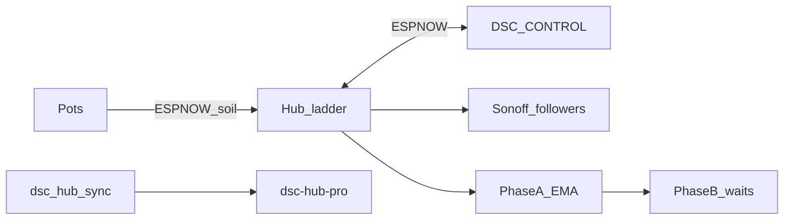

# DSC-HUB Pro

Indoor grow climate fleet: **ESPHome hub**, **CYD touch panel** (DSC-CONTROL),
**soil pots**, and **Sonoff demand followers** — local-first ladder control.
Home Assistant is the **lab soak / optional shell**; product destination is a
**Pi offline brain** + local webserver ([`docs/DSC-BRAIN.md`](docs/DSC-BRAIN.md),
Notion [Product layers](https://app.notion.com/p/3b52b4cda37081c2bcafc85d3407556c)).

**Current release tag:** [**v5.1.0**](https://github.com/weddas/DSC-HUB/releases/tag/v5.1.0)  
**Live train (in tree):** HA surface **5.1.12** · hub **5.1.11** · Control **5.1.17** · pots **5.1.8** · Sync **5.1.4**  
(Fleet chip compares major.minor — mixed `5.1.x` stays `ok`.)

---

## Why DSC-HUB

- **Hub owns climate** — dehumidifier → humidifier → heater → AC → mat ladder
  with reality gates, failsafe, and min-off (HA never drives those safety rails).
- **ESP-NOW primary** panel ↔ hub — works when Home Assistant is down.
- **DSC-HUB** product shell (`/dsc-hub-pro`) — one sidebar entry with primary
  **Ops · Plant · Advanced · System** (N-086 / surface **5.1.12**).
- **Plant** folds Compose (`/plant-build`) + Catalog Explorer (`/catalog`)
  beside fleet seats / mix lab; The Dash stays Ops cinema.
- **Learn Phase A + B** — Phase A EMA efficiencies & ETA; Phase B (opt-in)
  rate-limited writes to ladder **wait bases** only.
- **Fleet version chip** — at-a-glance `ok` / `warn` / `error` vs expected **5.1.6** train.
- **Push → all Sync HAOS** — packages, Pro dashboard, www, ESPHome stubs;
  **device firmware stays manual Install** (never auto-flash).



---

## Start here

| Doc | When |
|---|---|
| [`SETUP.md`](SETUP.md) | **Product unbox** — SoftAP kit without HA |
| [`docs/DSC-BRAIN.md`](docs/DSC-BRAIN.md) | Pi offline brain + webserver product shape |
| [`docs/HA-SCAFFOLD.md`](docs/HA-SCAFFOLD.md) | HA = lab soak; promote-don't-deepen |
| [`brain/README.md`](brain/README.md) | Catalog SQLite / Want / API stub (Phase B) |
| [`INSTALL.md`](INSTALL.md) | Lab HA + fleet bring-up |
| [`UPGRADE.md`](UPGRADE.md) | 5.0 → 5.1 cutover (add-on Update + flash) |
| [`RELEASE.md`](RELEASE.md) | What’s new, rollout checklist |
| [`scripts/ADDON.md`](scripts/ADDON.md) | Lab HA delivery — HAOS Sync add-on |
| [`docs/qa/FIRMWARE-QA-5.1.0.md`](docs/qa/FIRMWARE-QA-5.1.0.md) | Firmware Validate / flash QC |
| [`docs/qa/ADDON-QA-5.1.0.md`](docs/qa/ADDON-QA-5.1.0.md) | Sync add-on QC |
| [`homeassistant/README.md`](homeassistant/README.md) | Packages, HACS, entity notes |
| [`docs/qa/LIVE-UI-PRODUCT-SHELL.md`](docs/qa/LIVE-UI-PRODUCT-SHELL.md) | Unified HA product shell (N-086) |
| [`docs/qa/LIVE-UI-BUILD-A-PLANT.md`](docs/qa/LIVE-UI-BUILD-A-PLANT.md) | Build a Plant composition ops (N-083–N-086) |
| [`firmware/v4/README.md`](firmware/v4/README.md) | Local validate / flash |

**HAOS delivery:** Settings → Add-ons → Repositories → `https://github.com/weddas/DSC-HUB`
→ install / Update **DSC-HUB Sync** **5.1.4**. Push to `master` → poll (~60s) →
packages / dashboard / www / ESPHome stubs land in `/config`.

---

## Fleet at 5.1.x (live train)

| Device | Config | Version |
|---|---|---|
| Hub | `dsc-hub.yaml` → `dsc-hub-v4_0.yaml` + fleet-heal | **5.1.11** |
| Panel | `dsc-control.yaml` → `dsc-control-common.yaml` | **5.1.17** |
| Pots 1–4 | `dsc-pot{N}.yaml` → `dsc-pot-common.yaml` | **5.1.8** |
| Sonoffs | heater / heatmat / humidifier / de-humidifier | **5.1.x** |
| Kits | `*-kit.yaml`, `*-wifi-kit.yaml`, fleet-setup kits | same bodies as device train |
| Sync add-on | `dsc-hub-sync/` | **5.1.4** |
| HA surface | `sensor.dsc_ha_surface_version` | **5.1.12** |

Flash order: hub → panel → pots → Sonoffs. Living backlog: [`docs/FOLLOWUPS.md`](docs/FOLLOWUPS.md).

---

## Home Assistant surfaces

| Piece | Path |
|---|---|
| Sync add-on | [`dsc-hub-sync/`](dsc-hub-sync/) (**5.1.4+** ships Build/Nav/Catalog + catalog JSON) |
| Lovelace (product shell) | `homeassistant/dashboards/dsc-hub-v4-dashboard.yaml` → URL **`dsc-hub-pro`** |
| Lovelace (Build redirect stub) | `homeassistant/dashboards/dsc-build-plant-dashboard.yaml` → **`dsc-build-plant`** (sidebar hidden) |
| Packages | `homeassistant/packages/dsc_v4_*.yaml` |
| Config snippet | `homeassistant/configuration.snippet.yaml` (one **DSC-HUB** sidebar entry) |
| ESPHome stubs | `homeassistant/esphome/dsc-*.yaml` |

After Sync lands new `input_*` helpers: **restart HA Core once**.

Set notify target: `input_text.dsc_notify_service` (e.g. `notify.mobile_app_your_phone`).

---

## Secrets & ESP-NOW

```bash
cd firmware/v4
cp secrets.yaml.template secrets.yaml   # or ./generate-secrets.sh
```

Never commit `secrets.yaml`. Panel `hub_mac` ↔ hub WiFi MAC; hub `panel_mac` ↔
panel WiFi MAC; `espnow_cmd_tag` **54727** (`0xD5C7`) on both.

Sonoffs have no ESP-NOW — demand followers need HA.

## Validate

```bash
cd firmware/v4
g++ -std=c++17 -Wall -Wextra -O2 -o verify_v4 verify_v4.cpp && ./verify_v4
esphome config dsc-hub.yaml
esphome config dsc-control.yaml
esphome config dsc-pot1.yaml
esphome config dsc-heater.yaml
# kits (Validate even if not flashing lab)
esphome config dsc-hub-kit.yaml
```

## Flash order

1. Hub · 2. Panel · 3. Pots · 4. Sonoffs

Firmware Install is always **manual**. Sync never auto-flashes. The fleet version
chip stays `warn`/`error` until every device reports **5.1.0**.
