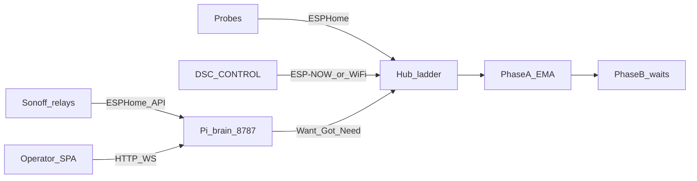

# DSC-HUB Pro

Indoor grow climate fleet: **ESPHome hub**, **CYD touch panel** (DSC-CONTROL),
**soil probes**, and **Sonoff demand followers** — local-first ladder control.
**Product path:** Pi **DSC-Brain** + operator SPA on `:8787`
([`docs/DSC-BRAIN.md`](docs/DSC-BRAIN.md)).

Home Assistant lab soak, HACS, Lovelace cards, and HA Sync delivery were
**retired** (2026-09). The SPA still speaks an HA-shaped entity/`call_service`
contract that the brain implements natively — there is no HA runtime.

**Live Pi island:** firmware **7.0.0.0** · brain/SPA surface **8.0.0** (kit SD installer train) · SoftAP kit path in [`SETUP.md`](SETUP.md). Spec: [`docs/superpowers/specs/2026-09-06-dsc-kit-sd-installer-design.md`](docs/superpowers/specs/2026-09-06-dsc-kit-sd-installer-design.md).

---

## Why DSC-HUB

- **Hub owns climate** — dehumidifier → humidifier → heater → AC → mat ladder
  with reality gates, failsafe, and min-off.
- **Pi offline brain** — DSC-Brain AP (`10.42.0.1`) + SPA at `:8787`
  ([`docs/DSC-BRAIN.md`](docs/DSC-BRAIN.md)).
- **ESP-NOW / SoftAP kit path** — product unbox without cloud or HA
  ([`SETUP.md`](SETUP.md)).
- **Learn Phase A + B** — EMA efficiencies & ETA; opt-in wait-base writes.
- **Zigbee** — Z2M role/task binding on the brain (not HA ZHA).

---

## Start here

| Doc | When |
|---|---|
| [`SETUP.md`](SETUP.md) | **Product unbox** — SoftAP kit |
| [`docs/DSC-BRAIN.md`](docs/DSC-BRAIN.md) | Pi brain + SPA shape |
| [`brain/README.md`](brain/README.md) | API / catalog / Want |
| [`docs/HA-SCAFFOLD.md`](docs/HA-SCAFFOLD.md) | **Retired** — HA lab historical note |
| [`firmware/v4/README.md`](firmware/v4/README.md) | Validate / flash |
| [`docs/FOLLOWUPS.md`](docs/FOLLOWUPS.md) | Living backlog |

---

## Fleet (Pi island)

| Device | Config | Version | Pi AP (DSC-Brain) |
|---|---|---|---|
| Hub | `firmware/v4/dsc-hub.yaml` | **7.0.0.0** | `.10` |
| Panel | `dsc-control*.yaml` | **7.0.0.0** | `.11` |
| Probes 1–2 (kit) | `dsc-pot{N}.yaml` | **7.0.0.0** | `.21`–`.22` |
| Sonoffs | heater / heatmat / humidifier / dehumidifier | **7.0.0.0** | `.50` / `.51` / `.54` / `.55` |
| Brain SPA | [`frontend/`](frontend/) | **7.4.x** | `:8787` |

Catalog packs: [`data/`](data/). Living backlog: [`docs/FOLLOWUPS.md`](docs/FOLLOWUPS.md).

---

## Repo layout (Pi product)

| Path | Role |
|---|---|
| `brain/` | FastAPI DSC-Brain |
| `frontend/` | Operator React SPA (`npm run build` → `spa-dist/`) |
| `data/` | Strain / medium / nutrient / light catalog YAML |
| `firmware/v4/` | ESPHome configs |
| `services/dsc-hub/` | Docker compose + Pi deploy scripts |

---

## License / contribute

See repository LICENSE and GitHub issues. Prefer Pi brain + SPA changes over
reviving HA packages.
