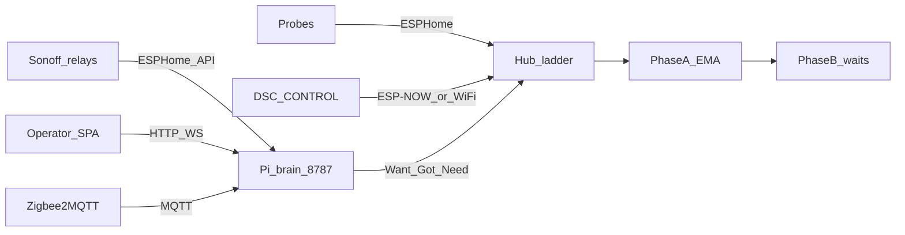

# DSC-HUB

**Indoor grow climate kit** — ESPHome hub, touch panel, soil probes, and Sonoff demand followers — driven by a **Raspberry Pi** control brain and operator SPA. Local-first. No cloud required for kit bring-up.

| | |
|---|---|
| **Release** | [8.0.0 AlphaPi](https://github.com/weddas/DSC-HUB/releases/tag/v8.0.0-AlphaPi) |
| **Surface** | Brain / SPA **8.0.0** · kit firmware train **7.0.0.0** |
| **Product path** | Flash SD → Pi boots → SPA Setup (`#/setup`) → USB flash fleet → SoftAP/LAN join → Zigbee bind |

Home Assistant lab, HACS, and Lovelace delivery were **retired** (2026-09). The SPA still speaks an HA-shaped entity / `call_service` dialect that **DSC-Brain implements natively** — there is no HA runtime.

---

## Why DSC-HUB

- **Hub owns climate safety** — dehumidifier → humidifier → heater → AC → mat ladder with reality gates, failsafe, and min-off.
- **Pi owns Want→Got→Need→act** — catalogs, roster, Learning, photoperiod / space energy, Zigbee role binding; hub refuses or clamps.
- **One SD card unbox** — fat offline image; Ethernet preferred for SPA + later full updates; Pi SoftAP only when Ethernet is absent.
- **USB flash on the Pi** — plug devices into the kit Pi; Setup wizard runs host esptool against baked binaries (no second PC required for kit path).
- **Honest operator UX** — gauges and chips match real Light / Climate / Root Want→Got; OOS kit SKUs stay OOS (not version theater).



---

## Get started (kit — AlphaPi)

### 1. Flash the SD image

1. Download **`dsc-hub-8.0.0-arm64.img.xz`** from the [8.0.0 AlphaPi release](https://github.com/weddas/DSC-HUB/releases/tag/v8.0.0-AlphaPi).
2. Open [Raspberry Pi Imager](https://www.raspberrypi.com/software/) → **Use custom** → select that file.
3. Flash a card for **Pi 4 or Pi 5** (aarch64).
4. Insert the card, power the Pi, prefer **Ethernet** on first boot.

### 2. Open Setup

| Network | How to reach the SPA |
|---|---|
| Ethernet up | `http://dsc-brain.local:8787/` or the Pi LAN IP `:8787` |
| No Ethernet | Join the **Pi SoftAP** (operator AP — not hub `DSC-Setup-*`) → SPA on the AP gateway |

Open **`#/setup`** and follow:

1. Welcome + network status  
2. USB flash (hub → panel → probes 1–2 → bridge → Sonoffs as kit allows)  
3. Fleet Wi‑Fi / SoftAP join (hub portal path)  
4. Zigbee role / zone / task bind (SkyConnect)  
5. Go live (commission)

Fleet SoftAP detail (hub `DSC-Setup-*`, bridge `DSC-Anchor`): [`SETUP.md`](SETUP.md).  
Design lock: [`docs/superpowers/specs/2026-09-06-dsc-kit-sd-installer-design.md`](docs/superpowers/specs/2026-09-06-dsc-kit-sd-installer-design.md).

### 3. Updates

Operator **Update** in Settings pulls a full kit version bundle **only when Ethernet is up**. Offline kits stay on the baked stack with an honest no-link state.

### Alpha caveats

- Kit firmware **`.bin` placeholders** may still need real ESPHome kit builds before production USB flash.
- Stock Lite inject paths may still expect Docker present for first-boot image preload — prefer the released factory `.img.xz`.
- Live kit probes are **1–2** (`KIT_PROBE_NUMBERS`); pot3/4 and F-001/F-002 stay Advanced / honest OOS, not kit defaults.

---

## Release artifacts

| Asset | Purpose |
|---|---|
| `dsc-hub-8.0.0-arm64.img.xz` | Flashable factory SD image |
| `dsc-hub-8.0.0-docker.tar.gz` | Preloaded brain + Mosquitto + Zigbee2MQTT images |
| `dsc-hub-8.0.0-payload.tar.gz` | Compose / units overlay (SPA lives inside the brain image) |
| `*-bake-manifest.json` / `*-sd-manifest.json` | Bake provenance |

Large binaries are **GitHub Release assets**, not git history.

---

## Fleet (Pi island)

| Device | Config (kit) | Version | Role |
|---|---|---|---|
| Hub | `firmware/v4/dsc-hub-kit.yaml` | **7.0.0.0** | Climate ladder + SoftAP portal |
| Panel | `dsc-control*-kit.yaml` | **7.0.0.0** | Field glass (DSC-CONTROL) |
| Probes 1–2 | `dsc-pot{N}-kit.yaml` | **7.0.0.0** | Root-zone kit probes |
| Bridge | `dsc-bridge-kit.yaml` | **7.0.0.0** | ETH01 + `DSC-Anchor` |
| Sonoffs | heater / heatmat / humidifier / dehumidifier | **7.0.0.0** | Demand followers (home LAN) |
| DSC-Brain + SPA | `brain/` + `frontend/` | **8.0.0** | Control SoT on `:8787` |
| Mosquitto + Z2M | compose stack | kit bake | Always on for Zigbee |

Catalog packs: [`data/`](data/) (thin local YAML — not the fat remote CannaLib corpus).

---

## Repo layout

| Path | Role |
|---|---|
| [`brain/`](brain/) | FastAPI DSC-Brain (Want, fleet, Setup / USB flash / Update APIs) |
| [`frontend/`](frontend/) | Operator React SPA (`npm run build` → `spa-dist/`) |
| [`data/`](data/) | Strain / medium / nutrient / light catalog YAML |
| [`firmware/v4/`](firmware/v4/) | ESPHome configs (lab + kit stubs) |
| [`services/dsc-hub/`](services/dsc-hub/) | Docker compose, Pi bootstrap, image bake scripts |
| [`docs/`](docs/) | Architecture, specs, [`FOLLOWUPS.md`](docs/FOLLOWUPS.md) backlog |

---

## Develop locally

### Brain API

```bash
cd brain
python -m pip install -r requirements.txt
python -m dsc_brain.cli init-db
python -m dsc_brain.cli reload-catalogs
python -m dsc_brain.api   # http://127.0.0.1:8787/docs
```

More: [`brain/README.md`](brain/README.md).

### Operator SPA

```bash
cd frontend
npm ci
npm run dev      # Vite dev server
npm run build    # spa-dist/ for brain image bake
```

### Demo mode (no hardware)

```bash
set DSC_DEMO_MODE=1
python -m dsc_brain.api
# or: docker compose -f services/dsc-hub/docker-compose.demo.yml up -d --build
```

Demo never starts ESPHome, MQTT, Zigbee, or Sonoff ingest.

### Bake (Linux / Pi)

Factory image bake lives under [`services/dsc-hub/image/`](services/dsc-hub/image/). Windows helpers: `.audit/kit-linux-bake.ps1`, `.audit/kit-sd-bench.ps1`. Prefer PuTTY `plink`/`pscp` with `-batch -hostkey` for Pi ops (OpenSSH `scp` password prompts hang agent shells).

---

## Docs map

| Doc | When |
|---|---|
| [`SETUP.md`](SETUP.md) | Fleet SoftAP unbox (hub / panel / pots / bridge) |
| [`docs/DSC-BRAIN.md`](docs/DSC-BRAIN.md) | Pi brain architecture |
| [`brain/README.md`](brain/README.md) | Brain CLI / API / catalogs |
| [`docs/superpowers/specs/2026-09-06-dsc-kit-sd-installer-design.md`](docs/superpowers/specs/2026-09-06-dsc-kit-sd-installer-design.md) | Kit SD installer design (8.0.0) |
| [`docs/FOLLOWUPS.md`](docs/FOLLOWUPS.md) | Living engineering backlog |
| [`INSTALL.md`](INSTALL.md) / [`docs/HA-SCAFFOLD.md`](docs/HA-SCAFFOLD.md) | Retired HA lab notes only |

Issue / recommendation SoT for product work: Notion **DSC-HUB Issue & Recommendation Tracker**.

---

## License / contribute

See repository license and GitHub issues. Prefer Pi brain + SPA + kit bake changes. Do not revive HA packages, HACS, or Sync as the product path.
