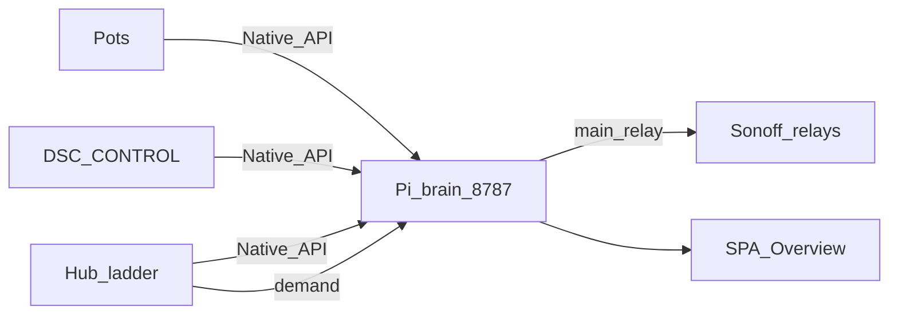

# DSC-HUB Pro

Indoor grow climate fleet: **ESPHome hub**, **CYD touch panel** (DSC-CONTROL),
**soil pots**, and **Sonoff demand followers** — local-first ladder control.
Home Assistant is the **lab soak / optional shell**; product destination is a
**Pi offline brain** + local webserver ([`docs/DSC-BRAIN.md`](docs/DSC-BRAIN.md),
Notion [Product layers](https://app.notion.com/p/3b52b4cda37081c2bcafc85d3407556c)).

**Current release tag:** [**v7.1.0**](https://github.com/weddas/DSC-HUB/releases/tag/v7.1.0)  
**Live Pi island train (in tree):** firmware **7.0.0.0** on ESPHome **2025.12.4** (Pi) / **2026.8.0** (lab) · brain **7.1.0** · HA surface optional soak shell  
**Product kit train:** SoftAP / ESP-NOW shaped (`*-kit.yaml`) — see [`SETUP.md`](SETUP.md). Pi island is primary (`docs/DSC-BRAIN.md`).

---

## Why DSC-HUB

- **Hub owns climate** — dehumidifier → humidifier → heater → AC → mat ladder
  with reality gates, failsafe, and min-off (HA never drives those safety rails).
- **Pi offline brain** — DSC-Brain AP (`10.42.0.1`) + local SPA at `:8787`; HA is lab soak only
  ([`docs/DSC-BRAIN.md`](docs/DSC-BRAIN.md)).
- **Lab live bus (optional):** HA Native API on studio LAN when soaking — not required for Pi island.
- **Bridge retired (7.1)** — former ETH01 `dsc-bridge*.yaml` archived under `firmware/_history/`; Sonoffs follow hub demand via Pi brain.
- **DSC-HUB Pro** dashboard (`/dsc-hub-pro`) — Home, Climate, Learning, tents,
  Root Zone, Tank, Light, Trends, System.
- **Build a Plant** (`/dsc-build-plant/build`) — separate composition dashboard
  (strain · soil % · nutrients · light · climate Want → roster / pot).
- **Learn Phase A + B** — Phase A EMA efficiencies & ETA; Phase B (opt-in)
  rate-limited writes to ladder **wait bases** only.
- **Fleet version chip** — at-a-glance `ok` / `warn` / `error` vs expected **6.1.0.0** train.
- **Push → all Sync HAOS** — packages, Pro dashboard, www, ESPHome stubs;
  **device firmware stays manual Install** (never auto-flash).



HA Native API remains an optional lab soak bus — not required for Pi island.
---

## Start here

| Doc | When |
|---|---|
| [`SETUP.md`](SETUP.md) | **Product unbox** — SoftAP kit without HA |
| [`docs/DSC-BRAIN.md`](docs/DSC-BRAIN.md) | Pi offline brain + webserver product shape |
| [`docs/HA-SCAFFOLD.md`](docs/HA-SCAFFOLD.md) | HA = lab soak; promote-don't-deepen |
| [`brain/README.md`](brain/README.md) | Catalog SQLite / Want / API stub (Phase B) |
| [`INSTALL.md`](INSTALL.md) | Lab HA + fleet bring-up |
| [`UPGRADE.md`](UPGRADE.md) | 5.0 → 5.1 cutover (add-on Update + flash) |
| [`RELEASE.md`](RELEASE.md) | What’s new, rollout checklist |
| [`scripts/ADDON.md`](scripts/ADDON.md) | Lab HA delivery — HAOS Sync add-on |
| [`docs/qa/FIRMWARE-QA-5.1.0.md`](docs/qa/FIRMWARE-QA-5.1.0.md) | Firmware Validate / flash QC |
| [`docs/qa/ADDON-QA-5.1.0.md`](docs/qa/ADDON-QA-5.1.0.md) | Sync add-on QC |
| [`homeassistant/README.md`](homeassistant/README.md) | Packages, HACS, entity notes |
| [`docs/qa/LIVE-UI-BUILD-A-PLANT.md`](docs/qa/LIVE-UI-BUILD-A-PLANT.md) | Build a Plant composition ops (N-083) |
| [`docs/ops/DSC-HUB-DOCKER.md`](docs/ops/DSC-HUB-DOCKER.md) | Pi cutover + island proof |
| [`docs/ops/SONOFF-FLASH.md`](docs/ops/SONOFF-FLASH.md) | Sonoff LAN/fallback OTA + AP heal |
| [`docs/qa/LIVE-ACCEPTANCE-7.1.md`](docs/qa/LIVE-ACCEPTANCE-7.1.md) | 7.1 live acceptance |
| [`firmware/v4/README.md`](firmware/v4/README.md) | Local validate / flash |

**HAOS delivery:** Settings → Add-ons → Repositories → `https://github.com/weddas/DSC-HUB`
→ install / Update **DSC-HUB Sync** **5.1.3**. Push to `master` → poll (~60s) →
packages / dashboard / www / ESPHome stubs land in `/config`.

---

## Fleet at 7.0.x (Pi island)

| Device | Config | Version | Pi AP (DSC-Brain) |
|---|---|---|---|
| Hub | `dsc-hub.yaml` → v4_0 + fleet-heal | **7.0.0.0** | `.10` |
| Panel | `dsc-control.yaml` → common + `dsc-control-wifi-pi.yaml` | **7.0.0.0** | `.11` |
| Pots 1–4 | `dsc-pot{N}.yaml` → pot-common | **7.0.0.0** | `.21`–`.24` |
| Sonoffs | heater / heatmat / humidifier / dehumidifier | **7.0.0.0** | `.50` / `.51` / `.54` / `.55` |
| Kits | `*-kit.yaml` SoftAP product path | kit train | SoftAP `192.168.4.x` |
| Brain SPA | `homeassistant/custom_components/dsc_hub/frontend` | **7.1.0** | `:8787` |

USB flash order (Pi cutover): hub → pots → Sonoffs → panel → soak → prove OTA. Bridge configs retired — see `firmware/_history/v4/dsc-bridge*.yaml`. Living backlog: [`docs/FOLLOWUPS.md`](docs/FOLLOWUPS.md).

---

## Home Assistant surfaces

| Piece | Path |
|---|---|
| Sync add-on | [`dsc-hub-sync/`](dsc-hub-sync/) (**5.1.4+** ships Build a Plant + catalog) |
| Lovelace (Pro) | `homeassistant/dashboards/dsc-hub-v4-dashboard.yaml` → URL **`dsc-hub-pro`** |
| Lovelace (Build a Plant) | `homeassistant/dashboards/dsc-build-plant-dashboard.yaml` → URL **`dsc-build-plant`** |
| Packages | `homeassistant/packages/dsc_v4_*.yaml` (incl. `dsc_v4_panel_ha_bus.yaml`) |
| Config snippet | `homeassistant/configuration.snippet.yaml` (Pro + Build a Plant) |
| ESPHome stubs | `homeassistant/esphome/dsc-*.yaml` |

After Sync lands new `input_*` helpers: **restart HA Core once**.

Set notify target: `input_text.dsc_notify_service` (e.g. `notify.mobile_app_your_phone`).

---

## Secrets & radios

```bash
cd firmware/v4
cp secrets.yaml.template secrets.yaml   # or ./generate-secrets.sh
```

Never commit `secrets.yaml`. Studio Wi-Fi lives in Notion **API Keys & Credentials**
and gitignored secrets only — not in FOLLOWUPS or git.

**Lab:** Native API on studio LAN. **Kit:** SoftAP pairing still documented in SETUP.
`espnow_cmd_tag` **54727** kept for parked / kit builds.

**Pi island:** Sonoffs are Native API clients of the brain appliance driver (bridge retired). Flash helpers: [`docs/ops/SONOFF-FLASH.md`](docs/ops/SONOFF-FLASH.md). Lab HA demand followers remain a soak fallback only.

## Validate

```bash
# N-008: compile from local tree, not the UNC repo
cd C:\Users\cmgwe\esphome-dsc\v4
esphome version   # expect 2025.12.4 on Pi dashboard / 2026.8.0 lab CLI
esphome config dsc-hub.yaml
esphome config dsc-control.yaml
esphome config dsc-pot1.yaml
esphome config dsc-heater.yaml
# dsc-bridge.yaml is archived under firmware/_history/v4/
```

## Flash order (Pi island USB / OTA)

1. Hub · 2. Pot2 canary · 3. Pot1/4/3 · 4. Sonoffs ([`SONOFF-FLASH.md`](docs/ops/SONOFF-FLASH.md)) · 5. Panel  
Do **not** flash ETH01 bridge for 7.1 product. After soak, OTA is the path (`flash-fleet-700.ps1` / Sonoff helpers).

Firmware Install is always **manual**. Sync never auto-flashes.