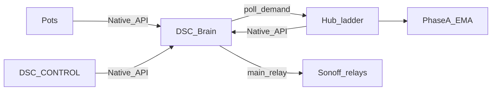

# DSC-HUB Pro

Indoor grow climate fleet: **ESPHome hub**, **CYD touch panel** (DSC-CONTROL),
**soil pots**, and **Sonoff demand followers** — local-first ladder control.

**Product destination (shipped in tree):** Raspberry Pi **DSC-Brain** appliance —
brain + SPA (`:8787`), `wifi-pi` firmware **7.0.0.0**, hub demand → Sonoff relays
via brain Native API. See [`docs/qa/PI-APPLIANCE-7.0.md`](docs/qa/PI-APPLIANCE-7.0.md),
[`docs/DSC-BRAIN.md`](docs/DSC-BRAIN.md), Notion
[Product layers](https://app.notion.com/p/3b52b4cda37081c2bcafc85d3407556c).

Home Assistant remains the **lab soak / optional shell**.

**Current GitHub tag:** [**v5.1.0**](https://github.com/weddas/DSC-HUB/releases/tag/v5.1.0) (historical)  
**Pi product train (in tree):** firmware **7.0.0.0** · brain/SPA **7.0.0-dev** until island soak + `v7.0.0`  
**HA lab train:** surface **7.2.0** · prior studio FW **6.1.0.0** · Sync **5.1.3+**  
**Kit SoftAP train:** `*-kit.yaml` — see [`SETUP.md`](SETUP.md)

---

## Why DSC-HUB

- **Hub owns climate** — dehumidifier → humidifier → heater → AC → mat ladder
  with reality gates, failsafe, and min-off (UI never bypasses those rails).
- **Pi product bus** — fleet on `DSC-Brain` AP (`10.42.0.0/24`); brain polls hub
  demand switches and drives Sonoff `main_relay` (45s stale OFF). Hub ESP-NOW parked.
- **HA lab bus** — studio Wi-Fi + HA Native API still documented for soak; do not
  conflate with Pi island IPs.
- **ETH01 bridge** — superseded on Pi path (lab archaeology only).
- **Brain SPA** (`http://dsc-brain.local:8787`) — ops, Settings, fleet, plant.
- **HA Pro / Build a Plant** — lab surfaces; Sync still delivers packages to HAOS.



---

## Start here

| Doc | When |
|---|---|
| [`docs/qa/PI-APPLIANCE-7.0.md`](docs/qa/PI-APPLIANCE-7.0.md) | **Pi 7.0 product** — AP, Docker, APIs, appliance driver, pitfalls |
| [`services/dsc-hub/README.md`](services/dsc-hub/README.md) | Compose bootstrap on Pi |
| [`docs/DSC-BRAIN.md`](docs/DSC-BRAIN.md) | Architecture memo |
| [`SETUP.md`](SETUP.md) | SoftAP kit unbox **without** Pi |
| [`INSTALL.md`](INSTALL.md) | HA lab bring-up |
| [`docs/HA-SCAFFOLD.md`](docs/HA-SCAFFOLD.md) | HA = lab soak; promote-don't-deepen |
| [`brain/README.md`](brain/README.md) | Brain package layout |
| [`UPGRADE.md`](UPGRADE.md) | 5.0 → 5.1 cutover (HA Sync) |
| [`RELEASE.md`](RELEASE.md) | HA surface / historical rollout notes |
| [`firmware/v4/README.md`](firmware/v4/README.md) | Local validate / flash |

**Pi bring-up:** `services/dsc-hub/pi/pi-bootstrap.sh` → `.env` → AP + compose → flash
`wifi-pi` stubs → island proof. Secrets only in Notion credentials + gitignored files.

**HAOS delivery (lab):** Settings → Add-ons → Repositories → `https://github.com/weddas/DSC-HUB`
→ **DSC-HUB Sync** **5.1.3+**. Device firmware stays **manual Install**.

---

## Fleet at 7.0.x (Pi product train)

| Device | Config | Version | Pi AP LAN |
|---|---|---|---|
| Hub | `dsc-hub.yaml` → wifi-pi + parked ESP-NOW | **7.0.0.0** | `.10` |
| Panel | `dsc-control.yaml` → wifi-pi | **7.0.0.0** | `.11` |
| Pots 1–4 | `dsc-pot{N}.yaml` → wifi-pi | **7.0.0.0** | `.21`–`.24` |
| Sonoffs | heater / heatmat / humidifier / dehumidifier | **7.0.0.0** | `.50` / `.51` / `.54` / `.55` |
| Brain / SPA | `services/dsc-hub` + `brain/` | **7.0.0-dev** | `.1:8787` |
| Kits | `*-kit.yaml` SoftAP product path | kit train | SoftAP `192.168.4.x` |

USB flash order (Pi cutover): hub → Pot2 canary → pots → Sonoffs → panel → island soak.
Living backlog: [`docs/FOLLOWUPS.md`](docs/FOLLOWUPS.md).

---

## Home Assistant surfaces (lab)

| Piece | Path |
|---|---|
| Sync add-on | [`dsc-hub-sync/`](dsc-hub-sync/) |
| Lovelace (Pro) | `homeassistant/dashboards/dsc-hub-v4-dashboard.yaml` → URL **`dsc-hub-pro`** |
| Lovelace (Build a Plant) | `homeassistant/dashboards/dsc-build-plant-dashboard.yaml` → URL **`dsc-build-plant`** |
| Packages | `homeassistant/packages/dsc_v4_*.yaml` |
| ESPHome stubs | `homeassistant/esphome/dsc-*.yaml` |

After Sync lands new `input_*` helpers: **restart HA Core once**.

---

## Secrets & radios

```bash
cd firmware/v4
cp secrets.yaml.template secrets.yaml   # or ./generate-secrets.sh
```

Never commit `secrets.yaml`. Wi-Fi / API keys live in Notion **API Keys & Credentials**
and gitignored `.env` only — not in FOLLOWUPS, Wiki, or git.

**Pi:** Noise API keys per seat in compose `.env`. **Kit:** SoftAP + ESP-NOW in SETUP.
`espnow_cmd_tag` **54727** kept for parked / kit builds.

## Validate

```bash
pytest brain/tests -q
esphome config firmware/v4/dsc-hub.yaml
esphome config firmware/v4/dsc-control.yaml
```

Firmware Install is always **manual**. Sync never auto-flashes.
