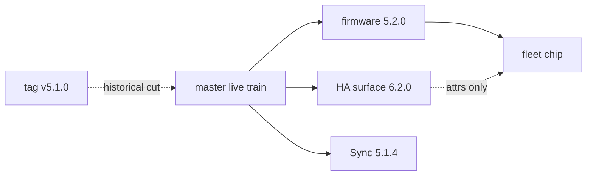

# DSC-HUB — Release notes

**Last marketing tag:** [`v5.1.0`](https://github.com/weddas/DSC-HUB/releases/tag/v5.1.0)  
**Live train (in tree / master tip):** firmware **5.2.0** · HA surface **6.2.0** · Sync **5.1.4**

Operator version model (do not conflate trains):
[`docs/qa/VERSION-TRAINS.md`](docs/qa/VERSION-TRAINS.md)

**Install:** [`INSTALL.md`](INSTALL.md) · **Upgrade:** [`UPGRADE.md`](UPGRADE.md) ·
**Add-on:** [`scripts/ADDON.md`](scripts/ADDON.md) ·
**QA:** [`docs/qa/`](docs/qa/)

Repo: https://github.com/weddas/DSC-HUB · branch **`master`**

---

## Live train (post-tag)

| Surface | Current | Notes |
|---|---|---|
| Hub / Control / pots / bridge / Sonoffs / kits | **5.2.0** | Dual-string lockstep (`project.version` + Firmware Version text) |
| HA product surface | **6.2.0** | `sensor.dsc_ha_surface_version` — React `/dsc-hub` + packages |
| `input_text.dsc_expected_release` | **5.2.0** | Firmware train only — never the surface string |
| Fleet chip | firmware major.minor | Does **not** score HA surface |
| Sync add-on | **5.1.4** | Packages / dashboards / www / stubs; no device flash |
| ESP-NOW tag | **54727** (`0xD5C7`) | Hub ↔ Control |
| SoftAP / bridge | SoftAP-primary fleet | ETH01 Anchor; pots SoftAP `.12`–`.15`; see F-010 |



### What’s in the live train (high level)

| Layer | Change since tagged 5.1.0 |
|---|---|
| **ETH01 bridge** | SoftAP Anchor + Sonoff Noise API + HA vitals mirror (F-010/F-012/F-013) |
| **SoftAP membership** | SoftAP-primary Hub / Control / Sonoffs / pots; Nest fallback only |
| **HA surface 6.x** | React custom panel `/dsc-hub`; glass HUD; Plant Seat; pot→tent SoT |
| **Catalog / brain** | Collation v4 + densify tooling; Pi brain Phase B scaffolding |
| **Version chip** | Firmware-only compare; surface reported separately |

**Still manual:** ESPHome Install per device; SoftAP DHCPS (non-goal v1); F-015 Sync copy of bridge components (Partial).

### Live-train rollout checklist

- [ ] Push `master` (no new marketing tag required for day-to-day Sync)
- [ ] On **each** HAOS: Update **DSC-HUB Sync** to **5.1.4+** → Start → “Synced to …”
- [ ] Restart HA Core **once** if new helpers / `dsc_hub` panel / pot-tent package landed
- [ ] Confirm `sensor.dsc_ha_surface_version` = **6.2.0**
- [ ] Confirm `input_text.dsc_expected_release` = **5.2.0**
- [ ] ESPHome Validate/Install devices to firmware **5.2.0** (hub → Control → pots → bridge → Sonoffs)
- [ ] Fleet chip → **ok** (firmware train); SoftAP / `hub_esp_now_link` per F-010

```
Cursor edit → push master → DSC-HUB Sync (~60s)
                          → ESPHome Install (devices, manual)
```

---

## Tagged cut: v5.1.0 (historical)

Full-fleet force to **5.1.0**: lab + kit firmwares, Sonoffs, Sync add-on,
HA packages, DSC-HUB Pro dashboard, and Learn Phase B (opt-in wait clamps).

| | |
|---|---|
| **GitHub tag** | `v5.1.0` |
| **Hub / panel / pots / Sonoffs** | **`5.1.0`** |
| **Sync add-on** | **`5.1.0`** (`sync_esphome: true` default) |
| **HA surface (at tag)** | `sensor.dsc_ha_surface_version` = **`5.1.0`** |
| **Dashboard (at tag)** | **DSC-HUB Pro** · URL **`dsc-hub-pro`** |
| **ESP-NOW tag** | **`54727` (`0xD5C7`)** |
| **Phase B** | Default **off** — wait bases only |

### What’s new in v5.1.0

| Layer | Change |
|---|---|
| **Fleet version** | Force **5.1.0** on hub, panel, pots, Sonoffs, **all kits**, add-on, stubs |
| **Learn Phase B** | Opt-in HA→hub ladder wait writes; floors/ceils; lock; never failsafe/min-off/fans |
| **Learning UI** | Phase A+B status, wait entities, resets, last-sample age |
| **Fleet chip** | `sensor.dsc_fleet_version_status` on Home + System table |
| **Root zone** | `sensor.dsc_coldest_root_zone_temp` / hottest (voted + plausible) |
| **Notify** | `input_text.dsc_notify_service` + `script.dsc_notify` |
| **Sync** | Atomic stage copy, last-good rollback, version/SHA marker, broader reloads, `sync_esphome` default **true** |
| **Door magnet** | Lab `lock.4x8_*` labeled as **room door release** |
| **QoL** | Multi-lever sample skip, alert-count plant-spec zeros, dead-demand chip, AC/mister NO ACTUATOR cues |

**Not in this cut:** auto-flash ESP devices; hub reconnect snapshot-restore;
remote ESP log capture; renaming `dsc_v4_*` filenames.

### Rollout (tag day — historical)

- [ ] Push `master` / tag `v5.1.0`
- [ ] On **each** HAOS: Update **DSC-HUB Sync** add-on to **5.1.0** → Start/restart → wait for “Synced to …”
- [ ] Restart HA Core **once** (new Learning / version helpers)
- [ ] Confirm `/dsc-hub-pro/home` + HA surface **5.1.0** (as of that tag)
- [ ] ESPHome: Validate/Install each device to firmware **5.1.0** (lab + field kits)
- [ ] Chip → **ok**

---

## Beyond OTA

| Surface | Deploy |
|---|---|
| Packages / Pro dashboard / www / custom panel `www` | Sync add-on on push |
| ESPHome stubs | Sync (`sync_esphome: true`) — still need manual Install |
| Sync add-on binary | Supervisor **Update** once per HAOS |
| Device firmware | Manual Validate/Install |
