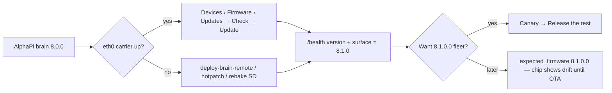

# DSC-HUB — Upgrade (8.x, Pi-only)

**New installs:** [`INSTALL.md`](INSTALL.md). **Unboxing a kit:** [`SETUP.md`](SETUP.md).
**Release notes:** [`RELEASE.md`](RELEASE.md) · [`CHANGELOG.md`](CHANGELOG.md).

Repo: https://github.com/weddas/DSC-HUB · branch **`master`** · tree tip **8.1.0**
(`6f1b1fa` — followups merge; bake provenance `cce5c74`; published
[`v8.1.0`](https://github.com/weddas/DSC-HUB/releases/tag/v8.1.0)).
See [Kit update honesty](#kit-update-honesty).

There is no Home Assistant in the upgrade path. Everything below happens in the
Pi SPA (`http://dsc-brain.local:8787`, or `http://10.42.0.1:8787` on the kit
hotspot) or, as a fallback, over SSH on the Pi.

---

## What gets upgraded

| Layer | Where it lives | How it moves |
|---|---|---|
| DSC-Brain + SPA | `dsc-hub-brain` container (compose) | **Settings → Devices → Firmware → Updates** (`#/settings/devices#kit-update`) — Ethernet-gated Check + Update, or `pi/deploy-brain-remote.sh` / hotpatch from a dev box |
| ESPHome build toolchain | host venv `/opt/dsc-esphome-venv` (`dsc-esphome-dashboard.service` on `:6052`) | **Settings → Devices → Firmware** → **Update ESPHome** (host helper runs `pip`, restarts the dashboard); **Roll back to X** if a bump misbehaves |
| Device firmware (hub, panel, probes, Sonoffs) | compiled from `firmware/v4/` on the Pi, flashed OTA | **Settings → Devices → Firmware** → **Canary … first → Release the rest** (or **Reflash whole fleet**), one job at a time, **hub last** |

Firmware train **8.1.0.0** pins ESPHome `min_version: "2026.6.5"`; a toolchain
below that refuses to build. Details: [`docs/ops/ESPHOME-TOOLCHAIN.md`](docs/ops/ESPHOME-TOOLCHAIN.md).

Legacy deep link `#/settings/server` redirects to `#/settings/devices#firmware`.

---

## AlphaPi (`v8.0.0-AlphaPi`) → **8.1.0** (+ tip `6f1b1fa` firmware train)

**Brain / SPA first**, then decide on fleet OTA.

- Published `v8.1.0` card / AlphaPi→8.1.0 Kit Update is a **brain** bump.
- Tip `6f1b1fa` also raises `EXPECTED_FIRMWARE` to **8.1.0.0** (air-temp band
  entities + aligned fleet chip). Kits that stay on **8.0.0.0** hub firmware will
  show train drift until canary → release-the-rest (or USB reflash).

1. Prefer Ethernet. Open **Settings → Devices → Firmware → Updates**.
2. **Check for updates.** GitHub [`v8.1.0`](https://github.com/weddas/DSC-HUB/releases/tag/v8.1.0)
   is published — `kit_update._is_newer` treats `v8.1.0` as newer than AlphaPi
   `8.0.0` / `v8.0.0-AlphaPi`, so **Update DSC-Brain** is offered on Ethernet.
   Kits already on **8.1.0** correctly see no brain bump (same numeric core).
3. Offline / no Ethernet: pull tip `6f1b1fa` via workstation deploy or
   [`docs/ops/PI-HOTPATCH.md`](docs/ops/PI-HOTPATCH.md) — Kit Update stays silent
   without carrier (`kit_update.github_latest` eth gate).
4. Verify: `GET /health` → `version` and `surface` **8.1.0**,
   `expected_firmware` **8.1.0.0**.
5. SoftAP kit-bake compile fixes (`dsc_fleet_setup`) do **not** by themselves
   require a live-fleet reflash — they matter for the **next** SD / USB flash bake.
   The **8.1.0.0** product train (air-temp min/max numbers, clone band defaults)
   **does** need OTA/USB when you want those entities live.

Compose image tags on tip: `dsc-hub-brain:8.1.0` / `dsc-hub-cannalib:8.1.0`.
SD bake: [`services/dsc-hub/image/README.md`](services/dsc-hub/image/README.md)
(`DSC_VERSION=8.1.0`, **copy live** `firmware/v4/secrets.yaml`, set
`DSC_RELEASE=1`, confirm kit `.bin` files are non-empty — hollow 8.0.0 lesson).

---

## Kit update honesty

`GET|POST /settings/update*` (`brain/dsc_brain/kit_update.py`):

- Compares GitHub `releases/latest` to running `__version__` by **numeric core**
  (`v8.0.0-AlphaPi` → `(8,0,0)`). Labels alone never count as newer.
- Ethernet-gated, ~1 h cache, never raises offline — offline kits keep the baked
  version.
- Fleet rows compare each seat’s product firmware to `EXPECTED_FIRMWARE`
  (`8.1.0.0`). Reflash is a separate confirm on the same Firmware tab.
- With `releases/latest` = `v8.1.0`, AlphaPi brains **do** see an in-SPA Update;
  already-on-8.1.0 kits do not. Offline kits keep the baked version until eth0
  is up (or use deploy/hotpatch/rebake).

---

## Routine upgrade (brain first, then firmware)

1. **Brain / SPA.** Settings → Devices → Firmware → Updates → **Check** →
   **Update** (needs Ethernet). The brain restarts; the page reloads on the new
   bundle. Settings → System → About shows the running version.
2. **ESPHome toolchain** (only when the card says *Update available*). Settings →
   Devices → Firmware → **Update ESPHome → x.y.z**. Watch the log; the card flips to
   the new *Installed* and offers the rollout.
3. **Firmware.** Same card → **Canary Probe 2 first**. Wait for *Canary OK*
   (the probe reports the new ESPHome version), then **Release the rest (N, hub
   last)**. Each device is compiled and flashed in turn through the build worker.
   Live/Overview keep serving the last-known values while a device reboots.
4. **Verify.** Settings → Devices: every row shows the expected firmware
   (`8.1.0.0`) and *online*; Overview fleet chip **ok**.

Nothing flashes without a confirm click. A failed job stops the queue at that
device — fix it (job log on the card, or **Logs ↗** into the ESPHome dashboard)
and re-queue just that seat.

---

## Bumping the pinned ESPHome (`min_version`)

Do this deliberately, not on every ESPHome release. Steps live in
[`docs/ops/ESPHOME-TOOLCHAIN.md`](docs/ops/ESPHOME-TOOLCHAIN.md#bump-the-pinned-min_version):
update the venv, `esphome config` **and** a real `esphome compile` per family
(`config` alone misses lambda C++), run `scripts/run_sim_gates`,
bump the four `esphome:` blocks + `PIN=` in `dsc-esphome-venv-setup.sh` +
`PINNED_MIN_VERSION` in `esphome_toolchain.py`, changelog line, reflash.

---

## Fallbacks (SSH on the Pi)

| Situation | Command |
|---|---|
| SPA rollout unavailable | `sudo bash /opt/dsc-hub/pi/flash-fleet-remote.sh <sudo-pass> [seats…]` — host venv, hosts from the brain inventory, canary first / hub last |
| Hub stuck on its fallback hotspot | `flash-hub-fallback-remote.sh` |
| Sonoffs on the AP island | `flash-sonoff-lan-remote.sh`; on their fallback AP: `flash-sonoff-fallback-remote.sh` |
| Toolchain by hand | `sudo -u dsc /opt/dsc-esphome-venv/bin/pip install esphome==<ver>` then `sudo systemctl restart dsc-esphome-dashboard` |
| Brain by hand | `docker compose -f /opt/dsc-hub/docker-compose.yml pull brain && … up -d brain` (prefer `docker stop -t 20` + `start` over `restart`) |

All of these need `firmware/v4/secrets.yaml` on the Pi (baked kits ship it at
`/opt/dsc-hub/firmware/v4/secrets.yaml`, `0600 dsc:dsc`).

---

## Rollback

- **Toolchain:** Settings → Devices → Firmware → **Roll back to X** (from a
  `done` job, or a failed update that still moved the venv), or the pip command above.
  Never offered onto a dashboard-less ESPHome ≥ 2026.8 until a Device Builder adapter exists.
- **Firmware:** re-queue the affected seats after rolling the toolchain back; the
  YAML is the same, so a rebuild on the previous ESPHome reproduces the previous
  binary. Hub and panel must keep a matching `espnow_cmd_tag` (**54727**).
- **Brain:** `docker compose … up -d brain` on the previous image tag, or
  Settings → System → profile import / last backup.

---

## From 7.x (Home Assistant lab) to 8.x

The HA lab (packages, HACS, Sync add-on, Lovelace) was retired in 2026-09 and
nothing in 8.x reads from or writes to a Home Assistant. Devices flashed from
the old HA ESPHome add-on keep working — they are just behind:

1. Bring the Pi up on 8.x ([`INSTALL.md`](INSTALL.md) / factory image).
2. Copy your `firmware/v4/secrets.yaml` to the Pi (keys are compiled in; keep the
   same set or plan to reflash everything over USB).
3. Settings → Devices → Firmware → **Reflash whole fleet** (hub last). The 8.x
   train (tip `6f1b1fa` → **8.1.0.0**) drops every `platform: homeassistant`
   entity (SNTP-only clock, native-API plant names, ESP-NOW-only root-zone), so
   the fleet no longer waits on an HA that is not there.
4. Decommission the HA integrations at your leisure — they are not consulted.

See [`docs/FIRMWARE-HA-REMOVAL.md`](docs/FIRMWARE-HA-REMOVAL.md) and
[`docs/HA-SCAFFOLD.md`](docs/HA-SCAFFOLD.md).
