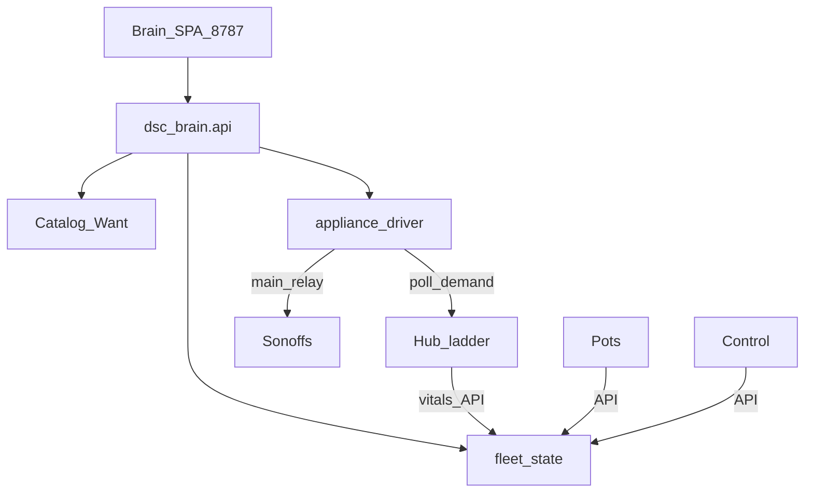

# DSC offline brain — architecture memo

**In one line:** Local fleet + Pi brain is the product; brain SPA presents and controls; Home Assistant is a lab scaffold.

Notion (canonical Wiki): [Product layers](https://app.notion.com/p/3b52b4cda37081c2bcafc85d3407556c) · Ops: [`docs/qa/PI-APPLIANCE-7.0.md`](qa/PI-APPLIANCE-7.0.md)

**Ship status (tip `c4eb97f`):** DSC-HUB **7.0** Pi release — Docker stack, `wifi-pi` firmware train **7.0.0.0**, appliance driver (hub demand → Sonoff relays), bundled SPA on `:8787`. Tree stays `7.0.0-dev` until island soak + tag `v7.0.0`.

## Layers

| Layer | Owns | Does not own |
|---|---|---|
| **Hub** | Ladder, failsafes, PWM | Catalogs, long history, composition UI, Sonoff drive on Pi path |
| **Pi brain** | Catalogs, Want/Need, roster, Learning, inventory, appliance driver, SPA | Hard safety if Pi unplugged |
| **Webserver (SPA)** | Presentation, Settings, fleet, updates UX | Catalog SoT / Want math |
| **DSC-CONTROL** | Field glass (Native API on Pi path; ESP-NOW parked) | Seed catalogues |
| **HA (optional)** | Lab prototypes, soak, Companion notify | Long-term product SoT |

**Authority:** Pi decides and proposes; hub refuses or clamps. Sonoffs follow hub demand via brain Native API (`appliance_driver.py`), not ETH01.

## Repo map

| Path | Role |
|---|---|
| [`brain/`](../brain/) | Pi brain package (catalog, Want, decision loop, fleet, appliance driver, FastAPI + static SPA) |
| [`services/dsc-hub/`](../services/dsc-hub/) | Docker Compose, Pi bootstrap, env template |
| [`docs/ops/DSC-HUB-DOCKER.md`](ops/DSC-HUB-DOCKER.md) | Cutover checklist |
| [`docs/qa/PI-APPLIANCE-7.0.md`](qa/PI-APPLIANCE-7.0.md) | Full Pi ops runbook |
| [`SETUP.md`](../SETUP.md) | SoftAP kit unbox (no Pi) |
| [`INSTALL.md`](../INSTALL.md) | HA lab bring-up (scaffold) |
| [`docs/HA-SCAFFOLD.md`](HA-SCAFFOLD.md) | Promote-don't-deepen rules |
| [`docs/brain/`](brain/) | Specs: decision loop, web UI, superseded ETH01 bridge |

## Phases

- **A** Architecture + Notion docs — done
- **B** Brain core (catalog / Want / tick) — done
- **C** Webserver MVP (SPA on `:8787`) — landed in 7.0 tree
- **D** Pi appliance driver + Docker island — landed in 7.0 tree (`7.0.0-dev` until soak)
