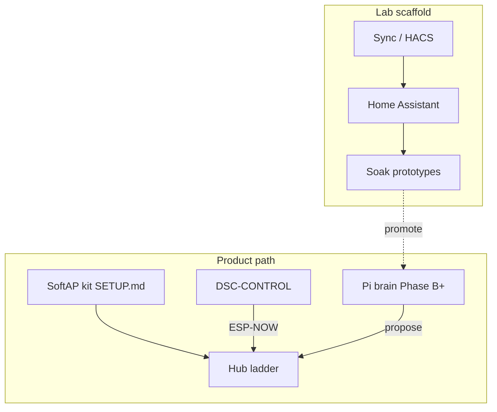

# DSC offline brain — architecture memo

**In one line:** Local fleet + Pi brain is the product; a local webserver presents and controls; Home Assistant is a lab scaffold.

Notion (canonical Wiki): [Product layers](https://app.notion.com/p/3b52b4cda37081c2bcafc85d3407556c)  
Developer ops (Phase B): [`docs/qa/DSC-BRAIN-PHASE-B.md`](qa/DSC-BRAIN-PHASE-B.md)

## Layers

| Layer | Owns | Does not own |
|---|---|---|
| **Hub** | Ladder, failsafes, PWM, ESP-NOW mesh | Catalogs, long history, composition UI |
| **Pi brain** | Catalogs, Want/Need, roster, Learning, setpoint proposals | Hard safety if Pi unplugged |
| **Webserver** | Presentation, advanced control, update UX | Catalog SoT / Want math |
| **DSC-CONTROL** | Field glass over ESP-NOW | Seed catalogues |
| **HA (optional)** | Lab prototypes, soak, Companion notify | Long-term product SoT |

**Authority:** Pi decides and proposes; hub refuses or clamps.

## Repo map

| Path | Role |
|---|---|
| [`brain/`](../brain/) | Pi brain package (catalog store, Want, decision loop, API stub) |
| [`docs/qa/DSC-BRAIN-PHASE-B.md`](qa/DSC-BRAIN-PHASE-B.md) | Phase B CLI/API ops + pitfalls |
| [`SETUP.md`](../SETUP.md) | SoftAP kit unbox (product path) |
| [`INSTALL.md`](../INSTALL.md) | HA lab bring-up (scaffold) |
| [`docs/HA-SCAFFOLD.md`](HA-SCAFFOLD.md) | Promote-don't-deepen rules |
| [`docs/brain/`](brain/) | Specs: decision loop, web UI, F-010 bridge |

## Phases

| Phase | Status | What |
|---|---|---|
| **A** | Done (`53f1d31`) | Architecture + Notion Product layers |
| **B** | Done (core) | Catalog SQLite + Want + dry-run tick + FastAPI stub — ops in `DSC-BRAIN-PHASE-B.md` |
| **C** | Next (**N-095**) | Webserver MVP |
| **D** | Next (**N-094** / **N-096**) | Hub API client + F-010 appliance bridge; HA optional |
