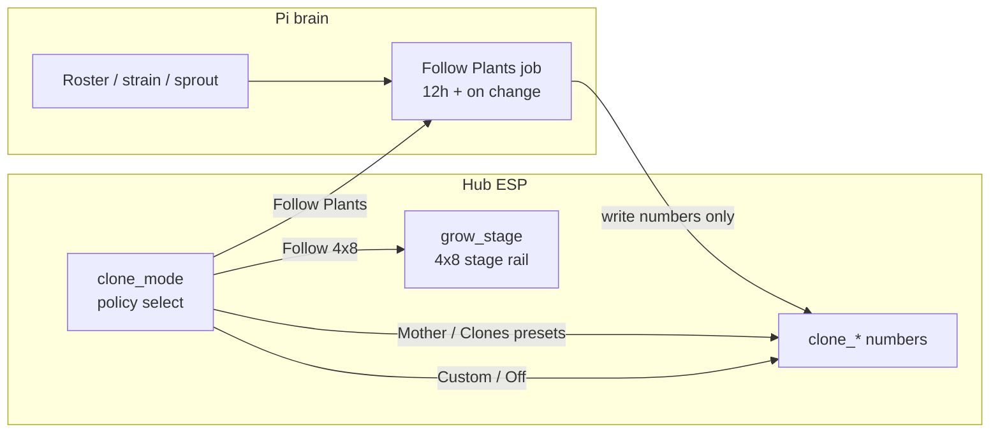

# Climate Mode policy (2×4)

**In one line:** `clone_mode` is a **policy select**, not a second stage engine. Stages and Follow Plants Want live on the Pi / `grow_stage` rail.

Source findings: [`docs/superpowers/plans/2026-08-29-pre-rebuild-interrogate.md`](../superpowers/plans/2026-08-29-pre-rebuild-interrogate.md)  
Verified tip: `906ad71` against `firmware/v4/dsc-hub-v4_0.yaml`, `dsc-hub-espnow-primary.yaml`, `brain/dsc_brain/control_ops.py`.

## Intent

Operators want richer 2×4 Climate Mode (Follow 4x8 · Follow Plants · presets · Custom · Off). Dumping the full growth-stage list onto `select.dsc_hub_clone_mode` creates **two stage engines** and is unsafe. Keep firmware Climate Mode small; let Pi own plant Want intersection.

Firmware already documents this:

> Clone Mode — small select, not a second stage engine.

## Ownership

| Piece | Owner | Notes |
|-------|--------|--------|
| Climate Mode select | Hub ESP | Policy only: Follow 4x8 · Follow Plants · Custom · Off (+ migrate Mother / Clones aliases) |
| Stage presets (4×8) | Hub `grow_stage` + Pi | Full rail stays on main tent |
| Follow Plants @ ~12h | **Pi job** | Intersect assigned 2×4 plants → write `clone_*` numbers only |
| Named presets today | Hub `apply_clone_mode` | Mother / Clones & Seedlings stamp Temp/RH/VPD once |

## Current options (live)

Hub `clone_mode` options today:

- `Follow 4x8` — early return; live main targets (no preset stamp)
- `Clones & Seedlings` — wet-clone preset stamp
- `Mother` — veg-like preset stamp
- `Custom` — sliders untouched
- `Off` — 2×4 inactive; SF1000 darked

Panel wire: vitals `clone_mode_idx` **0–4** (`CMODE_N[]` in `dsc-control-common.yaml`). Expanding options without a **protocol bump + hub/panel co-flash** remaps modes. Never ship hub-only.

## Act-on constraints (do not flash without these)

1. **No full stage list on `clone_mode`.** Stage stamps / Want resolution stay Pi + `grow_stage`.
2. **`apply_clone_mode` else → Clones is a climate fault.** Today unknown option names fall through to idx 1 and stamp wet-clone RH. New names (`Follow Plants`, Germination, …) must be exhaustive; **unknown = no stamp / fail closed**.
3. **Follow Plants is not ESP-native Want.** Roster/strain/sprout are not on the MCU. ESP mode means “targets externally owned” (same early-return pattern as Follow 4x8); Pi writes numbers.
4. **Gate `apply_clone_tent_automation` `grow_stage` writes.** Brain currently maps a seated 2×4 recipe → `clone_mode` **and** writes `select.dsc_hub_grow_stage` (REL-P1-3). Follow Plants without killing that overwrites the **main** tent stage.
5. **`grow_stage` panel clamp is 0–10.** Options are Germination…Custom…**Off** (12 entries, idx 0–11). `clampi(val,0,10)` maps **Off → Custom**. Fix in the same rebuild wave (`0–11`).

## Follow Plants (planned)

- Cadence: ~12h and on roster / sprout / assignment change.
- Output: `number.dsc_hub_clone_*` only (Temp / RH / VPD bands).
- Empty 2×4 plants: hold last Custom / honesty chip — **no ghost veg**.
- Mixed seats: document strictest-band intersection; refuse inverted bands.
- Set `clone_mode` + `clone_photo_select` atomically when entering Follow Plants.

## Verification gates

- Unknown `clone_mode` does **not** stamp Clones.
- Clone automation never writes `grow_stage` once Follow Plants ships.
- Follow Plants writes clone numbers; empty intersection refuses.
- Panel + hub paired flash checklist after protocol bump.

## Related

- [`PROBE-PLANT-MODEL.md`](PROBE-PLANT-MODEL.md) — probe / plant / assignment split
- [`SOFT-CAL.md`](../ops/SOFT-CAL.md) — SoftCal ≠ ESP lab SoT
- [`DECISION_LOOP.md`](DECISION_LOOP.md) — Want vs Got
- Brain: `control_ops.apply_clone_tent_automation`, `stage_model.clone_mode_for_stage`
- FW: `apply_clone_mode` in `dsc-hub-v4_0.yaml`; panel case 20/22 in `dsc-hub-espnow-primary.yaml`
