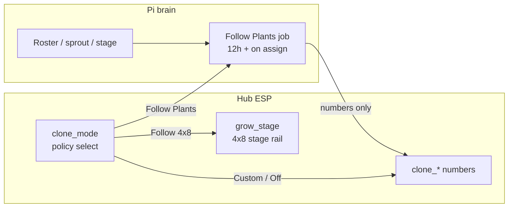

# Climate Mode policy (2×4)

**In one line:** `select.dsc_hub_clone_mode` is a **policy select**, not a second stage engine. Pi owns Follow Plants Want; hub owns Follow 4x8 live resolve + Custom/Off.

Verified tip: `9343be6` / `516a6b3` against `climate_mode.py`, `follow_plants.py`, `control_ops.apply_clone_tent_automation`, `firmware/v4/dsc-hub-v4_0.yaml` (`apply_clone_mode`), panel `dsc-control-common.yaml` (0xD1 v2).

## Intent

Operators need richer 2×4 Climate Mode without dumping the full growth-stage list onto the hub select (that creates two stage engines). Keep firmware Climate Mode small; let Pi intersect plant Want and write `clone_*` numbers.

## Ownership

| Piece | Owner | Notes |
|-------|--------|--------|
| Climate Mode select | Hub ESP | Policy only: Follow 4x8 · Follow Plants · Custom · Off |
| Stage presets (4×8) | Hub `grow_stage` | Full rail stays on main tent — **never** written by clone automation |
| Follow Plants (~12h + assign) | **Pi** | Intersect 2×4 roster plants → write `clone_*` numbers only |
| Custom / Off | Hub | Custom: sliders untouched; Off: 2×4 inactive, SF1000 dark |

## Live options (tip `9343be6`)

| Option | `clone_mode_idx` | ESP | Who writes numbers |
|--------|------------------|-----|--------------------|
| `Follow 4x8` | 0 | Live main stage targets; no preset stamp | Hub stage numbers |
| `Follow Plants` | 1 | No stamp; accept Pi writes (like Custom for sliders) | Pi Follow Plants |
| `Custom` | 2 | Sliders untouched | Operator / Pi |
| `Off` | 3 | 2×4 inactive; SF1000 off | — |

**NVS migrator (boot):** `Clones & Seedlings` / `Clones` → `Follow Plants`; `Mother` → `Custom`.

**Fail-closed:** unknown option → log + **no stamp** (never else→wet-clone presets). Shared idx helper: `climate_mode.clone_mode_idx` returns `None` for unknown.

**Wire:** vitals `0xD1` version byte **`0x02`**. Old panels with 5-option `CMODE_N` remapped modes — **hub + panel co-flash required**. Checklist: [`docs/qa/PANEL-HUB-COFLASH-CHECKLIST.md`](../qa/PANEL-HUB-COFLASH-CHECKLIST.md).

**Grow stage panel clamp:** hub RX case 20 uses `clampi(val,0,11)` so **Off** is selectable (was 0–10 → Off→Custom).

## Follow Plants (shipped)

- Module: `brain/dsc_brain/follow_plants.py` + `follow_plants_job.py` (boot settle 30s, then every **12h**).
- SPA tip: `climateMode.ts` `CLIMATE_MODE_TIP`.
- Collect roster rows with tent = 2×4 and a seated name/strain.
- Per plant: stage from recipe or sprout→`expected_stage`; band from stage rail (Temp ±1.5, RH, VPD).
- **Strictest intersection**; empty or inverted → refuse (`hold_last_custom`); no ghost veg.
- Writes: `number.dsc_hub_clone_{target_temp,rh_*,vpd_*,light_hours}` only — **never** `grow_stage`.
- Photoperiod: all flower → `Follow 4x8`; else `Independent`.
- Skips when takeover on or hub offline.
- Compose path: `apply_clone_tent_automation` maps stage family → Climate Mode (`seedling`/`veg`→Follow Plants, `flower`→Follow 4x8), then calls `apply_follow_plants(force=True)` when Follow Plants — still no `grow_stage` write.

## Operator pitfalls

- Mixing hub/panel firmware after 0xD1 v2 looks like the wrong Climate Mode.
- Follow Plants with empty 2×4 roster holds last Custom numbers — check honesty / logs (`empty or inverted intersection`).
- SoftCal / lab wet are unrelated to Climate Mode — see [`SOFT-CAL.md`](../ops/SOFT-CAL.md).

## Residual (not this tip)

- First-class `assigned_plant_id` (Follow Plants still keys 2×4 via roster tent + plant name/strain).
- Probe entity rename `dsc_potN` → `dsc_probeN`.
- SoftCal push to ESP NVS (one cal plane end-state).

## Related

- Spec: [`../superpowers/specs/2026-08-29-climate-mode-probe-rebuild-design.md`](../superpowers/specs/2026-08-29-climate-mode-probe-rebuild-design.md)
- [`PROBE-PLANT-MODEL.md`](PROBE-PLANT-MODEL.md) · [`SOFT-CAL.md`](../ops/SOFT-CAL.md) · [`DECISION_LOOP.md`](DECISION_LOOP.md)
- Code: `climate_mode.py`, `follow_plants.py`, `control_ops.py`, hub `apply_clone_mode`
