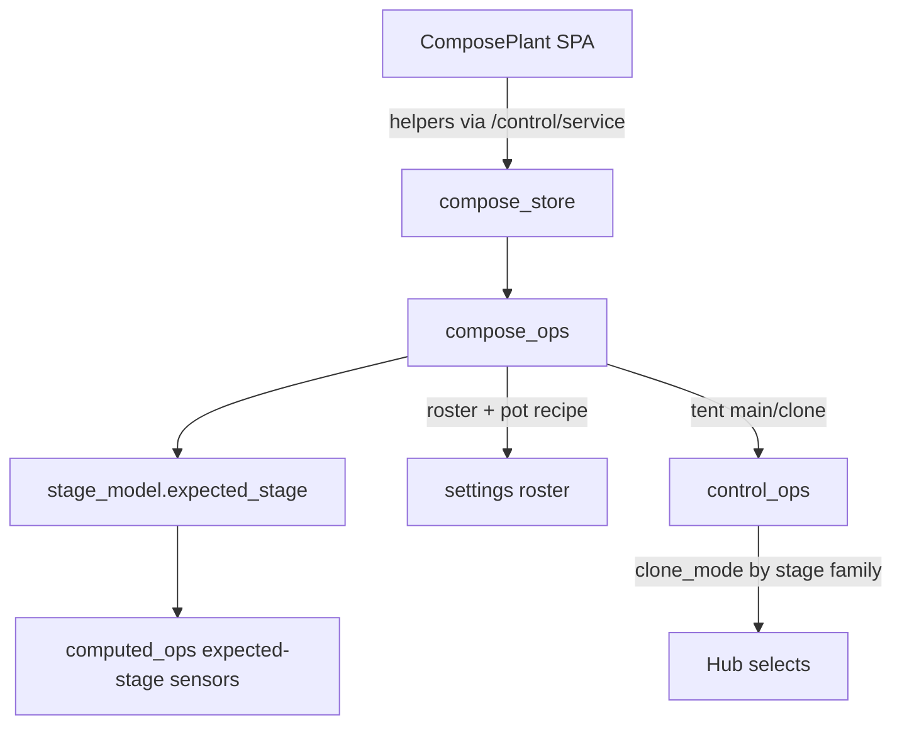

# Compose tent + sprout-derived stage (7.1.2)

**Intent:** On the Pi SPA, Add-as-Plant / Compose must choose a tent and derive grow stage from sprout date so the 2×4 lighting/climate path can follow a real plant. Verified against tip `ab49dd8` (`stage_model.py`, `compose_ops.py`, `control_ops.apply_clone_tent_automation`, `ComposePlant.tsx`).

**Acceptance screens:** [`screens-7.1.2/`](../qa/screens-7.1.2/) · [`LIVE-ACCEPTANCE-7.1.md`](../qa/LIVE-ACCEPTANCE-7.1.md) (#5)  
**HA lab card (legacy):** [`LIVE-UI-BUILD-A-PLANT.md`](../qa/LIVE-UI-BUILD-A-PLANT.md) — reuse labels, not HA helpers as product SoT.

## Architecture



## Tent vocabulary

| UI / roster label | Internal id (hub / pot helpers) |
|---|---|
| `4x8` | `main` |
| `2x4` | `clone` |
| `unassigned` | `unassigned` |

Normalization: `stage_model.tent_id()` accepts either spelling. Compose helper: `input_select.dsc_build_tent` (default `4x8`).

## Sprout → stage

`compose_ops.derived_stage_for(sprout_date, strain_id)`:

1. Parse ISO date (`YYYY-MM-DD`)
2. `days = today - sprout`
3. `expected_stage(days, auto=strain_type_is_auto)` from `stage_model.py`

Photoperiod thresholds (days since sprout) match the retired HA `dsc_potN_expected_stage` pack:

| Days (photo) | Stage label |
|---|---|
| ≤3 | Germination |
| ≤14 | Seedling |
| ≤28 | Early Vegetative |
| ≤42 | Vegetative |
| ≤49 | Late (Push) Vegetative |
| ≤56 | Early Flowering |
| ≤77 | Flowering |
| ≤91 | Late Flowering |
| else | Final 48-72h Flowering |

Autoflower uses a shorter veg/flower ladder in the same module. Empty sprout → no auto chip; commit falls back to family `veg` when stage unknown.

UI chip: **Auto stage · {label} · Day N** (`sensor.dsc_build_expected_stage` / days helper via computed).

## Commit + assign effects

| Action | Behavior |
|---|---|
| Commit | Roster slot gets `tent` label + sprout; growth stage derived |
| Assign pot N | Pot recipe `tent` = internal id; `select.dsc_potN_growth_stage` + `datetime.dsc_potN_sprout_date` set |
| Clone automation | When takeover **off**, `apply_clone_tent_automation` maps stage family → hub `select.dsc_hub_clone_mode` |

Clone mode by family (`CLONE_MODE_BY_FAMILY`):

| Family | Hub `clone_mode` |
|---|---|
| seedling | Clones & Seedlings |
| veg | Mother |
| flower | Follow 4x8 |

Live proof (2026-08-27): pot3 sprout `2026-07-09` → **Late (Push) Vegetative** day 48, tent **2x4**, hub `clone_mode=Mother` with full auto ON / takeover OFF. Reverted after walkthrough.

## Constraints

- Stage is **derived**, not hand-picked on Compose (seat editor may still patch stage explicitly via `update_plant`).
- Do not invent PPFD/height/chem from stage labels.
- HA Build-a-Plant dashboard remains lab/soak; Pi `:8787` Compose is the product path.

## Developer checks

```bash
pytest brain/tests/test_brain_pi.py -q -k stage
# Manual: Compose → tent 2x4 → sprout → confirm Auto stage chip → commit+assign
```
