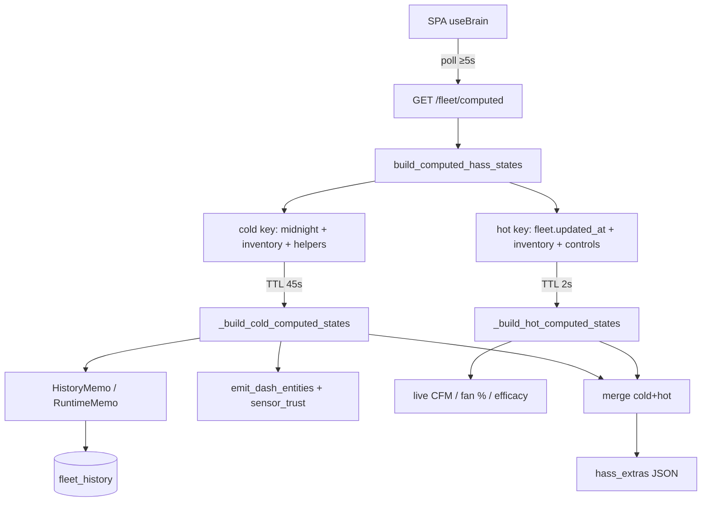

# `/fleet/computed` hot/cold cache

**Intent:** Keep the SPA’s Phase-E extras endpoint fast enough that polling does not starve `/fleet` and the fleet websocket. Verified against tip `86f8c2e` (`computed_ops.py`, `runtime_history.py`, `api.py`, `soak-check.sh`).

**Background:** Cold curls used to take ~6 s; SPA polling every 2 s wedged “Connecting to fleet…”. 7.1.2 ships a **2 s hot** / **45 s cold** split plus history memoization. SPA still uses a **5 s + in-flight** poll guard.

## Architecture



| Cache | TTL | Invalidates when | Contents (examples) |
|---|---|---|---|
| **Cold** | **45 s** | Sydney midnight, helpers change, inventory `in_service` rows | Helpers mirrors, roster/scripts, **runtime hours today**, dash mirrors, **sensor trust** |
| **Hot** | **2 s** | `fleet.updated_at`, controls JSON, inventory | Fan %, CFM curves/nameplate, intake allocated, alert rollups that depend on live levers |

`invalidate_computed_cache()` clears both (tests / forced refresh).

## Runtime history memo

`runtime_history.py`:

- `HistoryMemo` — one `list_history` load per `(seat, metric, since)` per build
- `RuntimeMemo` — integrates **today’s** on-hours from Sydney local midnight (`TZ=Australia/Sydney`)
- Shared across cold + hot within a single `build_computed_hass_states` call so CFM and lights-on do not re-scan SQLite

## API surfaces

| Endpoint | Role |
|---|---|
| `GET /fleet` | Fast seat snapshot; may attach `hass_extras` on some paths |
| `GET /fleet/computed` | **`{"hass_extras": …}`** only — preferred for heavy mirrors |
| SPA | Phase E: read seats from `/fleet`, extras from `/fleet/computed` (no legacy `hass_extras` shim in `useBrain`) |

## Ops soak

`services/dsc-hub/pi/soak-check.sh` curls `/fleet/computed` with a 15 s cap and **alerts if wall time &gt; 3 s**.

```bash
# Studio LAN
curl -sf -o /dev/null -w '%{time_total}\n' --max-time 15 http://dsc-brain.local:8787/fleet/computed
pytest brain/tests/test_brain_pi.py -q -k 'computed or intake_allocated or runtime'
```

## Pitfalls

| Symptom | Fix |
|---|---|
| SPA “Connecting…” / WS starved | Confirm SPA poll ≥5 s + in-flight lock; check soak latency |
| Stale helpers after Settings PATCH | Wait ≤45 s cold TTL, or restart brain / call `invalidate_computed_cache` in tests |
| Runtime hours stuck at 0 | History ingest must be writing duty metrics; TZ must be Sydney |
| CFM honesty “nameplate” | Need ≥2 calibration points per duct — Calibrate wizard, not cache bug |
