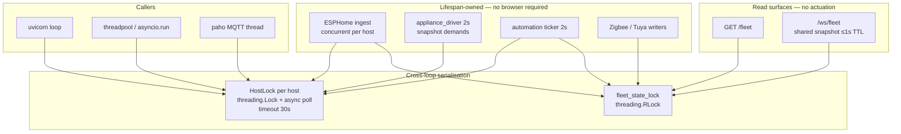

# Brain concurrency — HostLock, fleet lock, independent tickers

**In one line:** Device sessions, fleet mutation, and rule evaluation must not depend on which client or thread happens to be running.

Tip that shipped the shape: [`88a4faa`](https://github.com/weddas/DSC-HUB/commit/88a4faa6a94d2e7564decfe44cf0956e63f026b9). Notion: [Pi offline brain](https://app.notion.com/p/3b52b4cda370818e8b66f671689f7a57).

## Why this exists

Six 8.1.0 findings shared one shape: actuation and Native API sessions were coupled to whichever loop or browser was alive.

| Failure | Symptom |
|---|---|
| `asyncio.Lock` shared across loops | Zigbee / tank safety cut-out hangs forever while the appliance driver holds the Sonoff |
| Rules only inside `GET /fleet` + `/ws/fleet` | Closed browser → cut-outs never evaluate |
| Per-socket rule eval + full snapshot | N dashboards → N engine passes; reads side-effect writes |
| Sequential ESPHome poll (~30 s) | Hub half of the published snapshot ~25 s old |
| Unlocked `FleetState` singleton | Zigbee/Tuya/banner writes rolled back by ingest publish |
| Second hub Native API every 2 s | Contends with 5–8 s ingest → 50–70 s brain→hub RTT |
| Entity-key discovery outside `host_lock` | Session races with every other hub/Sonoff caller |

## Architecture

## HostLock (`api_lock.py`)

- One `HostLock` per ESPHome host (registry under a process-wide `threading.Lock`).
- Async context manager polls `threading.Lock.acquire(blocking=False)` every 20 ms with a **30 s** deadline → `TimeoutError` instead of an infinite hang.
- Usable from the uvicorn loop, FastAPI threadpool (`asyncio.run` for `/control/service`), and the paho MQTT thread (Zigbee cut-out via `force_set_sonoff_relay_sync`).
- Do **not** nest `host_lock` for the same host on one task. Callers that discover entity keys under the lock then command under the lock again must not hold both.

**Never:** reintroduce `asyncio.Lock` for device sessions. A waiter queued on a lock owned by another loop is never woken.

Tests: `brain/tests/test_api_lock_cross_loop.py`.

## FleetState (`fleet_state.py`)

Writers: ESPHome ingest (uvicorn), Zigbee (paho), Tuya lane, automation banners.

- Every read-modify-write holds `fleet_state_lock()` (`threading.RLock`).
- `update_fleet_state` always takes the lock for the singleton swap.
- On ingest publish: start `system` from the **latest** live dict; overlay only keys this poll reassigned. Otherwise Zigbee/Tuya/banner mutations made during the multi-second poll are silently rolled back.

## ESPHome ingest (`esphome_client.py`)

- Plan seats, then `asyncio.gather` fetches (different hosts → different HostLocks).
- Sleep ~5 s between full passes (not ~30 s of sequential sessions).
- OOS Sonoffs still get a read-only poll so a physically-ON relay is visible to the failsafe.

## Appliance driver (`appliance_driver.py`)

- Demand switches come from the ingest snapshot: `hub.values["controls"]` via `HUB_SWITCH_OID_TO_ENTITY` — **no second Native API session** to the hub every 2 s.
- Freshness: hub seat `last_seen` vs `STALE_SEC` (45 s). Stale / dark → failsafe OFF with `force=True` (OOS seats included).
- Only discovered demand object_ids are mirrored (undiscovered aliases must not report False and overwrite a real ON — heatmat chatter).

Tests: `brain/tests/test_appliance_demands_from_snapshot.py`.

## Automation ticker (`automation_rules.py`)

- `start_automation_ticker()` from API lifespan (every mode, including demo — demo still refuses writes at the control proxy).
- Cadence: `RULE_TICK_S = 2.0`.
- `GET /fleet` and `/ws/fleet` **must not** call `evaluate_automation_rules` — a read must not actuate; a closed browser must not silence cut-outs.

## WebSocket fleet (`api.py`)

- Push every `_WS_PUSH_S` (2 s).
- Payload built at most once per `_WS_SNAPSHOT_TTL_S` (1 s) and shared across connections.

## Operational pitfalls

1. **Safety cut-out “hung”** — check logs for `ESPHome host '…' busy for 30s`. A wedged session times out the next waiter; investigate who held the host (ingest vs control vs cut-out), do not add a second hub session.
2. **Rules “only work with the SPA open”** — means the ticker is not running (lifespan never started, or an old image). Confirm process start logs: `automation rule engine ticking every 2s`.
3. **Stale hub half of `/fleet`** — sequential ingest regression; verify concurrent gather still present.
4. **Zigbee role row vanished after a poll** — ingest publish must merge from latest `system`, not the poll-start copy.
5. **50–70 s control latency** — almost always two hub Native API sessions contending; demand must stay snapshot-fed.

## Related

- Appliance path (superseded ETH01): [F010_APPLIANCE_BRIDGE.md](F010_APPLIANCE_BRIDGE.md)
- Decision loop / shadow demand proposals: [DECISION_LOOP.md](DECISION_LOOP.md) · [../DSC-BRAIN.md](../DSC-BRAIN.md)
- Zigbee recovery ops: [../ops/ZIGBEE-RECOVERY.md](../ops/ZIGBEE-RECOVERY.md)
