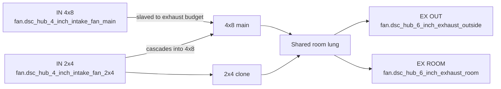
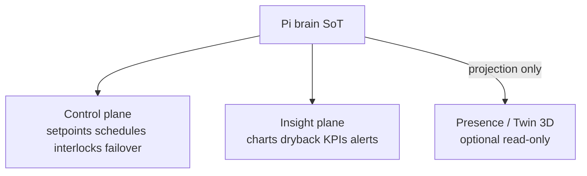
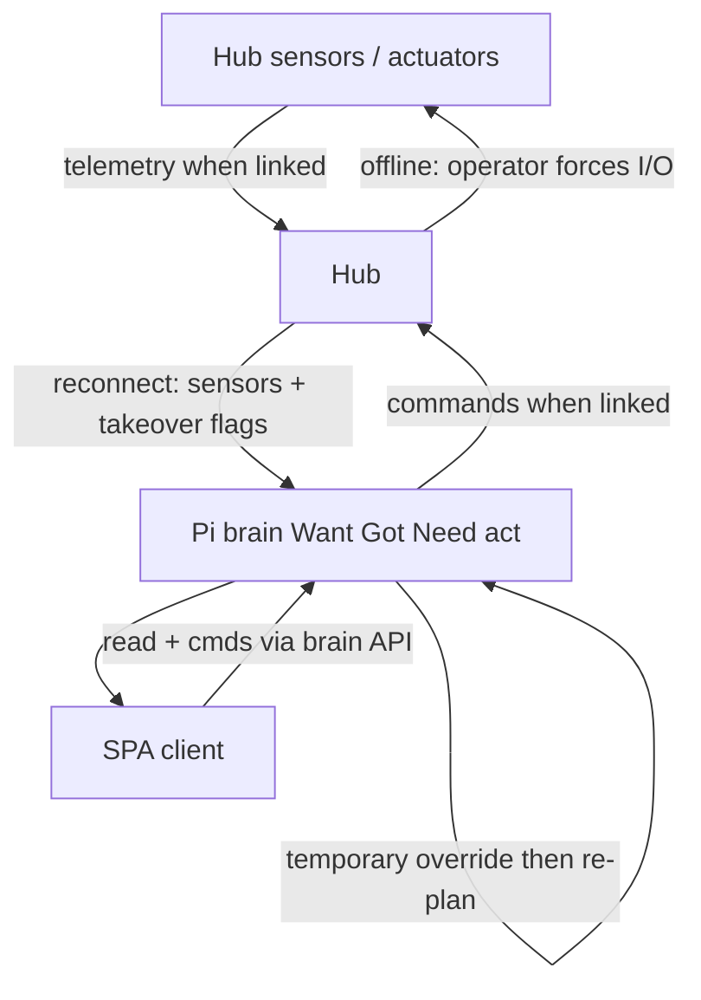
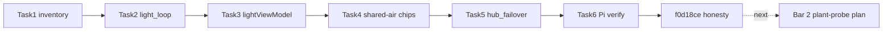
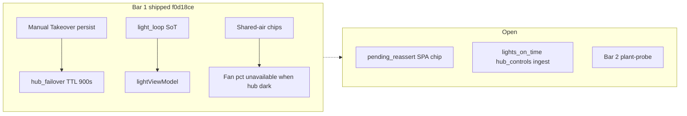

# Brain control recovery (parity + hub failover)

**In one line:** Restore HA-era control coherence on the Pi brain, keep the SPA as an honest client, and treat the hub as failover actuator — not a rival brain. Physical SoT: **two tents, one shared air plant**. Premium bar: **truth + closed-loop + local failover**; Twin/3D is SoT projection only.

**Status:** Design locked (`acae659` → topology `3e5af0c` → peers `f25c762` → premium `653808d`); Bar 1 plan `f3f7b10`; **Bar 1 runtime shipped and Pi-verified** through tip `f0d18ce` (Tasks 1–6 + honesty fixes). This page maps locked decisions to **verified shipped code**.

| Artifact | Role |
|---|---|
| [Design spec](../superpowers/specs/2026-08-29-brain-control-recovery-design.md) | Locked SoT, topology §0, peers §Premium, bars, acceptance, sequencing |
| [Bar 1 plan](../superpowers/plans/2026-08-29-brain-control-recovery-bar1.md) | Task checklist executed on `feat/brain-control-recovery-bar1` |
| [HA vs brain inventory](../superpowers/research/2026-08-29-ha-vs-brain-control-inventory.md) | Task 1 gap list (pre-port; some rows superseded by emit) |
| [Task 6 report](../../.superpowers/sdd/task-6-report.md) | Pi hot-patch + screenshot evidence |
| This page | Shipped code map + developer pitfalls |
| [DECISION_LOOP.md](DECISION_LOOP.md) | Want→Got→Need→propose tick (+ failover hold/re-assert) |
| Notion | [Pi offline brain](https://app.notion.com/p/3b52b4cda370818e8b66f671689f7a57) · [Local webserver UI](https://app.notion.com/p/3b52b4cda37081c19048e794d4bdf819) · [Product layers](https://app.notion.com/p/3b52b4cda37081c2bcafc85d3407556c) |

## Locked decisions (summary)

| Decision | Meaning |
|---|---|
| Control SoT | **Pi brain** — faithful Want→Got→Need→act port of HA packages, then advance |
| Approach | **Restore-then-advance** — no dual-run third story (HA + brain + SPA math) |
| Physical topology | **4x8 + 2x4 share intake/exhaust** — one HVAC skeleton; not two isolated OGB rooms |
| Hub online | Sensors/actuators; obeys brain |
| Hub offline | Operator **manual takeover** (force devices) |
| Reconnect | Hub snapshot + takeover flags → brain **temporary override** → re-plan → re-assert |
| Override expiry | TTL **900s** **or** clear of `switch.dsc_hub_manual_takeover` — both clear the temporary override; TTL under takeover clears the binary and keeps sticky `pending_reassert` until clear |
| Bar 1 | HA-era parity on Light/Climate/Overview **plus** hub failover — **shipped** tip `f0d18ce` |
| Bar 2 | Plant ↔ probe assign / move / **detach** (separate plan) |
| Later | Advanced brain / AI — not before bars 1–2 |
| OGB role | **Behavior bar** (“UI matches the room”), not a multi-room product model |
| Premium split | Control / insight / presence planes; **3D never owns control** |

## Physical topology (hard constraint)

DSC is **two grow volumes on one air plant** (design §0; firmware fan topology):

- **4x8 (main)** and **2x4 (clone)** each have climate sensors, lights, and plant/probe seats.
- They **share** ducting, **exhaust** (OUT + ROOM/recirc), and **intake** (main + 2x4 intakes slave to total exhaust; 2x4 intake cascades into 4x8).
- Climate Want/Need is a **coupled** problem — `Follow 4x8` / `Follow Plants` exist because air is shared.
- Fan duties (IN 4x8 / IN 2x4 / EX ROOM / EX OUT) are labels on **one** shared plant.
- Light can still differ per tent (e.g. SF1000 Follow 4x8 photoperiod) while air remains shared.

**Verified (not invented):**

| Piece | Where |
|---|---|
| Two-tent vocabulary | `stage_model.TENT_*` — UI `4x8`/`2x4`, hub `main`/`clone` |
| Climate Mode options | `climate_mode.CLIMATE_MODE_OPTIONS` — Follow 4x8 · Follow Plants · Custom · Off |
| Stage→clone mode policy | `CLONE_MODE_BY_FAMILY` — seedling/veg → Follow Plants; flower → Follow 4x8 |
| Clone automation writes mode | `control_ops.apply_clone_tent_automation` → `select.dsc_hub_clone_mode` |
| Shared fan OIDs | `hub_controls` intake main/clone + exhaust out/recirc |
| Hub curve comment | intakes slave to total exhaust; OUT vs ROOM blend is the damper |

## Peer + premium lessons (design §Peers / §Premium)

Open/hobby peers set the **behavior bar**. Paid stacks sell **outcomes operators bet a crop on** — not wallpaper charts.

| Lesson | DSC implication (bar 1) |
|---|---|
| **One SoT per loop** | Light ON/%/hours/schedule = `light_loop` + SPA `lightViewModel`; Overview cites same entities |
| **Photoperiod = grow-day** | Follow 4x8 inherits that day — no “NO SCHEDULE” when main on-time is set |
| **Manual override first-class** | Hub takeover + reconnect temporary override + re-assert |
| **Consolidated trust** | HubLink override chip + Climate/Overview takeover banners |
| **Topology beats templates** | Shared-duct 4x8+2x4 — never two HVAC islands |
| **3D never owns control** | Twin / Overview chrome = projection of brain SoT, or gated/blank |

### Industrial layers (premium split)

**Verified SPA posture:** Twin route is `demoted: true` (`routes.ts`); `LiveTwinPage` stays gated until WebGL is honest.

## Target control flow (shipped)

## Bar 1 plan → code map (tip `f0d18ce`)

Plan: [`2026-08-29-brain-control-recovery-bar1.md`](../superpowers/plans/2026-08-29-brain-control-recovery-bar1.md). Evidence: [task-6-report](../../.superpowers/sdd/task-6-report.md) · screenshots `docs/qa-screenshots-2026-08-29/bar1-*.png` · FOLLOWUPS Bar 1 sections.

| Plan task | Target paths | Status on tip `f0d18ce` |
|---|---|---|
| **1** HA vs brain inventory | `docs/superpowers/research/2026-08-29-ha-vs-brain-control-inventory.md` | **Shipped** (`77c23f6`) — historical gap list; treat as pre-port snapshot |
| **2** `light_loop` SoT | `light_loop.py` + `test_light_loop.py` → `computed_ops.emit_light_loop` | **Shipped** (`5ee1b8b`) — Follow 4x8 + SF honesty; want/got/deviation overwrite dash emit |
| **3** SPA `lightViewModel` | `lightViewModel.ts` → Light / TentLightClock / Overview SF | **Shipped** (`bbc9d14`) — single desk model + `headerSfLabel` |
| **4** Shared-air honesty | Climate + `DashHomeSections` demand/fan chips + takeover banners | **Shipped** (`2afa4cc`) — RUNNING/fans cite demand SoT; Overview override banner |
| **5** `hub_failover` | `hub_failover.py` + `esphome_client` reconnect + `decision_loop` / `computed_ops` | **Shipped** (`bb8bfce` → sticky `b3c1716`) — TTL **900s**; emit `binary_sensor.dsc_brain_hub_override_active` |
| **6** Pi verify | Screenshots + FOLLOWUPS + skill | **Shipped** (`dadd8b8`/`7812f54`) after takeover persist (`768cc47`) |
| Honesty pass | Fan % `available=False` when hub dark; stage-aware re-assert | **Shipped** (`f0d18ce`) |

### What exists today (verified on tip `f0d18ce`)

| Piece | Where | Behavior |
|---|---|---|
| Manual Takeover switch | Hub YAML → `ha_takeover_active` | Suspends fan curve / ladder / photoperiods; operator drives outputs. Entity: `switch.dsc_hub_manual_takeover` |
| Takeover persist into computed | `control_ops` `set_helper` + `computed_ops` helper-wins overlay | SPA banner / failover see computed `on`/`off` matching control write (`768cc47`) |
| Photoperiod SoT | `light_loop.build_light_loop` → `emit_light_loop` | Emits expected/got/deviation + honesty attrs; Follow inherits main want hours; missing main on-time → invalid schedule |
| SPA light desk | `lightViewModel.buildCloneLightDesk` | Light page + Overview SF + TentLightClock share one model |
| Shared-air chips | `DashHomeSections` RUNNING + Climate demand toggles | Same `switch.dsc_hub_*_demand` entities |
| Reconnect ingest | `esphome_client` → `on_hub_reconnect` | Offline→online + takeover → temporary override snapshot |
| Failover policy | `hub_failover.evaluate_failover` | TTL 900s under takeover → clear binary + sticky `pending_reassert`; clear takeover → `force_reassert` |
| Override SPA chrome | `binary_sensor.dsc_brain_hub_override_active` + `HubLinkLine` / Overview banner | Active override visible; **pending_reassert chip still next-plan** (FOLLOWUPS) |
| Re-assert tick | `computed_ops` on `force_reassert` → `decision_tick(emit=True)` | Stage from grow_stage / roster (`_resolve_hub_tick_stage`); failures logged + grow-log |
| Fan % honesty | hot computed `FAN_PCT_ENTITIES` | When `!hub_live`, state `None` + `available=False` — no theater 0% |
| Twin demotion | `routes.ts` + `LiveTwinPage` | Presence plane gated |
| Pi verify skill | `.cursor/skills/dsc-spa-pi-verify/SKILL.md` | Hot-patch + screenshot checklist |

### Residual gaps (do not claim closed)

| Gap | Notes |
|---|---|
| SPA chip for `pending_reassert` | Sticky bit on override attrs; SPA only shows active override today |
| `lights_on_time` ingest into `hub_controls` | Follow stays invalid until hub datetime lands on helper/control bus (operator can set via datetime service — verified in Task 6) |
| Dual dash→light_loop emit | `emit_dash_entities` still sets expected hours; `emit_light_loop` overwrites (harmless redundancy) |
| 2×4 Got window vs lamp delivered-hours | Got 2×4 may still use `window_2x4_open` when delivered-hours absent |
| Bar 2 detach lifecycle | Deferred — write plant-probe plan after operators need assign/move/detach |

## Developer pitfalls

1. **Do not invent a third Got story** — Overview / Light hours / ON% must come from `light_loop` / demand entities (or show explicit empty/override).
2. **Do not model two independent HVAC rooms** — OGB is a behavior bar only. Fan row = one shared plant.
3. **Do not dual-run HA packages as equal controllers** — HA is optional/legacy read-through at most.
4. **Manual Takeover ≠ temporary override** — takeover is the operator switch; override is the reconnect hold (`binary_sensor.dsc_brain_hub_override_active`) with TTL / sticky pending.
5. **Do not claim theater fan % when hub dark** — publish `available=False`, not `0.0`.
6. **Cosmetic Twin polish is out of bar 1** — Twin stays gated until it projects brain SoT.
7. **Do not invent height / chem / PPFD / NPK theater** — prefer honest “no channel.”
8. **Override expiry is locked** — TTL **900s** or clear of Manual Takeover; sticky `pending_reassert` until clear when TTL fires under takeover.

## Acceptance pointers (bar 1 — verified)

See design §4, plan Task 6, and [task-6-report](../../.superpowers/sdd/task-6-report.md). Short checklist:

1. Light: no Follow 4x8 + “NO SCHEDULE” when `time.dsc_hub_lights_on_time` is set; SF / Got / Want / Deviation from sensors.  
2. Overview RUNNING / fans / MAT / SF1000 agree with Climate/Light for the same tick.  
3. Shared-duct Climate Mode stories (Follow 4x8 / Follow Plants), not solo room loops.  
4. Takeover on→off persists into `/fleet/computed`; reconnect override + re-assert path wired (TTL 900s or clear).  
5. Hub dark → fan % sensors unavailable (not fake zeros).  
6. Twin/3D never invents a competing commander.

## Related codepaths

| Path | Role |
|---|---|
| `firmware/v4/dsc-hub-v4_0.yaml` | `ha_takeover_active`, fan topology, Full Auto arm |
| `brain/dsc_brain/light_loop.py` | Photoperiod SoT snapshot + emit |
| `brain/dsc_brain/hub_failover.py` | Reconnect override + TTL / sticky pending |
| `brain/dsc_brain/computed_ops.py` | Emit light_loop + failover + fan % honesty + re-assert tick |
| `brain/dsc_brain/esphome_client.py` | Offline→online `on_hub_reconnect` |
| `brain/dsc_brain/decision_loop.py` | Hold emit under override; force re-assert |
| `brain/dsc_brain/control_ops.py` | Takeover helper persist; Climate Mode gates |
| `brain/dsc_brain/climate_mode.py` / `stage_model.py` | Climate Mode + tent vocabulary |
| `frontend/.../lib/lightViewModel.ts` | Single Light + Overview SF story |
| `frontend/.../components/DashHomeSections.tsx` | Shared demand chips + takeover/override banners |
| `frontend/.../components/HubLinkLine.tsx` | Override-active chip |
| `frontend/.../pages/ClimatePage.tsx` | Manual Takeover + demand toggles |
| `docs/superpowers/specs/2026-08-29-brain-control-recovery-design.md` | Locked design |
| `docs/superpowers/plans/2026-08-29-brain-control-recovery-bar1.md` | Bar 1 plan |
| `.superpowers/sdd/task-6-report.md` | Pi verify evidence |
| `.cursor/skills/dsc-spa-pi-verify/SKILL.md` | Pi hot-patch + screenshot verify |
