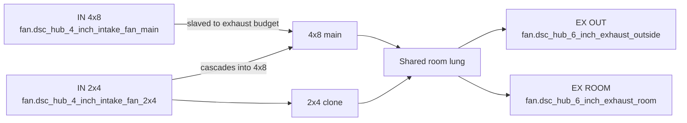
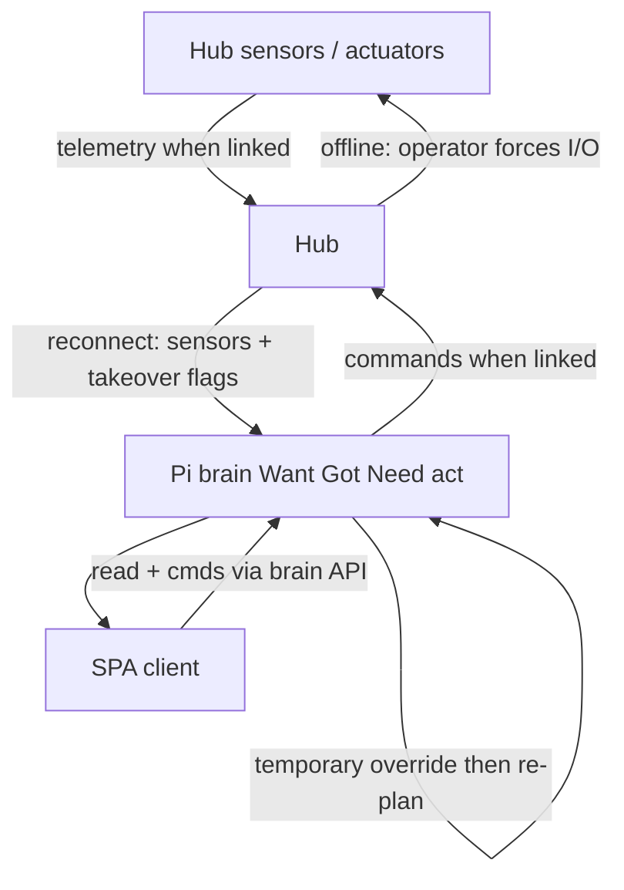
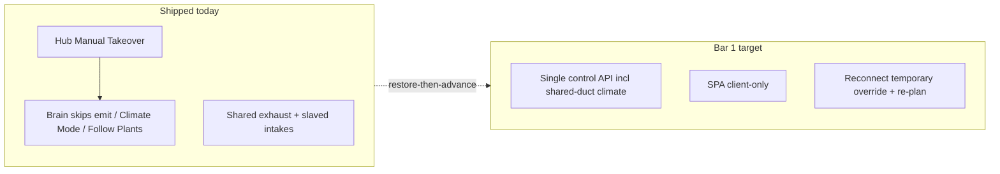

# Brain control recovery (parity + hub failover)

**In one line:** Restore HA-era control coherence on the Pi brain, keep the SPA as an honest client, and treat the hub as failover actuator — not a rival brain. Physical SoT: **two tents, one shared air plant**.

**Status:** Design locked (`acae659` + topology `3e5af0c`); **not yet implemented** as bar 1. This page maps locked decisions to **verified current code** so engineers do not confuse intent with shipped behavior.

| Artifact | Role |
|---|---|
| [Design spec](../superpowers/specs/2026-08-29-brain-control-recovery-design.md) | Locked SoT, topology §0, bars, acceptance, sequencing |
| This page | Current code vs target + developer pitfalls |
| [DECISION_LOOP.md](DECISION_LOOP.md) | Want→Got→Need→propose tick |
| Notion | [Pi offline brain](https://app.notion.com/p/3b52b4cda370818e8b66f671689f7a57) · [Product layers](https://app.notion.com/p/3b52b4cda37081c2bcafc85d3407556c) |

## Locked decisions (summary)

| Decision | Meaning |
|---|---|
| Control SoT | **Pi brain** — faithful Want→Got→Need→act port of HA packages, then advance |
| Approach | **Restore-then-advance** — no dual-run third story (HA + brain + SPA math) |
| Physical topology | **4x8 + 2x4 share intake/exhaust** — one HVAC skeleton; not two isolated OGB rooms |
| Hub online | Sensors/actuators; obeys brain |
| Hub offline | Operator **manual takeover** (force devices) |
| Reconnect | Hub snapshot + takeover flags → brain **temporary override** → re-plan → re-assert |
| Bar 1 | HA-era parity on control loops **plus** hub failover protocol |
| Bar 2 | Plant ↔ probe assign / move / **detach** |
| Later | Advanced brain / AI — not before bars 1–2 |
| OGB role | **Behavior bar** (“UI matches the room”), not a multi-room product model |

## Physical topology (hard constraint)

DSC is **two grow volumes on one air plant** (design §0; firmware fan topology):

- **4x8 (main)** and **2x4 (clone)** each have climate sensors, lights, and plant/probe seats.
- They **share** ducting, **exhaust** (OUT + ROOM/recirc), and **intake** (main + 2x4 intakes slave to total exhaust; 2x4 intake cascades into 4x8).
- Climate Want/Need is a **coupled** problem — `Follow 4x8` / `Follow Plants` exist because air is shared.
- Fan duties (IN 4x8 / IN 2x4 / EX ROOM / EX OUT) are labels on **one** shared plant.
- Light can still differ per tent (e.g. SF1000 Follow 4x8 photoperiod) while air remains shared.

**Verified today (not invented):**

| Piece | Where |
|---|---|
| Two-tent vocabulary | `stage_model.TENT_*` — UI `4x8`/`2x4`, hub `main`/`clone` |
| Climate Mode options | `climate_mode.CLIMATE_MODE_OPTIONS` — Follow 4x8 · Follow Plants · Custom · Off |
| Stage→clone mode policy | `CLONE_MODE_BY_FAMILY` — seedling/veg → Follow Plants; flower → Follow 4x8 |
| Clone automation writes mode | `control_ops.apply_clone_tent_automation` → `select.dsc_hub_clone_mode` |
| Shared fan OIDs | `hub_controls` intake main/clone + exhaust out/recirc |
| Hub curve comment | intakes slave to total exhaust; OUT vs ROOM blend is the damper |

## Target control flow

## Current code (verified on tip `3e5af0c`)

### What exists today

| Piece | Where | Behavior |
|---|---|---|
| Manual Takeover switch | Hub YAML `manual_takeover_switch` → `ha_takeover_active` | Suspends fan curve, ladder, photoperiods; operator drives outputs. Emergency >35 °C + sensor watchdog still override. Entity: `switch.dsc_hub_manual_takeover` |
| Brain maps the switch | `brain/dsc_brain/hub_controls.py` | OID alias `manual_takeover` |
| Decision tick respects takeover | `decision_loop.decision_tick` | If `manual_takeover=True`, advisories only — **no emit** |
| Climate / Follow Plants gates | `control_ops.py`, `follow_plants.py` | Skip apply when takeover `on` or hub offline (`reason`: `takeover on` / `hub offline`) |
| SPA / API | `api.py` `/decision/tick` | Accepts `manual_takeover` flag on the tick body |
| Shared-air Climate Mode | `climate_mode.py` + hub fan curve | Policy select + coupled intakes/exhaust — **not** dual isolated room controllers |

### What the design still requires (not in code)

| Gap | Notes |
|---|---|
| Single control API for HA-era loops | Light schedule, climate demand, photoperiod Follow, **shared-duct / Follow 4x8 climate**, roster→Want — inventory vs brain emitters not closed |
| SPA binds Live pages to that one SoT | Light/Climate/Overview still risk contradictory ON/%/hours/schedule stories |
| Reconnect **temporary override** | No brain record of takeover-on-reconnect, expiry policy, or explicit SPA override chrome |
| Re-assert after override | Hub restores Full Auto on boot unless Takeover ON; brain does not yet re-plan/re-assert as a contract |
| Bar 2 detach lifecycle | Partial roster refresh exists in places; full detach/reassign without hard reload is bar 2 |

## Developer pitfalls

1. **Do not invent a third Got story** — Overview / Light hours / ON% must come from the same photoperiod / demand engine the brain uses (or show explicit empty/override). Forbidden anti-pattern is called out in the design §3.
2. **Do not model two independent HVAC rooms** — OGB is a behavior bar only. UI must not imply disconnected room controllers; fan row = one shared plant.
3. **Do not dual-run HA packages as equal controllers** while porting — HA is optional/legacy read-through at most; product SoT is brain.
4. **Manual Takeover ≠ bar 1 failover** — the switch already exists; the reconnect override + re-plan contract does not.
5. **Cosmetic SPA passes are out of bar 1** — polish without SoT fix is explicitly rejected by the design.
6. **Override expiry** (timeout vs explicit clear vs both) is an open plan point — do not hard-code a policy in docs or UI until the implementation plan locks it.

## Acceptance pointers (bar 1)

See design §4. Short checklist for implementers:

1. Light page: no contradictory ON/%/schedule/hours on one load.  
2. Overview RUNNING / fans / MAT / SF1000 agree with Climate/Light for the same tick; fan row reads as one shared plant.  
3. 2x4 Climate Mode stories match shared-duct policy (Follow 4x8 / Follow Plants), not solo room loops.  
4. Hub link drop → force devices; reconnect → brain logs override and re-asserts; SPA shows that story.  
5. Spot-check against HA-era package notes for demand + photoperiod + shared-duct Follow.  
6. OGB bar: grower can trust Light / Climate / Overview against the room — without assuming N independent rooms.

## Related codepaths

| Path | Role |
|---|---|
| `firmware/v4/dsc-hub-v4_0.yaml` | `ha_takeover_active`, fan topology (intakes slave to exhaust), Full Auto arm |
| `brain/dsc_brain/climate_mode.py` | Climate Mode taxonomy |
| `brain/dsc_brain/stage_model.py` | Tent vocabulary + `CLONE_MODE_BY_FAMILY` |
| `brain/dsc_brain/decision_loop.py` | Takeover blocks emit |
| `brain/dsc_brain/control_ops.py` | Climate Mode apply gates |
| `brain/dsc_brain/follow_plants.py` | Follow Plants apply gates |
| `brain/dsc_brain/hub_controls.py` | Entity OID map (fans + takeover) |
| `docs/superpowers/specs/2026-08-29-brain-control-recovery-design.md` | Locked design |
