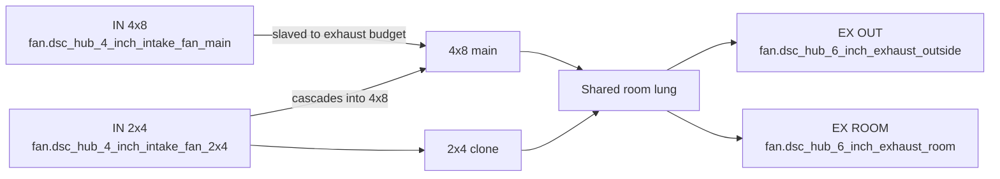
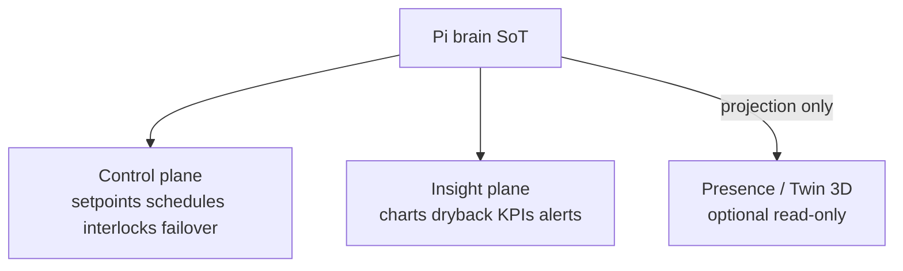
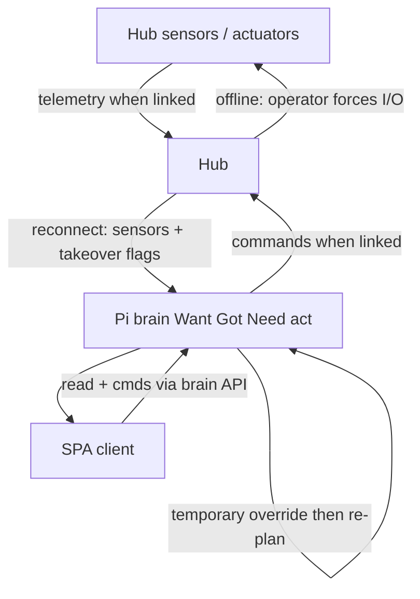
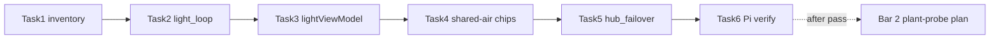
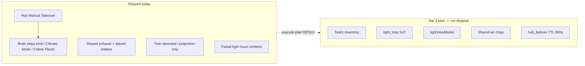

# Brain control recovery (parity + hub failover)

**In one line:** Restore HA-era control coherence on the Pi brain, keep the SPA as an honest client, and treat the hub as failover actuator — not a rival brain. Physical SoT: **two tents, one shared air plant**. Premium bar: **truth + closed-loop + local failover**; Twin/3D is SoT projection only.

**Status:** Design locked (`acae659` → topology `3e5af0c` → peers `f25c762` → premium `653808d`); **Bar 1 implementation plan written** (`f3f7b10`) — **runtime still not shipped**. This page maps locked decisions + the plan’s task map to **verified current code** so engineers do not confuse intent with shipped behavior.

| Artifact | Role |
|---|---|
| [Design spec](../superpowers/specs/2026-08-29-brain-control-recovery-design.md) | Locked SoT, topology §0, peers §Premium, bars, acceptance, sequencing |
| [Bar 1 plan](../superpowers/plans/2026-08-29-brain-control-recovery-bar1.md) | Task checklist: inventory → `light_loop` → SPA view-model → shared-air chips → `hub_failover` → Pi verify |
| This page | Current code vs target + developer pitfalls |
| [DECISION_LOOP.md](DECISION_LOOP.md) | Want→Got→Need→propose tick |
| Notion | [Pi offline brain](https://app.notion.com/p/3b52b4cda370818e8b66f671689f7a57) · [Local webserver UI](https://app.notion.com/p/3b52b4cda37081c19048e794d4bdf819) · [Product layers](https://app.notion.com/p/3b52b4cda37081c2bcafc85d3407556c) |

## Locked decisions (summary)

| Decision | Meaning |
|---|---|
| Control SoT | **Pi brain** — faithful Want→Got→Need→act port of HA packages, then advance |
| Approach | **Restore-then-advance** — no dual-run third story (HA + brain + SPA math) |
| Physical topology | **4x8 + 2x4 share intake/exhaust** — one HVAC skeleton; not two isolated OGB rooms |
| Hub online | Sensors/actuators; obeys brain |
| Hub offline | Operator **manual takeover** (force devices) |
| Reconnect | Hub snapshot + takeover flags → brain **temporary override** → re-plan → re-assert |
| Override expiry (plan lock) | TTL **900s** **or** clear of `switch.dsc_hub_manual_takeover` — both clear the temporary override |
| Bar 1 | HA-era parity on control loops **plus** hub failover protocol |
| Bar 2 | Plant ↔ probe assign / move / **detach** (separate plan after Bar 1 Task 6) |
| Later | Advanced brain / AI — not before bars 1–2 |
| OGB role | **Behavior bar** (“UI matches the room”), not a multi-room product model |
| Premium split | Control / insight / presence planes; **3D never owns control** |

## Physical topology (hard constraint)

DSC is **two grow volumes on one air plant** (design §0; firmware fan topology):

- **4x8 (main)** and **2x4 (clone)** each have climate sensors, lights, and plant/probe seats.
- They **share** ducting, **exhaust** (OUT + ROOM/recirc), and **intake** (main + 2x4 intakes slave to total exhaust; 2x4 intake cascades into 4x8).
- Climate Want/Need is a **coupled** problem — `Follow 4x8` / `Follow Plants` exist because air is shared.
- Fan duties (IN 4x8 / IN 2x4 / EX ROOM / EX OUT) are labels on **one** shared plant.
- Light can still differ per tent (e.g. SF1000 Follow 4x8 photoperiod) while air remains shared.

**Verified today (not invented):**

| Piece | Where |
|---|---|
| Two-tent vocabulary | `stage_model.TENT_*` — UI `4x8`/`2x4`, hub `main`/`clone` |
| Climate Mode options | `climate_mode.CLIMATE_MODE_OPTIONS` — Follow 4x8 · Follow Plants · Custom · Off |
| Stage→clone mode policy | `CLONE_MODE_BY_FAMILY` — seedling/veg → Follow Plants; flower → Follow 4x8 |
| Clone automation writes mode | `control_ops.apply_clone_tent_automation` → `select.dsc_hub_clone_mode` |
| Shared fan OIDs | `hub_controls` intake main/clone + exhaust out/recirc |
| Hub curve comment | intakes slave to total exhaust; OUT vs ROOM blend is the damper |

## Peer + premium lessons (design §Peers / §Premium)

Open/hobby peers (OGB, HAGR, Mycodo, Irrigation-Strategy, GroLab, farmOS) set the **behavior bar**. Paid stacks (AROYA, Growlink, TrolMaster, Pulse, TSRgrow) sell **outcomes operators bet a crop on** — not wallpaper charts.

| Lesson | DSC implication (bar 1) |
|---|---|
| **One SoT per loop** | Light ON/%/hours/schedule = one photoperiod engine; Overview chips cite the same entities |
| **Photoperiod = grow-day** | Follow 4x8 inherits that day — not a sticker while “NO SCHEDULE” |
| **Manual override first-class** | Hub takeover + brain re-plan; never silent fight |
| **Consolidated trust** | One honest alert story over contradictory status pills |
| **Topology beats templates** | Shared-duct 4x8+2x4 — never two HVAC islands |
| **3D never owns control** | Twin / Overview chrome = projection of brain SoT, or gated/blank |

### Industrial layers (premium split)

**Verified SPA posture today:** Twin route is `demoted: true` (`routes.ts`); `LiveTwinPage` states it is gated until the WebGL canvas is honest — prefer Climate air path. That matches “presence plane stays gated until it can cite the same entities as the actuator.”

## Target control flow

## Bar 1 plan → code map (tip `f3f7b10`)

Plan file: [`2026-08-29-brain-control-recovery-bar1.md`](../superpowers/plans/2026-08-29-brain-control-recovery-bar1.md). **None of the new modules below exist on tip yet** — verified absent: `brain/dsc_brain/light_loop.py`, `hub_failover.py`, `frontend/.../lightViewModel.ts`.

| Plan task | Target paths | Spec coverage | Status on tip |
|---|---|---|---|
| **1** HA vs brain inventory | `docs/superpowers/research/2026-08-29-ha-vs-brain-control-inventory.md` | Brain SoT / restore-then-advance | **Not started** — research doc missing |
| **2** `light_loop` SoT | `light_loop.py` + `test_light_loop.py` → wire `computed_ops` | Light parity / Follow 4x8 | **Missing** — got hours still via `computed_ops` / `dash_computed` expected-hours helpers; no `LightLoopSnapshot` |
| **3** SPA `lightViewModel` | `lightViewModel.ts` → `LightPage` / `TentLightClock` / Overview SF chip | One Light + Overview story | **Missing** — Light still uses ad-hoc schedule helpers (`lightSchedule.ts`) |
| **4** Shared-air honesty | `ClimatePage` / `DashHomeSections` takeover banner + fan % chips | Shared duct / demand SoT | **Partial** — Manual Takeover toggle on Climate; Overview already reads takeover in places; no single “re-plan on clear” banner contract |
| **5** `hub_failover` | `hub_failover.py` + wire `decision_loop` / `api` reconnect; emit `binary_sensor.dsc_brain_hub_override_active` | Reconnect override TTL 900s | **Missing** — takeover skip-emit only |
| **6** Pi verify | Screenshots + FOLLOWUPS; skill `.cursor/skills/dsc-spa-pi-verify` | Acceptance §4 | **Blocked** on Tasks 1–5 |

### What exists today (verified on tip `f3f7b10`)

| Piece | Where | Behavior |
|---|---|---|
| Manual Takeover switch | Hub YAML `manual_takeover_switch` → `ha_takeover_active` | Suspends fan curve, ladder, photoperiods; operator drives outputs. Emergency >35 °C + sensor watchdog still override. Entity: `switch.dsc_hub_manual_takeover` |
| Brain maps the switch | `brain/dsc_brain/hub_controls.py` | OID alias `manual_takeover` |
| Decision tick respects takeover | `decision_loop.decision_tick` | If `manual_takeover=True`, advisories only — **no emit** |
| Climate / Follow Plants gates | `control_ops.py`, `follow_plants.py` | Skip apply when takeover `on` or hub offline (`reason`: `takeover on` / `hub offline`) |
| SPA / API | `api.py` `/decision/tick` | Accepts `manual_takeover` flag on the tick body |
| Light got / expected hours (partial) | `computed_ops` emits `sensor.dsc_lights_on_today_*`; `dash_computed` sets expected hours | **Not** the unified `light_loop` SoT the plan requires |
| Shared-air Climate Mode | `climate_mode.py` + hub fan curve | Policy select + coupled intakes/exhaust — **not** dual isolated room controllers |
| Twin demotion | `routes.ts` + `LiveTwinPage` | Presence plane gated; not a second controller |
| Pi verify skill | `.cursor/skills/dsc-spa-pi-verify/SKILL.md` | Hot-patch + screenshot checklist for Task 6 |

### What the design + plan still require (not in code)

| Gap | Notes |
|---|---|
| Inventory markdown | Task 1 — entity rows `{entity, ha_source, brain_source, spa_consumer, gap}` before runtime edits |
| `light_loop` + Follow 4x8 honesty | Schedule invalid if main on-time missing; SF on+brightness never invent ON from hours gauge |
| SPA single light desk model | `headerSfLabel` rules (ON · 0% vs OFF); kill Follow 4x8 + “NO SCHEDULE” when schedule valid |
| Overview/Climate shared demand chips | RUNNING / fans cite same demand entities Climate toggles; takeover banner copy locked in plan |
| Reconnect temporary override | `note_reconnect` / `should_reassert` TTL 900s; SPA override chrome |
| Bar 2 detach lifecycle | Deferred — write `…-plant-probe-lifecycle.md` only after Task 6 passes |

## Developer pitfalls

1. **Do not invent a third Got story** — Overview / Light hours / ON% must come from the same photoperiod / demand engine the brain uses (or show explicit empty/override). Forbidden anti-pattern is called out in the design §3.
2. **Do not model two independent HVAC rooms** — OGB is a behavior bar only. UI must not imply disconnected room controllers; fan row = one shared plant.
3. **Do not dual-run HA packages as equal controllers** while porting — HA is optional/legacy read-through at most; product SoT is brain.
4. **Manual Takeover ≠ bar 1 failover** — the switch already exists; the reconnect override + re-plan contract does not.
5. **Plan exists ≠ shipped** — tip `f3f7b10` only adds the writing-plans checklist; do not mark Bar 1 done until Task 6 evidence lands.
6. **Cosmetic SPA / Twin polish is out of bar 1** — wallpaper 3D and contradictory chips are negative value (design §Premium). Twin stays gated until it projects brain SoT.
7. **Do not invent height / chem / PPFD / NPK theater** — prefer honest “no channel” over fake instrumentation.
8. **Override expiry is locked in the plan** — TTL **900s** or clear of Manual Takeover; do not invent a third policy in UI copy.

## Acceptance pointers (bar 1)

See design §4 and plan Task 6. Short checklist for implementers:

1. Light page: no contradictory ON/%/schedule/hours on one load; no Follow 4x8 + “NO SCHEDULE” when `time.dsc_hub_lights_on_time` is set.  
2. Overview RUNNING / fans / MAT / SF1000 agree with Climate/Light for the same tick; fan row reads as one shared plant.  
3. 2x4 Climate Mode stories match shared-duct policy (Follow 4x8 / Follow Plants), not solo room loops.  
4. Hub link drop → force devices; reconnect → brain logs override and re-asserts (TTL 900s or clear); SPA shows that story.  
5. Spot-check against HA-era package notes for demand + photoperiod + shared-duct Follow.  
6. Peer/premium bar: grower can trust Light / Climate / Overview against the room — Twin/3D never invents a competing commander.

## Related codepaths

| Path | Role |
|---|---|
| `firmware/v4/dsc-hub-v4_0.yaml` | `ha_takeover_active`, fan topology (intakes slave to exhaust), Full Auto arm |
| `brain/dsc_brain/climate_mode.py` | Climate Mode taxonomy |
| `brain/dsc_brain/stage_model.py` | Tent vocabulary + `CLONE_MODE_BY_FAMILY` |
| `brain/dsc_brain/decision_loop.py` | Takeover blocks emit |
| `brain/dsc_brain/control_ops.py` | Climate Mode apply gates |
| `brain/dsc_brain/follow_plants.py` | Follow Plants apply gates |
| `brain/dsc_brain/hub_controls.py` | Entity OID map (fans + takeover) |
| `brain/dsc_brain/computed_ops.py` / `dash_computed.py` | Today’s partial light-hours emitters (pre-`light_loop`) |
| `frontend/.../routes.ts` · `LivePages.tsx` | Twin demoted (presence plane) |
| `frontend/.../lib/lightSchedule.ts` | Today’s SPA schedule helpers (pre-`lightViewModel`) |
| `docs/superpowers/specs/2026-08-29-brain-control-recovery-design.md` | Locked design |
| `docs/superpowers/plans/2026-08-29-brain-control-recovery-bar1.md` | Bar 1 implementation plan |
| `.cursor/skills/dsc-spa-pi-verify/SKILL.md` | Pi hot-patch + screenshot verify (Task 6) |
