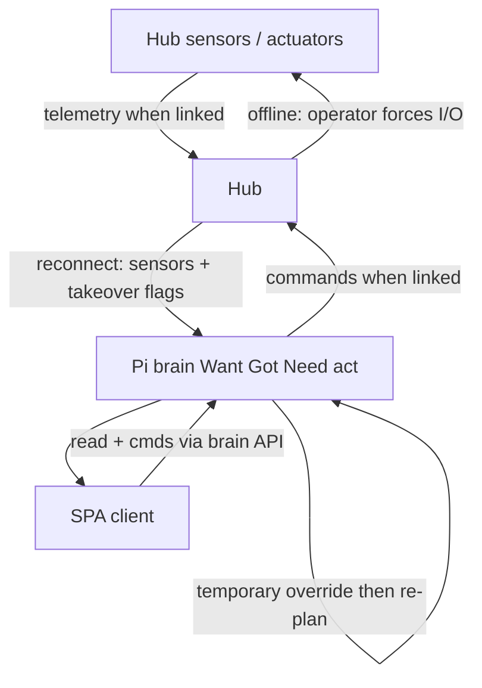
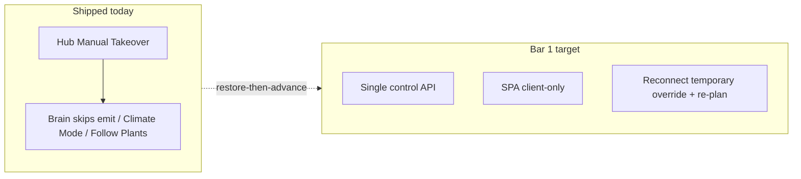

# Brain control recovery (parity + hub failover)

**In one line:** Restore HA-era control coherence on the Pi brain, keep the SPA as an honest client, and treat the hub as failover actuator — not a rival brain.

**Status:** Design locked (`acae659`); **not yet implemented** as bar 1. This page maps the locked decisions to **verified current code** so engineers do not confuse intent with shipped behavior.

| Artifact | Role |
|---|---|
| [Design spec](../superpowers/specs/2026-08-29-brain-control-recovery-design.md) | Locked SoT, bars, acceptance, sequencing |
| This page | Current code vs target + developer pitfalls |
| [DECISION_LOOP.md](DECISION_LOOP.md) | Want→Got→Need→propose tick |
| Notion | [Pi offline brain](https://app.notion.com/p/3b52b4cda370818e8b66f671689f7a57) · [Product layers](https://app.notion.com/p/3b52b4cda37081c2bcafc85d3407556c) |

## Locked decisions (summary)

| Decision | Meaning |
|---|---|
| Control SoT | **Pi brain** — faithful Want→Got→Need→act port of HA packages, then advance |
| Approach | **Restore-then-advance** — no dual-run third story (HA + brain + SPA math) |
| Hub online | Sensors/actuators; obeys brain |
| Hub offline | Operator **manual takeover** (force devices) |
| Reconnect | Hub snapshot + takeover flags → brain **temporary override** → re-plan → re-assert |
| Bar 1 | HA-era parity on control loops **plus** hub failover protocol |
| Bar 2 | Plant ↔ probe assign / move / **detach** |
| Later | Advanced brain / AI — not before bars 1–2 |

## Target flow

## Current code (verified on tip `acae659`)

### What exists today

| Piece | Where | Behavior |
|---|---|---|
| Manual Takeover switch | Hub YAML `manual_takeover_switch` → `ha_takeover_active` | Suspends fan curve, ladder, photoperiods; operator drives outputs. Emergency >35 °C + sensor watchdog still override. Entity: `switch.dsc_hub_manual_takeover` |
| Brain maps the switch | `brain/dsc_brain/hub_controls.py` | OID alias `manual_takeover` |
| Decision tick respects takeover | `decision_loop.decision_tick` | If `manual_takeover=True`, advisories only — **no emit** |
| Climate / Follow Plants gates | `control_ops.py`, `follow_plants.py` | Skip apply when takeover `on` or hub offline (`reason`: `takeover on` / `hub offline`) |
| SPA / API | `api.py` `/decision/tick` | Accepts `manual_takeover` flag on the tick body |

### What the design still requires (not in code)

| Gap | Notes |
|---|---|
| Single control API for HA-era loops | Light schedule, climate demand, photoperiod Follow, roster→Want — inventory vs brain emitters not closed |
| SPA binds Live pages to that one SoT | Light/Climate/Overview still risk contradictory ON/%/hours/schedule stories |
| Reconnect **temporary override** | No brain record of takeover-on-reconnect, expiry policy, or explicit SPA override chrome |
| Re-assert after override | Hub restores Full Auto on boot unless Takeover ON; brain does not yet re-plan/re-assert as a contract |
| Bar 2 detach lifecycle | Partial roster refresh exists in places; full detach/reassign without hard reload is bar 2 |

## Developer pitfalls

1. **Do not invent a third Got story** — Overview / Light hours / ON% must come from the same photoperiod / demand engine the brain uses (or show explicit empty/override). Forbidden anti-pattern is called out in the design §3.
2. **Do not dual-run HA packages as equal controllers** while porting — HA is optional/legacy read-through at most; product SoT is brain.
3. **Manual Takeover ≠ bar 1 failover** — the switch already exists; the reconnect override + re-plan contract does not.
4. **Cosmetic SPA passes are out of bar 1** — polish without SoT fix is explicitly rejected by the design.
5. **Override expiry** (timeout vs explicit clear vs both) is an open plan point — do not hard-code a policy in docs or UI until the implementation plan locks it.

## Acceptance pointers (bar 1)

See design §4. Short checklist for implementers:

1. Light page: no contradictory ON/%/schedule/hours on one load.  
2. Overview RUNNING / fans / MAT / SF1000 agree with Climate/Light for the same tick.  
3. Hub link drop → force devices; reconnect → brain logs override and re-asserts; SPA shows that story.  
4. Spot-check against HA-era package notes for demand + photoperiod.  
5. OGB bar: grower can trust Light / Climate / Overview against the room.

## Related codepaths

| Path | Role |
|---|---|
| `firmware/v4/dsc-hub-v4_0.yaml` | `ha_takeover_active`, `manual_takeover_switch`, Full Auto arm |
| `brain/dsc_brain/decision_loop.py` | Takeover blocks emit |
| `brain/dsc_brain/control_ops.py` | Climate Mode apply gates |
| `brain/dsc_brain/follow_plants.py` | Follow Plants apply gates |
| `brain/dsc_brain/hub_controls.py` | Entity OID map |
| `docs/superpowers/specs/2026-08-29-brain-control-recovery-design.md` | Locked design |
