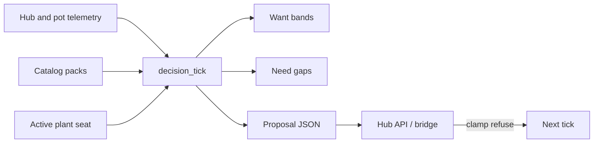

# Brain decision loop

**In one line:** Ingest hub/pot state + catalogs → resolve Want → compute Need vs Got → propose setpoints/cmds → hub clamps and actuates.

Notion: [Pi offline brain](https://app.notion.com/p/3b52b4cda370818e8b66f671689f7a57) · [Ownership](https://app.notion.com/p/3b52b4cda370818da235e4569b1cc9c6) · Ops: [`docs/qa/DSC-BRAIN-PHASE-B.md`](../qa/DSC-BRAIN-PHASE-B.md)



## Tick inputs

- Active roster seat (strain id, stage, custom overrides)
- Catalog want for that strain (or custom / stage default)
- Latest Got: temp, RH, soil EC/pH/moisture (VPD/light not scored yet)
- Hub mode flags (Manual Takeover today; Full Auto / in-service gates later)

## Want precedence

1. Custom bands (skip `[0,0]` / numeric `0`)
2. Catalog `want` for `strain_id` (stage-map `ec_*_us` → `ec_us`)
3. Stage defaults (`seedling` / `veg` / `flower`)

## Tick outputs (proposal — Phase B shape)

Verified against `brain/dsc_brain/decision_loop.py`:

```json
{
  "tick_id": "uuid",
  "ts": 1786096229.26,
  "seat": "pot1",
  "want_meta": {
    "source": "catalog:generic_photoperiod",
    "stage": "veg",
    "strain_id": "generic_photoperiod"
  },
  "want": {
    "temp_c": [20, 28],
    "rh_pct": [45, 70],
    "ph": [5.8, 6.5],
    "ec_us": [1000, 1600],
    "moisture_pct": [45, 70]
  },
  "got": {"temp_c": 26.1, "rh_pct": 58},
  "need": {
    "temp_c": "ok",
    "rh_pct": "ok",
    "ph": "unknown",
    "ec_us": "unknown",
    "moisture_pct": "unknown"
  },
  "commands": [],
  "advisories": [],
  "safety": {
    "hub_must_clamp": true,
    "emit": false,
    "manual_takeover": false
  }
}
```

Need values: `ok` | `low` | `high` | `unknown`. Missing Got → `unknown`.

With `emit=True` today, `commands` contains a single noop stub — **not** hub
writes. Live emit is Phase D (**N-094**).

## Never

- Bypass hub failsafe / min-off / fire countdown
- Drive Sonoff relays through HA as the *product* path (lab OK until F-010)
- Emit real commands when Manual Takeover is asserted (unless user-approved advanced override)
- Treat `emit=True` as production actuation before Phase D

## Implementation

Python: [`brain/dsc_brain/decision_loop.py`](../../brain/dsc_brain/decision_loop.py)  
Want: [`brain/dsc_brain/want.py`](../../brain/dsc_brain/want.py)  
Dry-run by default (`emit=False`); live emit is Phase D.
