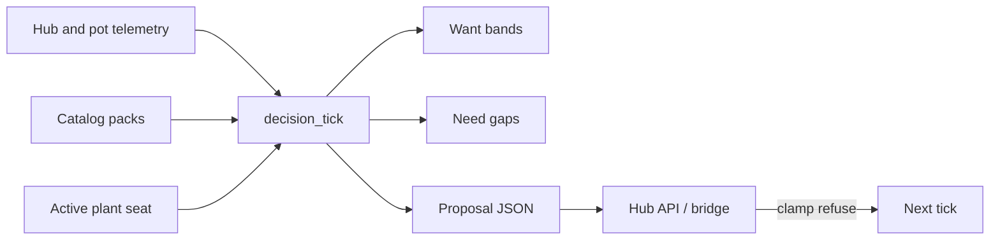

# Brain decision loop

**In one line:** Ingest hub/pot state + catalogs → resolve Want → compute Need vs Got → propose setpoints/cmds → hub clamps and actuates.

Notion: [Pi offline brain](https://app.notion.com/p/3b52b4cda370818e8b66f671689f7a57) · [Ownership](https://app.notion.com/p/3b52b4cda370818da235e4569b1cc9c6)



## Tick inputs

- Active roster seat (strain id, stage, custom overrides)
- Catalog want_bands for that strain (or custom / stage default)
- Latest Got: temp, RH, VPD, soil EC/pH/moisture, light state
- Hub mode flags (Full Auto, Manual Takeover, in-service gates)

## Tick outputs (proposal)

```json
{
  "tick_id": "...",
  "seat": "pot1",
  "want": {"temp_c": [20, 28], "rh_pct": [45, 70]},
  "got": {"temp_c": 26.1, "rh_pct": 58},
  "need": {"temp_c": "ok", "rh_pct": "ok"},
  "commands": [],
  "advisories": [],
  "safety": {"hub_must_clamp": true}
}
```

## Never

- Bypass hub failsafe / min-off / fire countdown
- Drive Sonoff relays through HA as the *product* path (lab OK until F-010)
- Emit commands when Manual Takeover is asserted (unless user-approved advanced override)

## Takeover vs control recovery

Today: `manual_takeover=True` (or hub `switch.dsc_hub_manual_takeover` on) blocks emit / Climate Mode / Follow Plants apply. That is **not** yet the full Bar 1 reconnect contract (`hub_failover`: temporary override → re-plan → re-assert TTL **900s** or clear + SPA override chrome). Plan: [bar1](../superpowers/plans/2026-08-29-brain-control-recovery-bar1.md).

Climate Mode (`Follow 4x8` / `Follow Plants`) assumes **shared ducting** between 4x8 and 2x4 — not two independent HVAC rooms. Twin/3D must stay a **projection** of this loop (or stay gated), never a second commander.

See [CONTROL-RECOVERY.md](CONTROL-RECOVERY.md) and the [design spec](../superpowers/specs/2026-08-29-brain-control-recovery-design.md).

## Implementation

Python: [`brain/dsc_brain/decision_loop.py`](../../brain/dsc_brain/decision_loop.py)  
Dry-run by default (`emit=False`); live emit is Phase D.
