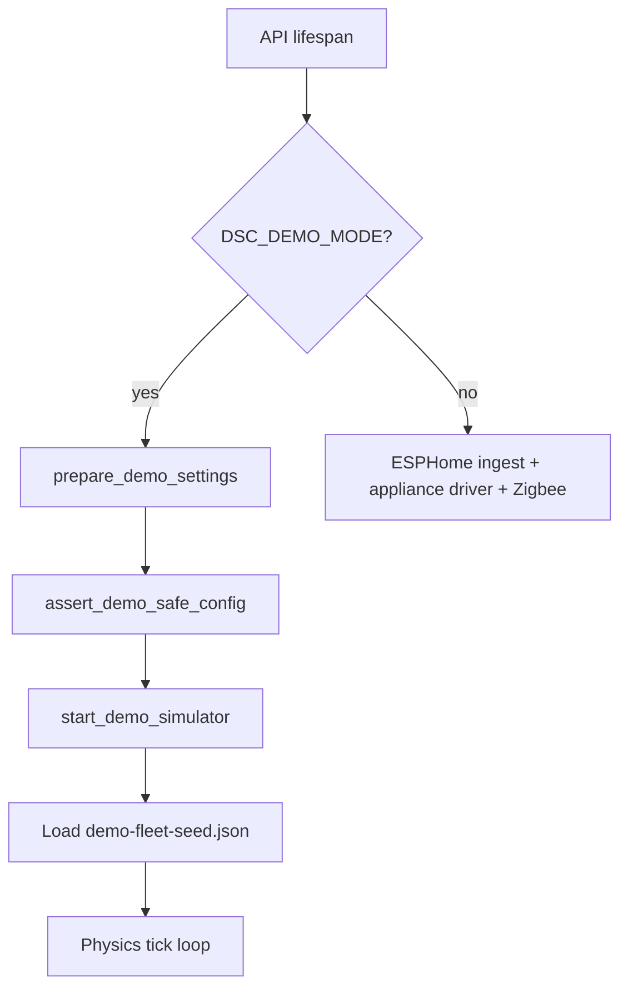
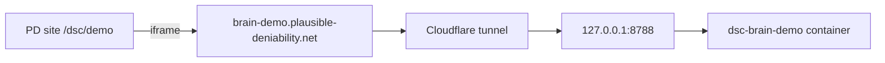

# Software-only demo mode

**Intent:** Run the Pi brain + SPA with a simulated grow room for public WiP demos and local UX work — **no** ESPHome, MQTT, Zigbee, Sonoffs, or LAN inventory.

**Tip:** `8fc5e33` (7.4 WiP) · surface still **7.3.0** / demo image tag `7.3.0-demo` until Phase E bumps `7.4.0`.

## When to use

| Use | Do not use |
|-----|------------|
| Public embed / marketing walkthrough | Pointing at studio Pi or house LAN |
| Local SPA UX without fleet hardware | Soaking real climate / Zigbee / OTA |
| Brain unit tests (`demo_client` fixture) | Mixing `DSC_DEMO_MODE=1` with live API keys |

## Enable

```bash
# Local process
export DSC_DEMO_MODE=1
cd brain && python -m dsc_brain.api
# → http://127.0.0.1:8787  GET /health → mode=demo

# Isolated Compose (host 8788 → container 8787)
docker compose -f services/dsc-hub/docker-compose.demo.yml up -d --build
# → http://localhost:8788
```

On Unraid/NAS: [`deploy-brain-demo-remote.sh`](../../services/dsc-hub/pi/deploy-brain-demo-remote.sh) runs compose in `services/dsc-hub` and curls `127.0.0.1:8788/health`.

Env truth: `DSC_DEMO_MODE` in `1|true|yes|on` ([`demo_mode.py`](../../brain/dsc_brain/demo_mode.py)).

Compose also sets `CANNALIB_USE_LOCAL_FALLBACK=true`, `DSC_EXPECTED_FIRMWARE=7.0.0.0-demo`, `DSC_SURFACE_VERSION=7.3.0-demo`.

## Boot path



On demo start the brain:

1. Scrubs `cannalib_api_url` / `ollama_base_url`, forces local catalog fallback.
2. Clears inventory `host` / `mac` / `api_key` for every seat.
3. **Fails closed** if any `DSC_*_API_KEY` env is set, inventory hosts private/`*.local`, or settings URLs point at private hosts.
4. Starts [`demo_simulator.py`](../../brain/dsc_brain/demo_simulator.py) instead of ingest/drivers.

## Runtime behavior

| Surface | Demo behavior |
|---------|---------------|
| `GET /health` | `mode: "demo"`, `simulation: true`, honesty detail string |
| `GET /fleet`, `/ws/fleet`, `/fleet/computed` | Seeded + simulated hub/pots/controls |
| `POST /control/service`, `/control/demand` | In-process `demo_call_service` — updates controls + soft physics (heater↑temp, dehum↓RH, fan%→CFM) |
| Zigbee permit-join | **403** |
| Network apply | **403** |
| ESPHome job queue | **403** |
| Backup import | **403** |
| Test Ollama | `{ok:false, mode:demo_simulation}` |
| Test CannaLib | `{ok:true}` local fallback only |
| SPA | [`DemoBanner`](../../homeassistant/custom_components/dsc_hub/frontend/src/components/DemoBanner.tsx) when `/health.mode === "demo"` |
| Responses (demo only) | CSP `frame-ancestors 'self' https://plausible-deniability.net https://www.plausible-deniability.net`; `X-Frame-Options` stripped so PD can iframe |

Blocked detail string: `demo_simulation — blocked (software only, no hardware/network apply)`.

## Public host (PD embed)

Public hostname: **`brain-demo.plausible-deniability.net`** → origin `http://127.0.0.1:8788` on the WordPress Cloudflare tunnel.



Tunnel helpers (require `CF_API_TOKEN` / `CLOUDFLARE_API_TOKEN` with Tunnel Edit + DNS Edit — store token in Notion credentials, never commit):

| Script | Role |
|--------|------|
| [`add-brain-demo-tunnel.py`](../../services/dsc-hub/scripts/add-brain-demo-tunnel.py) | Local: upsert ingress + proxied CNAME |
| [`add-brain-demo-tunnel-remote.sh`](../../services/dsc-hub/scripts/add-brain-demo-tunnel-remote.sh) | Same from NAS with curl |

Constraints:

- Demo compose must already be healthy on `:8788` before expecting the public host to work.
- Embed only from the PD apex/www origins listed in CSP; other sites will be blocked by the browser.
- Do **not** put live LAN inventory or `DSC_*_API_KEY` into the demo stack.

## Seed + constraints

- Seed file: [`brain/data/demo-fleet-seed.json`](../../brain/data/demo-fleet-seed.json) (`version` `7.0.0.0-demo`, `surface` `7.3.0-demo`).
- Demand switches map to simulated relays (`heater` / `humidifier` / `dehumidifier` / `heatmat`).
- Appliance driver and Native API clients are **not** started; tests assert `make_api_client` is never called on control.
- Do **not** paste live API keys, Wi-Fi PSKs, or deploy passwords into demo configs or Wiki.
- `DemoBanner` mounts once from `App.tsx` when `/health.mode === "demo"` (duplicate mount fixed on tip).

## Developer checks

```bash
pytest brain/tests/test_brain_pi.py -k demo -q
# health mode, seeded online hub, heater/dehum physics, network 403, no native API
```

After SPA UI changes for the public demo: `npm run build:spa` in the frontend package, sync `spa-dist/` → `brain/static/` (same as live), rebuild the demo compose image.

## Related

- Compose: [`services/dsc-hub/docker-compose.demo.yml`](../../services/dsc-hub/docker-compose.demo.yml)
- Package README: [`brain/README.md`](../../brain/README.md)
- Ops cutover (live Pi, not demo): [`docs/ops/DSC-HUB-DOCKER.md`](../ops/DSC-HUB-DOCKER.md)
- Plan: [`docs/qa/PLAN-7.4.md`](../qa/PLAN-7.4.md)
