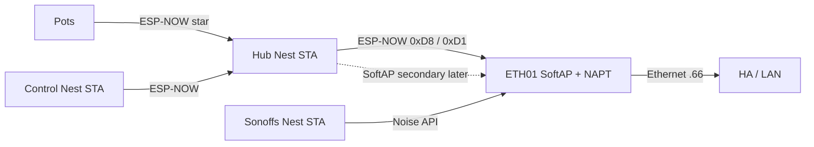

# F-010 / F-012 / F-013 — ETH01 SoftAP fleet home + appliance bridge

**In one line:** WT32-ETH01 hosts SoftAP `DSC-Anchor` (NAPT + ESP-NOW on `WIFI_IF_AP`), drives Sonoffs over Noise API, and mirrors hub vitals to HA over Ethernet. SoftAP-home **membership is paused** (`5893ea6`) until SoftAP IP path is proven — Nest-first for Hub / Control / Sonoffs.

**Design:** [`docs/superpowers/specs/2026-08-10-softap-fleet-star-design.md`](../superpowers/specs/2026-08-10-softap-fleet-star-design.md)  
**Ops runbook:** [`docs/qa/SOFTAP-FLEET-HOME.md`](../qa/SOFTAP-FLEET-HOME.md)  
**FOLLOWUPS:** SoftAP fleet home § (2026-08-10 evening pause)

## Topology (current membership)

| Path | Role |
|---|---|
| Hub demand `0xD8` → bridge → Sonoff Noise API | HA-down actuation |
| Hub vitals `0xD1` broadcast → bridge HA mirror | Ethernet telemetry |
| SoftAP AP on bridge | Channel pin + future fleet Wi‑Fi home |
| Hub / Control / Sonoffs Nest STA | **Current** membership until SoftAP IP gate |
| SoftAP static map `.10`/`.11`/`.20`–`.23` | Reserved secondary; do not prefer yet |
| Pots → hub ESP-NOW only | SoftAP not preferred (star) |
| HA followers | Idempotent fallback when HA up |

## SoftAP networking (v1)

| Item | Value |
|---|---|
| SSID | `DSC-Anchor` |
| Gateway | `192.168.4.1/24` |
| Client addressing | **Static map** — no SoftAP DHCPS in v1 |
| SoftAP mode | `WIFI_MODE_APSTA` (AP-only was a regression vs known-good ETH01 path) |
| Forwarding | LwIP IP forward + IPv4 NAPT on SoftAP netif |
| ESP-NOW ifidx | `WIFI_IF_AP` after SoftAP up (peers rebound) |
| Max STA | **4** (runtime + sdkconfig cap; raise only after clean rebuild) |
| Bridge ETH | Static `192.168.86.66` (DHCP `.17` broke SoftAP route) |
| sdkconfig | `CONFIG_LWIP_IP_FORWARD`, `CONFIG_LWIP_IPV4_NAPT`, `CONFIG_ESP_WIFI_SOFTAP_MAX_NUM_STA=4` |

### Static SoftAP leases (kept for SoftAP-home resume)

| Device | SoftAP IP | Status under pause |
|---|---|---|
| Hub | `192.168.4.10` | Secondary network entry; no `use_address` |
| Control | `192.168.4.11` | Secondary; no `use_address` |
| Heater | `192.168.4.20` | Secondary `softap_ip` |
| Heatmat | `192.168.4.21` | Secondary |
| Humidifier | `192.168.4.22` | Secondary |
| Dehumidifier | `192.168.4.23` | Secondary |

HA → SoftAP clients needs `192.168.4.0/24 via 192.168.86.66` — **hard gate** before SoftAP-primary returns.

## SoftAP-home pause gate

1. SoftAP SSID up; Anchor BSSID published  
2. Static SoftAP STA can ping `192.168.4.1`  
3. HA SoftAP route delivers SoftAP clients  
4. SoftAP-primary hub only → HA API at `.4.10`; then Control; then Sonoffs  

See runbook for recovery flash notes (hub micro-USB vs bridge USB-TTL).

## Fleet Fix (glass)

Primary UX is glass (works without HA). HA button remains a duplicate trigger.

1. `FIX_ACTIVE=1` (`0xDC` op **60**) → hub blocks OTA / HA safe-off grace  
2. `FLEET_JUMP` (op **62**) → hub pins preferred SoftAP BSSID (`bridge_mac`) + WiFi bounce; EVT `FLEET_JUMP`  
3. Poll hub vitals → Control SoftAP bounce → pot link bits (star wait)  
4. Success gate: SoftAP preferred match (when known) + hub beat + pots OK  
5. `FIX_ACTIVE=0` → return to Connections  

Code: `fleet_fix_run` in `dsc-control-common.yaml`; `rf_fleet_jump_arm` in `dsc-hub-fleet-heal.yaml`. SoftAP prefer only helps after SoftAP join + HA path work.

## Firmware

| Path | Role |
|---|---|
| [`firmware/v4/dsc-bridge.yaml`](../../firmware/v4/dsc-bridge.yaml) | Lab stub |
| [`firmware/v4/dsc-bridge-kit.yaml`](../../firmware/v4/dsc-bridge-kit.yaml) | Kit (ethernet + SoftAP; SoftAP hello deferred F-014) |
| [`firmware/v4/components/dsc_api_client/`](../../firmware/v4/components/dsc_api_client/) | Noise native API client |
| [`firmware/v4/components/dsc_anchor_ap/`](../../firmware/v4/components/dsc_anchor_ap/) | SoftAP + NAPT with ethernet (ESPHome forbids `wifi:`+`ethernet:`) |
| `dsc-*-wifi-lab.yaml` / `dsc-sonoff-common.yaml` | **Nest-first** membership; SoftAP secondary |

## Sensors / secrets

- `sensor.dsc_bridge_anchor_bssid` — SoftAP **AP MAC** (prefer into hub `bridge_mac` / Lock only after SoftAP IP gate)
- `binary_sensor.dsc_bridge_anchor_softap_up` — SoftAP up
- `sensor.dsc_bridge_anchor_channel` — pinned channel (lab default 11)
- Secrets: `dsc_bridge_*`, `dsc_anchor_ap_password`, four `dsc_*_host` (match **live** STA IPs while Nest-first)

## Safety

- Bridge respects demand OFF as hard
- No fresh `0xD8` for 45s → all four relays OFF
- Sonoff API-loss grace still applies if **all** clients disconnect
- Manual button test mode still local stop (bridge skips commands)

## Acceptance

**While paused:** SoftAP beacon up; eth `.66`; Nest-first Hub/Control/Sonoffs reachable; ESP-NOW can go on; bridge can drive Sonoffs at their live hosts.

**SoftAP-home resume (goal):** SoftAP-primary Hub `.10` path to HA API; Sonoff SoftAP hosts; glass Fleet Fix ops 60/62 walk.

## Deferred / still open

- SoftAP IP / NAPT / HA route **hardware proof** (blocks SoftAP-primary membership)
- **F-011** — move kit `DSC-Setup-*` portal host onto ETH01
- **F-014** — bridge SoftAP satellite hello without ESPHome `wifi:` (paste Anchor BSSID into hub)
- **F-015** — Sync copy of `dsc_api_client` + `dsc_anchor_ap` to HA `/config/esphome/components/`
- L2 SoftAP↔Ethernet bridge (v1 uses NAPT + host route instead)
- Pots as SoftAP STAs (non-goal)
