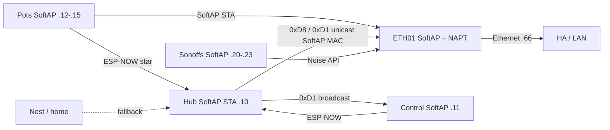

# F-010 / F-012 / F-013 — ETH01 SoftAP fleet home + appliance bridge

**In one line:** WT32-ETH01 hosts SoftAP `DSC-Anchor` (NAPT + ESP-NOW on `WIFI_IF_AP`), drives Sonoffs over Noise API, and mirrors hub vitals to HA over Ethernet. SoftAP-primary membership for Hub / Control / Sonoffs / **pots** is the steady state (`c47f5f1`) — Nest is emergency fallback only.

**Design:** [`docs/superpowers/specs/2026-08-10-softap-fleet-star-design.md`](../superpowers/specs/2026-08-10-softap-fleet-star-design.md)  
**Ops runbook:** [`docs/qa/SOFTAP-FLEET-HOME.md`](../qa/SOFTAP-FLEET-HOME.md)  
**FOLLOWUPS:** SoftAP fleet home § (pots SoftAP + hub↔bridge ESP-NOW prove)

## Topology (current membership)

| Path | Role |
|---|---|
| Hub demand `0xD8` **unicast** SoftAP MAC → bridge → Sonoff Noise API | HA-down actuation |
| Hub vitals `0xD1` broadcast + **unicast** SoftAP MAC → bridge HA mirror | Ethernet telemetry + Control/pots |
| SoftAP AP on bridge | Fleet Wi‑Fi home + channel pin |
| Hub / Control / Sonoffs / pots SoftAP STA | **Steady-state** membership (`c47f5f1`) |
| SoftAP BSSID pin `58:2A:BD:60:3C:1D` | SoftAP wifi entry only — never home Wi‑Fi; never `00…` |
| SoftAP static map `.10`/`.11`/`.12`–`.15`/`.20`–`.23` | Required (no SoftAP DHCPS) |
| Pots SoftAP STA + ESP-NOW → hub | SoftAP pins channel; soil/vitals still ESP-NOW star |
| Bridge `hub_mac` peer on `WIFI_IF_AP` | SoftAP host can RX hub frames |
| HA followers | Idempotent fallback when HA up |

## SoftAP networking (v1)

| Item | Value |
|---|---|
| SSID | `DSC-Anchor` |
| Gateway | `192.168.4.1/24` |
| Client addressing | **Static map** — no SoftAP DHCPS in v1 |
| SoftAP mode | `WIFI_MODE_APSTA` |
| Forwarding | LwIP IP forward + IPv4 NAPT on SoftAP netif |
| ESP-NOW ifidx | `WIFI_IF_AP` after SoftAP up (`ensure_espnow_ap_peers_`) |
| Max STA | **14** (`max_connections` + `CONFIG_ESP_WIFI_SOFTAP_MAX_NUM_STA`) |
| Bridge ETH | Static `192.168.86.66` (DHCP `.17` broke SoftAP route) |
| sdkconfig | `CONFIG_LWIP_IP_FORWARD`, `CONFIG_LWIP_IPV4_NAPT`, `CONFIG_LWIP_L2_TO_L3_COPY`, `CONFIG_ESP_WIFI_SOFTAP_MAX_NUM_STA=14` |
| Build flag | `IP_FORWARD_ALLOW_TX_ON_RX_NETIF=1` (eth↔SoftAP forward) |

### Static SoftAP leases

| Device | SoftAP IP |
|---|---|
| Hub | `192.168.4.10` (`use_address`) |
| Control | `192.168.4.11` (`use_address`) |
| Pot1 | `192.168.4.12` |
| Pot2 | `192.168.4.13` |
| Pot3 | `192.168.4.14` |
| Pot4 | `192.168.4.15` |
| Heater | `192.168.4.20` |
| Heatmat | `192.168.4.21` |
| Humidifier | `192.168.4.22` |
| Dehumidifier | `192.168.4.23` |

HA → SoftAP clients needs `192.168.4.0/24 via 192.168.86.66`. SoftAP preference stays even while L3 soak continues — do not Nest-first as the product steady state. SoftAP L3 **proved** 2026-08-10.

## Hub ↔ bridge ESP-NOW contract

SoftAP host often misses STA **broadcast** ESP-NOW. Do not rely on broadcast alone for bridge RX.

| Frame | Hub TX | Bridge RX requirement |
|---|---|---|
| `0xD8` appliance demand | Unicast `${bridge_mac}` (SoftAP AP MAC) | Hub peer on `WIFI_IF_AP` |
| `0xD1` vitals | Broadcast (Control/pots) **and** unicast SoftAP MAC | Same; age sensor updates from either path |

`dsc_anchor_ap` takes `hub_mac` (hub SoftAP **STA** MAC) and, after SoftAP up, rebinds peers onto `WIFI_IF_AP` and forces hub + broadcast peers. Lab hub STA MAC: `84:1F:E8:16:E6:60`. SoftAP AP MAC / hub `bridge_mac`: `58:2A:BD:60:3C:1D`.

**Proved 2026-08-11:** `binary_sensor.dsc_bridge_hub_esp_now_link=true`, age ~1s after hub SoftAP OTA.

## Membership rules

- SoftAP priority > home Wi‑Fi
- Pin Anchor BSSID on SoftAP nets only (`wifi_bssid` / `softap_bssid`)
- Home Wi‑Fi has no BSSID pin
- Never `bssid: 00:00:00:00:00:00`
- SoftAP STA budget: hub + control + 4 sonoffs + 4 pots = **10**; bridge capacity **14**

## Fleet Fix (glass)

Primary UX is glass (works without HA). HA button remains a duplicate trigger.

1. `FIX_ACTIVE=1` (`0xDC` op **60**) → hub blocks OTA / HA safe-off grace  
2. `FLEET_JUMP` (op **62**) → hub pins preferred SoftAP BSSID (`bridge_mac`) + WiFi bounce; EVT `FLEET_JUMP`  
3. Poll hub vitals → Control SoftAP bounce → pot link bits (pots SoftAP-home)  
4. Success gate: SoftAP preferred match (when known) + hub beat + pots OK  
5. `FIX_ACTIVE=0` → return to Connections  

Code: `fleet_fix_run` in `dsc-control-common.yaml`; `rf_fleet_jump_arm` in `dsc-hub-fleet-heal.yaml`.

## Firmware

| Path | Role |
|---|---|
| [`firmware/v4/dsc-bridge.yaml`](../../firmware/v4/dsc-bridge.yaml) | Lab stub (`hub_mac` SoftAP STA) |
| [`firmware/v4/dsc-bridge-kit.yaml`](../../firmware/v4/dsc-bridge-kit.yaml) | Kit (ethernet + SoftAP; SoftAP hello deferred F-014) |
| [`firmware/v4/dsc-bridge-common.yaml`](../../firmware/v4/dsc-bridge-common.yaml) | SoftAP max 14 + NAPT + `hub_mac` → `dsc_anchor_ap` |
| [`firmware/v4/components/dsc_api_client/`](../../firmware/v4/components/dsc_api_client/) | Noise native API client |
| [`firmware/v4/components/dsc_anchor_ap/`](../../firmware/v4/components/dsc_anchor_ap/) | SoftAP + NAPT + ESP-NOW peer rebind (`WIFI_IF_AP`) |
| [`firmware/v4/dsc-hub-espnow-primary.yaml`](../../firmware/v4/dsc-hub-espnow-primary.yaml) | `0xD8`/`0xD1` SoftAP unicast + broadcast vitals |
| `dsc-*-wifi-lab.yaml` / `dsc-sonoff-common.yaml` / `dsc-pot-wifi-lab.yaml` | SoftAP-primary membership + SoftAP BSSID pin |

## Sensors / secrets

- `sensor.dsc_bridge_anchor_bssid` — SoftAP **AP MAC** (paste into hub `bridge_mac` / SoftAP `wifi_bssid`)
- `binary_sensor.dsc_bridge_anchor_softap_up` — SoftAP up
- `sensor.dsc_bridge_anchor_channel` — pinned channel (lab default 11)
- `binary_sensor.dsc_bridge_hub_esp_now_link` — hub SoftAP unicast path healthy
- Secrets: `dsc_bridge_*`, `dsc_anchor_ap_password`, four `dsc_*_host` (SoftAP IPs when SoftAP-primary)

## Safety

- Bridge respects demand OFF as hard
- No fresh `0xD8` for 45s → all four relays OFF
- Sonoff API-loss grace still applies if **all** clients disconnect
- Manual button test mode still local stop (bridge skips commands)

## Acceptance

- SoftAP-primary Hub `.10` / Control `.11` / pots `.12`–`.15` / Sonoffs `.20`–`.23`
- SoftAP beacon up; eth `.66`; Anchor BSSID published; max STA **14**
- Hub path to HA API via NAPT + SoftAP route
- `binary_sensor.dsc_bridge_hub_esp_now_link` on (unicast SoftAP MAC + `WIFI_IF_AP` peers)
- Bridge toggles a Sonoff at SoftAP static IP
- Glass Fleet Fix ops 60/62 walk
- HA powered off; hub raises humidifier demand; relay follows within ~2s
- Control alert is “Appliances need bridge or HA” (not bare HA-only)
- Pot ESP-NOW links stay healthy while pots are SoftAP STAs

## F-004 SoftAP orphan (HA cues — `4a4160c`)

Standing F-004 is **SoftAP preferred-BSSID mismatch** (`CHX` in `sensor.dsc_hub_rf_status`), not Nest router channel lock.

| Piece | Behavior |
|---|---|
| `binary_sensor.dsc_nest_channel_split` | Display **DSC SoftAP Preferred Mismatch** — Home chip source |
| `binary_sensor.dsc_wifi_preferred_ap_mismatch` | Display **DSC SoftAP Lock Mismatch** — omitted from alert count |
| Hub HA stub `use_address` | SoftAP `192.168.4.10` (Nest-orphan OTA is temporary only) |

Ops runbook + heal path: [`docs/qa/SOFTAP-FLEET-HOME.md`](../qa/SOFTAP-FLEET-HOME.md) § F-004. Packages: `dsc_v4_fleet_heal.yaml`, `dsc_v4_alert_count.yaml`, `dsc_v4_core_helpers.yaml`.

## Deferred / still open

- **F-011** — move kit `DSC-Setup-*` portal host onto ETH01
- **F-014** — bridge SoftAP satellite hello without ESPHome `wifi:`
- **F-015** — Sync copy of `dsc_api_client` + `dsc_anchor_ap` to HA `/config/esphome/components/`
- Pot3 USB/OTA (F-003) — SoftAP IP reserved `.14`; device still absent
- L2 SoftAP↔Ethernet bridge (v1 uses NAPT + host route instead)
- Nest router channel lock — remains **out of scope** (SoftAP-primary is the heal path)
