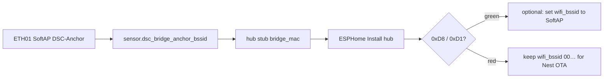

# F-010 / F-012 / F-013 — ETH01 appliance bridge + channel anchor + HA mirror

**In one line:** WT32-ETH01 follows hub demand over ESP-NOW, drives Sonoffs without HA, SoftAP-pins the fleet channel, and mirrors hub vitals to HA over Ethernet.

## Paths

```
Hub demand ──ESP-NOW 0xD8──► DSC-BRIDGE ──native API──► Sonoff relays
Hub vitals ──ESP-NOW 0xD1 broadcast──► Bridge HA mirror (Ethernet)
Fleet STA ──prefer DSC-Anchor SoftAP BSSID──► fixed channel (F-012)
HA followers ──idempotent fallback──► same relays (when HA up)
```

## Firmware

| Stub | Role |
|---|---|
| [`firmware/v4/dsc-bridge.yaml`](../../firmware/v4/dsc-bridge.yaml) | Lab |
| [`firmware/v4/dsc-bridge-kit.yaml`](../../firmware/v4/dsc-bridge-kit.yaml) | Kit (ethernet + SoftAP; SoftAP hello deferred F-014) |
| [`firmware/v4/components/dsc_api_client/`](../../firmware/v4/components/dsc_api_client/) | Noise native API client |
| [`firmware/v4/components/dsc_anchor_ap/`](../../firmware/v4/components/dsc_anchor_ap/) | SoftAP with ethernet (ESPHome forbids `wifi:`+`ethernet:`) |

## Safety

- Bridge respects demand OFF as hard
- No fresh `0xD8` for 45s → all four relays OFF
- Sonoff API-loss grace still applies if **all** clients disconnect
- Manual button test mode still local stop (bridge skips commands)

## Acceptance

- HA powered off; hub raises humidifier demand; relay follows within ~2s
- Hub clears demand; relay off
- Bridge peer lost / stale; relays off
- Control alert is “Appliances need bridge or HA” (not bare HA-only)
- Fleet prefers Anchor BSSID; ESP-NOW holds without Nest hops
- Pro System view shows bridge / anchor / Sonoff API links

## Hub `bridge_mac` / `wifi_bssid` (lab paste — F-014 until SoftAP hello)

Until kit SoftAP hello lands, operators paste the bridge Anchor SoftAP BSSID into the
hub stub. Two substitutions matter (do not conflate them):

| Substitution | Stub | Role |
|---|---|---|
| `bridge_mac` | `homeassistant/esphome/dsc-hub.yaml` (and firmware kits) | ESP-NOW peer allow-list for the bridge SoftAP MAC |
| `wifi_bssid` | same hub WiFi packages | Optional STA preferred BSSID (Lock WiFi / Nest pin) |



### Lab sequence (verified against HA stub + FOLLOWUPS fleet snapshot)

1. Bridge online; SoftAP up; read `sensor.dsc_bridge_anchor_bssid` (example lab value `58:2A:BD:60:3C:1D`).
2. Set hub stub `bridge_mac` to that BSSID. Master HA stub already carries the lab paste; kit/firmware defaults remain `00:00:00:00:00:00` until configured.
3. Leave `wifi_bssid: "00:00:00:00:00:00"` until Hub ESP-NOW Link proves green — Nest OTA / recovery stays possible.
4. Power-cycle hub if unreachable, then ESPHome **Install** so the stub substitution is compiled in (git package refresh alone does not rewrite a running flash).
5. Confirm bridge path: Hub ESP-NOW Link True + demand `0xD8` / vitals `0xD1`. Only then consider pinning SoftAP via `wifi_bssid` / Lock WiFi.

**Pitfalls**

- `bridge_mac` ≠ `wifi_bssid` — peer allow-list vs STA preferred AP.
- Hub ESP-NOW Link False with Sonoffs API True usually means hub never received the paste (or radio/channel), not a Sonoff fault.
- Do not force SoftAP `wifi_bssid` before ESP-NOW is green if you still need Nest-path OTA.

## Deferred

- **F-011** — move kit `DSC-Setup-*` portal host onto ETH01
- **F-014** — bridge SoftAP satellite hello without ESPHome `wifi:` (paste Anchor BSSID into hub)
