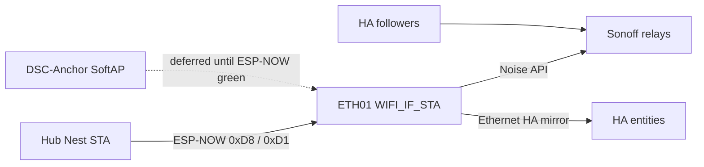
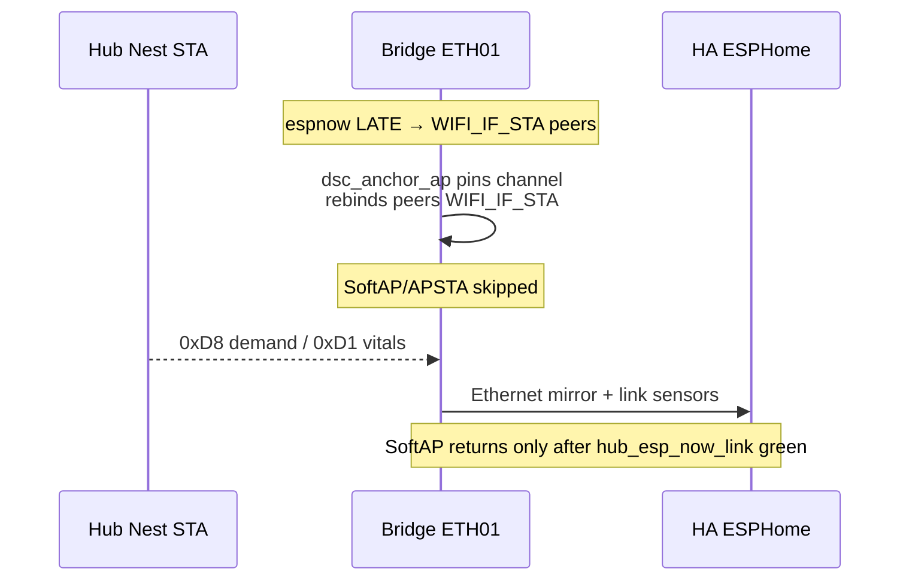

# F-010 / F-012 / F-013 — ETH01 appliance bridge + channel pin + HA mirror

**In one line:** WT32-ETH01 follows hub demand over ESP-NOW, drives Sonoffs without HA, pins the ESP-NOW radio channel while SoftAP is deferred, and mirrors hub vitals to HA over Ethernet.

## Paths

```
Hub demand ──ESP-NOW 0xD8──► DSC-BRIDGE ──native API──► Sonoff relays
Hub vitals ──ESP-NOW 0xD1 broadcast──► Bridge HA mirror (Ethernet)
Bridge radio ──channel pin on WIFI_IF_STA──► same ch as hub (F-012 deferred SoftAP)
HA followers ──idempotent fallback──► same relays (when HA up)
```



## Firmware

| Stub / component | Role |
|---|---|
| [`firmware/v4/dsc-bridge.yaml`](../../firmware/v4/dsc-bridge.yaml) | Lab (git package + Nest `wifi_*` secrets wired for optional STA) |
| [`homeassistant/esphome/dsc-bridge.yaml`](../../homeassistant/esphome/dsc-bridge.yaml) | HA Install stub (same substitutions; HA pulls `dsc-bridge-common` from `master`) |
| [`firmware/v4/dsc-bridge-kit.yaml`](../../firmware/v4/dsc-bridge-kit.yaml) | Kit (ethernet + channel pin; SoftAP hello deferred F-014) |
| [`firmware/v4/components/dsc_api_client/`](../../firmware/v4/components/dsc_api_client/) | Noise native API client |
| [`firmware/v4/components/dsc_anchor_ap/`](../../firmware/v4/components/dsc_anchor_ap/) | Channel pin with ethernet (ESPHome forbids `wifi:`+`ethernet:`) |

## F-012 bring-up (SoftAP deferred) — `6f198d1`

**Why:** ESPHome `espnow` starts `WIFI_MODE_STA` and peers on `WIFI_IF_STA`. Earlier SoftAP `set_mode(APSTA)` after that init dropped hub `0xD8` / `0xD1` RX (`hub_esp_now_link` stuck off, age capped at `600000`).

**What `dsc_anchor_ap` does now (verified in `dsc_anchor_ap.cpp`):**

1. Keep / force `WIFI_MODE_STA` — do **not** start SoftAP/APSTA.
2. Pin radio channel (`anchor_channel`, lab default **11**).
3. Rebind existing ESP-NOW peers onto **`WIFI_IF_STA`**.
4. Publish diagnostics:
   - `sensor.dsc_bridge_anchor_bssid` → **STA MAC** (not SoftAP BSSID)
   - `sensor.dsc_bridge_anchor_channel` → radio channel (fallback to configured pin)
   - `binary_sensor.dsc_bridge_anchor_softap_up` entity id still exists; state means **channel pin up**, SoftAP is deferred

YAML still accepts `ssid` / `password` / optional `sta_ssid` / `sta_password` (`dsc-bridge-common` wires Nest secrets). **`setup()` does not associate SoftAP or Nest STA yet** — Nest STA join soft-bricked remote API/OTA in lab; SoftAP returns only after ESP-NOW link is proven.

## Operator constraints

| Do | Don't |
|---|---|
| Match `anchor_channel` to the hub's live Nest/home channel | Prefer SoftAP as the hub STA path (ETH01 SoftAP has no LAN/NAT) |
| Keep hub/panel/pots on Nest (or fixed-channel home Wi‑Fi) until SoftAP returns | Migrate fleet onto `DSC-Anchor` SoftAP while SoftAP is deferred |
| Paste hub stub `bridge_mac` from live bridge STA MAC / peer target | Treat `sensor.dsc_bridge_anchor_bssid` as SoftAP Lock-prefer BSSID while SoftAP is off |
| Keep hub `wifi_bssid` `00…` until ESP-NOW is green | Run `_patch_bridge_secrets.py` on live HA secrets |
| After pull of SoftAP-deferred `dsc_anchor_ap`, **Install** bridge (USB if OTA handshake races) | Expect HA Install alone to copy components — Sync still omits `dsc_api_client` / `dsc_anchor_ap` (**F-015**) |



## Safety

- Bridge respects demand OFF as hard
- No fresh `0xD8` for 45s → all four relays OFF
- Sonoff API-loss grace still applies if **all** clients disconnect
- Manual button test mode still local stop (bridge skips commands)

## Acceptance

- HA powered off; hub raises humidifier demand; relay follows within ~2s
- Hub clears demand; relay off
- Bridge peer lost / stale; relays off
- Control alert is “Appliances need bridge or HA” (not bare HA-only)
- `binary_sensor.dsc_bridge_hub_esp_now_link` **on** with fresh `sensor.dsc_bridge_esp_now_age` (same channel as hub)
- Pro System view shows bridge / channel-pin / Sonoff API links
- SoftAP fleet prefer (F-012 full) remains **soak-gated** — not required for demand path

## Deferred

- **F-011** — move kit `DSC-Setup-*` portal host onto ETH01
- **F-012 SoftAP restore** — bring back `DSC-Anchor` SoftAP / APSTA only after ESP-NOW link is proven; then fleet Lock-prefer SoftAP BSSID (needs SoftAP↔Ethernet path or Nest locked to SoftAP channel — F-004)
- **F-014** — bridge SoftAP satellite hello without ESPHome `wifi:` (paste bridge MAC into hub)
- **Nest STA join in `dsc_anchor_ap`** — YAML keys exist; association code not active (lab OTA brick risk)
- **F-015** — Sync copy of `dsc_api_client` + `dsc_anchor_ap` to `/config/esphome/components/`
