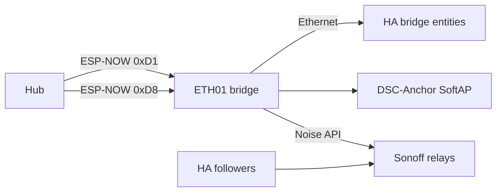
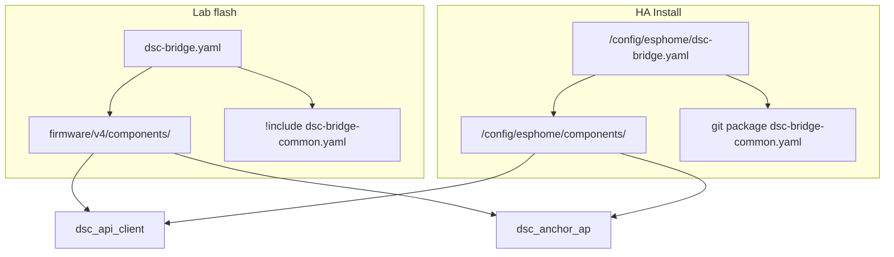

# F-010 / F-012 / F-013 — ETH01 appliance bridge + channel anchor + HA mirror

**In one line:** WT32-ETH01 follows hub demand over ESP-NOW, drives Sonoffs without HA, SoftAP-pins the fleet channel, and mirrors hub vitals to HA over Ethernet.

## Paths

```
Hub demand ──ESP-NOW 0xD8──► DSC-BRIDGE ──native API──► Sonoff relays
Hub vitals ──ESP-NOW 0xD1 broadcast──► Bridge HA mirror (Ethernet)
Fleet STA ──prefer DSC-Anchor SoftAP BSSID──► fixed channel (F-012)
HA followers ──idempotent fallback──► same relays (when HA up)
```



## Firmware

| Stub | Role |
|---|---|
| [`firmware/v4/dsc-bridge.yaml`](../../firmware/v4/dsc-bridge.yaml) | Lab |
| [`firmware/v4/dsc-bridge-kit.yaml`](../../firmware/v4/dsc-bridge-kit.yaml) | Kit (ethernet + SoftAP; SoftAP hello deferred F-014) |
| [`homeassistant/esphome/dsc-bridge.yaml`](../../homeassistant/esphome/dsc-bridge.yaml) | HA Install stub (git-pulls common package) |
| [`firmware/v4/components/dsc_api_client/`](../../firmware/v4/components/dsc_api_client/) | Noise native API client |
| [`firmware/v4/components/dsc_anchor_ap/`](../../firmware/v4/components/dsc_anchor_ap/) | SoftAP with ethernet (ESPHome forbids `wifi:`+`ethernet:`) |

Package body: [`firmware/v4/dsc-bridge-common.yaml`](../../firmware/v4/dsc-bridge-common.yaml) — remote-git safe, **no** `external_components`.

## Why `external_components` live in stubs

`dsc-bridge-common.yaml` is pulled into HA as a **git package**. A relative
`external_components: path: components` inside that package body cannot resolve
against the HA host tree — ESPHome Install fails looking for `dsc_api_client`.

**Fix (master `6922c82`):** declare `external_components` on the **stubs** only:

| Flash context | Stub | Component path |
|---|---|---|
| Lab / kit | `firmware/v4/dsc-bridge.yaml` / `-kit.yaml` | `firmware/v4/components/` (sibling of stub) |
| HA ESPHome | `homeassistant/esphome/dsc-bridge.yaml` | `/config/esphome/components/` |



### HA operator steps

1. Ensure stub exists at `/config/esphome/dsc-bridge.yaml` (Sync copies stubs when
   `sync_esphome` is on).
2. Copy **both** component trees onto the HA host (Sync does **not** do this today):

   ```bash
   # from a checkout that has firmware/v4/components/
   scp -r firmware/v4/components/dsc_api_client \
         firmware/v4/components/dsc_anchor_ap \
         root@HAHOST:/config/esphome/components/
   ```

3. Secrets in `/config/esphome/secrets.yaml`: `dsc_bridge_*`,
   `dsc_anchor_ap_password`, four `dsc_*_host` (+ matching API keys).
4. ESPHome **Validate** → **Install** on `dsc-bridge` (manual; Sync never flashes).

### Sync / F-015 constraint

| What Sync copies today | What bridge Install needs |
|---|---|
| `homeassistant/esphome/dsc-*.yaml` stubs | same |
| `firmware/v4/components/dsc_fleet_setup` only | **`dsc_api_client` + `dsc_anchor_ap`** |

**F-015** remains open for Sync to stage the bridge components. Until then,
prefer lab flash from `firmware/v4/`, or manual SCP as above. Do **not** assume
`sync_esphome` alone makes HA Install succeed for the bridge.

## Safety

- Bridge respects demand OFF as hard
- No fresh `0xD8` for 45s → all four relays OFF
- Sonoff API-loss grace still applies if **all** clients disconnect
- Manual button test mode still local stop (bridge skips commands)

## Acceptance

- HA powered off; hub raises humidifier demand; relay follows within ~2s
- Hub clears demand; relay off
- Bridge peer lost / stale; relays off
- Control alert is “Appliances need bridge or HA” (not bare HA-only)
- Fleet prefers Anchor BSSID; ESP-NOW holds without Nest hops
- Pro System view shows bridge / anchor / Sonoff API links

## Troubleshooting

| Symptom | Likely cause | Fix |
|---|---|---|
| Install: cannot find / failed to load `dsc_api_client` or `dsc_anchor_ap` | Components missing beside stub | Copy trees into `/config/esphome/components/` (HA) or flash from `firmware/v4/` |
| Validate OK after Sync, Install still fails on components | Sync staged stub only | Manual component copy; F-015 not closed |
| SoftAP + ethernet config rejected | Putting `wifi:` STA in bridge YAML | SoftAP is `dsc_anchor_ap` only; see F-014 |
| Kit satellites not on Anchor | SoftAP hello deferred | Paste `sensor.dsc_bridge_anchor_bssid` into hub `bridge_mac` / Lock WiFi |

## Deferred

- **F-011** — move kit `DSC-Setup-*` portal host onto ETH01
- **F-014** — bridge SoftAP satellite hello without ESPHome `wifi:` (paste Anchor BSSID into hub)
- **F-015** — Sync/add-on copy of `dsc_api_client` + `dsc_anchor_ap` into `/config/esphome/components/`
