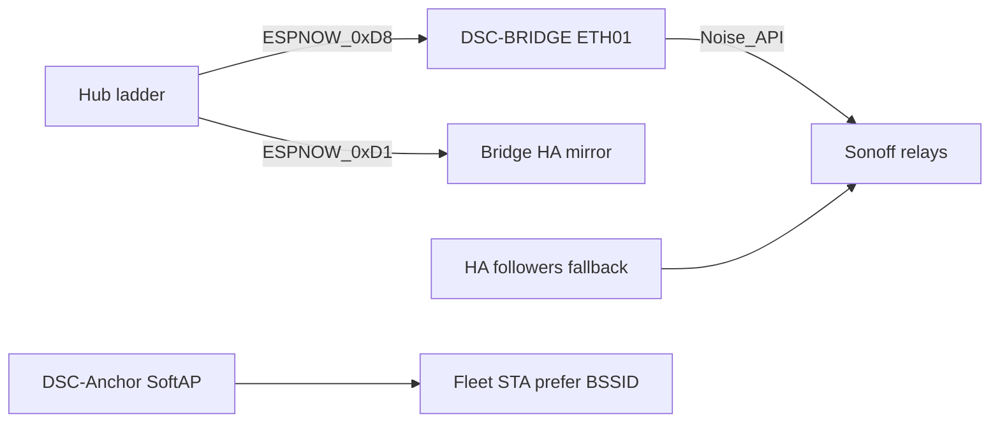

# F-010 / F-012 / F-013 — ETH01 appliance bridge + channel anchor + HA mirror

**In one line:** WT32-ETH01 follows hub demand over ESP-NOW, drives Sonoffs without HA, SoftAP-pins the fleet channel, and mirrors hub vitals to HA over Ethernet.

**Train:** firmware **5.2.0** (hub / Control / pots / bridge / Sonoffs). HA surface stays **6.0.0** (React panel). Fleet expected helper initial **5.2.0**.

## Paths



```
Hub demand ──ESP-NOW 0xD8──► DSC-BRIDGE ──native API──► Sonoff relays
Hub vitals ──ESP-NOW 0xD1 broadcast──► Bridge HA mirror (Ethernet)
Fleet STA ──prefer DSC-Anchor SoftAP BSSID──► fixed channel (F-012)
HA followers ──idempotent fallback──► same relays (when HA up)
```

## Firmware

| Stub | Role |
|---|---|
| [`firmware/v4/dsc-bridge.yaml`](../../firmware/v4/dsc-bridge.yaml) | Lab |
| [`firmware/v4/dsc-bridge-kit.yaml`](../../firmware/v4/dsc-bridge-kit.yaml) | Kit (ethernet + SoftAP; SoftAP hello deferred F-014) |
| [`firmware/v4/dsc-bridge-common.yaml`](../../firmware/v4/dsc-bridge-common.yaml) | Shared body (`project.version` **5.2.0**) |
| [`firmware/v4/components/dsc_api_client/`](../../firmware/v4/components/dsc_api_client/) | Noise native API client |
| [`firmware/v4/components/dsc_anchor_ap/`](../../firmware/v4/components/dsc_anchor_ap/) | SoftAP with ethernet (ESPHome forbids `wifi:`+`ethernet:`) |

Flash order: hub → panel → pots → **bridge** → Sonoffs. Validate/flash from `firmware/v4/` (or HA stubs after Sync copies `components/`).

## Secrets (template)

From [`firmware/v4/secrets.yaml.template`](../../firmware/v4/secrets.yaml.template):

- `dsc_bridge_api_key` / `dsc_bridge_ota_password` / `dsc_bridge_ap_password`
- `dsc_anchor_ap_password` — SoftAP **`DSC-Anchor`**
- Four Sonoff hosts used by the bridge client: `dsc_heater_host`, `dsc_heatmat_host`, `dsc_humidifier_host`, `dsc_dehumidifier_host`

Never commit `secrets.yaml`.

## HA package

[`homeassistant/packages/dsc_v4_bridge.yaml`](../../homeassistant/packages/dsc_v4_bridge.yaml) exposes helpers used by Pro System:

- `binary_sensor.dsc_bridge_online` (hub ESP-NOW link)
- `binary_sensor.dsc_anchor_softap_up`
- `sensor.dsc_anchor_bssid` / `sensor.dsc_anchor_channel` (from bridge entities)
- Per-appliance API link sensors (`dsc_bridge_*_api_link`)
- Automation `dsc_prefer_anchor_bssid` can pin preferred AP when Anchor BSSID is known

System view cards: `homeassistant/dashboards/modules/view_system.yaml`.

## Safety

- Bridge respects demand OFF as hard
- No fresh `0xD8` for 45s → all four relays OFF
- Sonoff API-loss grace still applies if **all** clients disconnect
- Manual button test mode still local stop (bridge skips commands)
- HA demand followers remain idempotent fallback (still debounce OFF ~25s)

## Bring-up pitfalls

| Pitfall | Detail |
|---|---|
| ESPHome `wifi:` + `ethernet:` | Forbidden — SoftAP is custom `dsc_anchor_ap`, not stock `wifi:` AP |
| Bridge Validate fails | Missing `components/dsc_api_client` / `dsc_anchor_ap` beside stub |
| SoftAP hello to hub | **Deferred F-014** — paste `sensor.dsc_bridge_anchor_bssid` into hub `bridge_mac` / Lock WiFi prefer after first ethernet boot |
| Kit SoftAP portal on ETH01 | **Deferred F-011** — kit `DSC-Setup-*` still on hub |
| Flash old sketch | Do **not** flash retired `dsc-appliance-bridge.yaml` path for product (N-096 BOM still open for board kit story) |
| Sonoffs “need HA” | Outdated — with bridge up, appliances follow hub demand without HA; HA followers are fallback |

## Acceptance

- HA powered off; hub raises humidifier demand; relay follows within ~2s
- Hub clears demand; relay off
- Bridge peer lost / stale; relays off
- Control alert is “Appliances need bridge or HA” (not bare HA-only)
- Fleet prefers Anchor BSSID; ESP-NOW holds without Nest hops
- Pro System view shows bridge / anchor / Sonoff API links
- `sensor.dsc_bridge_*` / firmware text **5.2.0** lockstep with `project.version`

## Deferred

- **F-011** — move kit `DSC-Setup-*` portal host onto ETH01
- **F-014** — bridge SoftAP satellite hello without ESPHome `wifi:` (paste Anchor BSSID into hub)
- **N-096** — F-010 board BOM + ESP-NOW demand protocol packaging for kit

See FOLLOWUPS **ETH01 bridge pass** / **N-093** Done / **N-096** open. Product unbox: [`SETUP.md`](../../SETUP.md).
