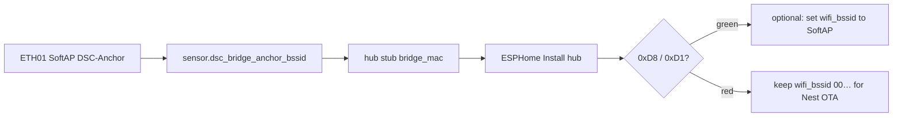

# F-010 / F-012 / F-013 — ETH01 appliance bridge + channel anchor + HA mirror

**In one line:** WT32-ETH01 follows hub demand over ESP-NOW, drives Sonoffs without HA, SoftAP-pins the fleet channel, and mirrors hub vitals to HA over Ethernet.

## Paths

```
Hub demand ──ESP-NOW 0xD8──► DSC-BRIDGE ──native API──► Sonoff relays
Hub vitals ──ESP-NOW 0xD1 broadcast──► Bridge HA mirror (Ethernet)
Fleet STA ──prefer DSC-Anchor SoftAP BSSID──► fixed channel (F-012)
HA followers ──idempotent fallback──► same relays (when HA up)
```

## Firmware

| Stub | Role |
|---|---|
| [`firmware/v4/dsc-bridge.yaml`](../../firmware/v4/dsc-bridge.yaml) | Lab |
| [`firmware/v4/dsc-bridge-kit.yaml`](../../firmware/v4/dsc-bridge-kit.yaml) | Kit (ethernet + SoftAP; SoftAP hello deferred F-014) |
| [`firmware/v4/components/dsc_api_client/`](../../firmware/v4/components/dsc_api_client/) | Noise native API client |
| [`firmware/v4/components/dsc_anchor_ap/`](../../firmware/v4/components/dsc_anchor_ap/) | SoftAP with ethernet (ESPHome forbids `wifi:`+`ethernet:`) |

## Safety

- Bridge respects demand OFF as hard
- No fresh `0xD8` for 45s → all four relays OFF
- Sonoff API-loss grace still applies if **all** clients disconnect
- Manual button test mode still local stop (bridge skips commands)

## Acceptance

- HA powered off; hub raises humidifier demand; relay follows within ~2s
- Hub clears demand; relay off
- Bridge peer lost / stale; relays off
- Control alert is “Appliances need bridge or HA” (not bare HA-only)
- Fleet prefers Anchor BSSID; ESP-NOW holds without Nest hops
- Pro System view shows bridge / anchor / Sonoff API links

## Secrets (`generate-secrets.sh`)

Fresh lab keys: run [`firmware/v4/generate-secrets.sh`](../../firmware/v4/generate-secrets.sh)
(or fill [`secrets.yaml.template`](../../firmware/v4/secrets.yaml.template)).

Bridge block emitted by the generator:

| Key | Used by |
|---|---|
| `dsc_bridge_api_key` / `_ota_password` / `_ap_password` | `dsc-bridge.yaml` / kit stubs |
| `dsc_anchor_ap_password` | SoftAP `DSC-Anchor` (F-012) |
| `dsc_{heater,heatmat,humidifier,dehumidifier}_host` | Bridge native API client targets |

Never commit `secrets.yaml`. Rotating bridge keys means re-flashing the ETH01 (and updating HA API entries).

## Hub `bridge_mac` / `wifi_bssid` (lab paste — F-014 until SoftAP hello)

Until kit SoftAP hello lands, paste the bridge Anchor SoftAP BSSID into the hub stub.
Two substitutions — do not conflate them:

| Substitution | Role |
|---|---|
| `bridge_mac` | ESP-NOW peer allow-list for the bridge SoftAP MAC |
| `wifi_bssid` | Optional STA preferred BSSID (Lock WiFi / Nest pin) |



### Lab sequence (post Bridge bring-up)

1. Bridge online; SoftAP up; read `sensor.dsc_bridge_anchor_bssid` (lab example `58:2A:BD:60:3C:1D`).
2. Set hub stub `bridge_mac` to that BSSID. After alignment commit `4985431`, both
   [`firmware/v4/dsc-hub.yaml`](../../firmware/v4/dsc-hub.yaml) and
   [`homeassistant/esphome/dsc-hub.yaml`](../../homeassistant/esphome/dsc-hub.yaml)
   carry the live lab paste; **kits** still default `00:00:00:00:00:00`.
3. Leave `wifi_bssid: "00:00:00:00:00:00"` until Hub ESP-NOW Link is green — Nest OTA stays possible.
4. Power-cycle hub if unreachable, then ESPHome **Install** so the substitution is compiled in.
5. Confirm Hub ESP-NOW Link True + demand `0xD8` / vitals `0xD1`, then optionally pin SoftAP via `wifi_bssid`.

**Pitfalls:** `bridge_mac` ≠ `wifi_bssid`; Sonoffs API True with Hub ESP-NOW Link False usually means hub never got the paste (or radio/channel), not a Sonoff fault; do not force SoftAP `wifi_bssid` before ESP-NOW is green if Nest-path OTA is still needed.

## Deferred

- **F-011** — move kit `DSC-Setup-*` portal host onto ETH01
- **F-014** — bridge SoftAP satellite hello without ESPHome `wifi:` (paste Anchor BSSID into hub)
- **F-015** — Sync copy of `dsc_api_client` + `dsc_anchor_ap` into `/config/esphome/components/` (manual until closed)
