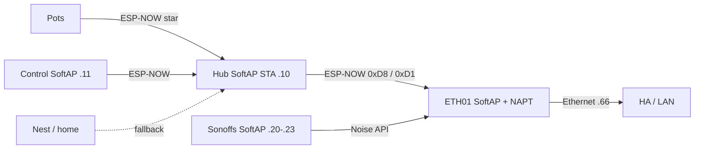

# F-010 / F-012 / F-013 — ETH01 SoftAP fleet home + appliance bridge

**In one line:** WT32-ETH01 hosts SoftAP `DSC-Anchor` (NAPT + ESP-NOW on `WIFI_IF_AP`), drives Sonoffs over Noise API, and mirrors hub vitals to HA over Ethernet. SoftAP-primary membership for Hub / Control / Sonoffs is the steady state (`21e34e5`) — Nest is emergency fallback only.

**Design:** [`docs/superpowers/specs/2026-08-10-softap-fleet-star-design.md`](../superpowers/specs/2026-08-10-softap-fleet-star-design.md)  
**Ops runbook:** [`docs/qa/SOFTAP-FLEET-HOME.md`](../qa/SOFTAP-FLEET-HOME.md)  
**FOLLOWUPS:** SoftAP fleet home § (2026-08-10 SoftAP-primary restore)

## Topology (current membership)

| Path | Role |
|---|---|
| Hub demand `0xD8` → bridge → Sonoff Noise API | HA-down actuation |
| Hub vitals `0xD1` broadcast → bridge HA mirror | Ethernet telemetry |
| SoftAP AP on bridge | Fleet Wi‑Fi home + channel pin |
| Hub / Control / Sonoffs SoftAP STA | **Steady-state** membership (`21e34e5`) |
| SoftAP BSSID pin `58:2A:BD:60:3C:1D` | SoftAP wifi entry only — never home Wi‑Fi; never `00…` |
| SoftAP static map `.10`/`.11`/`.20`–`.23` | Required (no SoftAP DHCPS) |
| Pots → hub ESP-NOW only | SoftAP not preferred (star + STA budget) |
| HA followers | Idempotent fallback when HA up |

## SoftAP networking (v1)

| Item | Value |
|---|---|
| SSID | `DSC-Anchor` |
| Gateway | `192.168.4.1/24` |
| Client addressing | **Static map** — no SoftAP DHCPS in v1 |
| SoftAP mode | `WIFI_MODE_APSTA` |
| Forwarding | LwIP IP forward + IPv4 NAPT on SoftAP netif |
| ESP-NOW ifidx | `WIFI_IF_AP` after SoftAP up (peers rebound) |
| Max STA | **10** (`max_connections` + `CONFIG_ESP_WIFI_SOFTAP_MAX_NUM_STA`) |
| Bridge ETH | Static `192.168.86.66` (DHCP `.17` broke SoftAP route) |
| sdkconfig | `CONFIG_LWIP_IP_FORWARD`, `CONFIG_LWIP_IPV4_NAPT`, `CONFIG_ESP_WIFI_SOFTAP_MAX_NUM_STA=10` |

### Static SoftAP leases

| Device | SoftAP IP |
|---|---|
| Hub | `192.168.4.10` (`use_address`) |
| Control | `192.168.4.11` (`use_address`) |
| Heater | `192.168.4.20` |
| Heatmat | `192.168.4.21` |
| Humidifier | `192.168.4.22` |
| Dehumidifier | `192.168.4.23` |

HA → SoftAP clients needs `192.168.4.0/24 via 192.168.86.66`. SoftAP preference stays even while L3 soak continues — do not Nest-first as the product steady state.

## Membership rules

- SoftAP priority > home Wi‑Fi
- Pin Anchor BSSID on SoftAP nets only (`wifi_bssid` / `softap_bssid`)
- Home Wi‑Fi has no BSSID pin
- Never `bssid: 00:00:00:00:00:00`
- SoftAP STA budget: hub + control + 4 sonoffs = 6; bridge capacity 10; pots excluded

## Fleet Fix (glass)

Primary UX is glass (works without HA). HA button remains a duplicate trigger.

1. `FIX_ACTIVE=1` (`0xDC` op **60**) → hub blocks OTA / HA safe-off grace  
2. `FLEET_JUMP` (op **62**) → hub pins preferred SoftAP BSSID (`bridge_mac`) + WiFi bounce; EVT `FLEET_JUMP`  
3. Poll hub vitals → Control SoftAP bounce → pot link bits (star wait)  
4. Success gate: SoftAP preferred match (when known) + hub beat + pots OK  
5. `FIX_ACTIVE=0` → return to Connections  

Code: `fleet_fix_run` in `dsc-control-common.yaml`; `rf_fleet_jump_arm` in `dsc-hub-fleet-heal.yaml`.

## Firmware

| Path | Role |
|---|---|
| [`firmware/v4/dsc-bridge.yaml`](../../firmware/v4/dsc-bridge.yaml) | Lab stub |
| [`firmware/v4/dsc-bridge-kit.yaml`](../../firmware/v4/dsc-bridge-kit.yaml) | Kit (ethernet + SoftAP; SoftAP hello deferred F-014) |
| [`firmware/v4/components/dsc_api_client/`](../../firmware/v4/components/dsc_api_client/) | Noise native API client |
| [`firmware/v4/components/dsc_anchor_ap/`](../../firmware/v4/components/dsc_anchor_ap/) | SoftAP + NAPT with ethernet (ESPHome forbids `wifi:`+`ethernet:`) |
| `dsc-*-wifi-lab.yaml` / `dsc-sonoff-common.yaml` | **SoftAP-primary** membership + SoftAP BSSID pin |

## Sensors / secrets

- `sensor.dsc_bridge_anchor_bssid` — SoftAP **AP MAC** (paste into hub `bridge_mac` / SoftAP `wifi_bssid`)
- `binary_sensor.dsc_bridge_anchor_softap_up` — SoftAP up
- `sensor.dsc_bridge_anchor_channel` — pinned channel (lab default 11)
- Secrets: `dsc_bridge_*`, `dsc_anchor_ap_password`, four `dsc_*_host` (SoftAP IPs when SoftAP-primary)

## Safety

- Bridge respects demand OFF as hard
- No fresh `0xD8` for 45s → all four relays OFF
- Sonoff API-loss grace still applies if **all** clients disconnect
- Manual button test mode still local stop (bridge skips commands)

## Acceptance

- SoftAP-primary Hub `.10` / Control `.11` / Sonoffs `.20`–`.23`
- SoftAP beacon up; eth `.66`; Anchor BSSID published
- Hub path to HA API via NAPT + SoftAP route
- `binary_sensor.dsc_bridge_hub_esp_now_link` can go on
- Bridge toggles a Sonoff at SoftAP static IP
- Glass Fleet Fix ops 60/62 walk
- HA powered off; hub raises humidifier demand; relay follows within ~2s
- Control alert is “Appliances need bridge or HA” (not bare HA-only)

## Deferred / still open

- SoftAP L3 / HA route **hardware soak** (does not justify Nest-first steady state)
- **F-011** — move kit `DSC-Setup-*` portal host onto ETH01
- **F-014** — bridge SoftAP satellite hello without ESPHome `wifi:`
- **F-015** — Sync copy of `dsc_api_client` + `dsc_anchor_ap` to HA `/config/esphome/components/`
- L2 SoftAP↔Ethernet bridge (v1 uses NAPT + host route instead)
- Pots as SoftAP STAs (non-goal)
