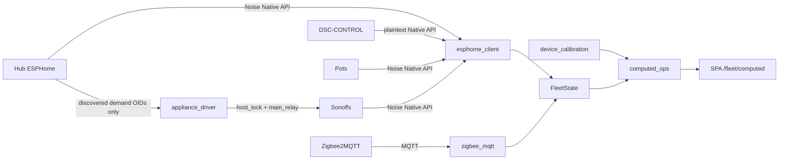

# Fleet ingest + appliance path (7.1.2)

**Intent:** How Pi brain turns hub/panel/pot/Sonoff Native API traffic and Zigbee MQTT into fleet truth and Sonoff relays — including 7.1.1 closeout, the 7.1.2 heatmat alias fix, and remediation fleet truth. Verified against tip `65d4104`.

**Acceptance / soak:** [`LIVE-ACCEPTANCE-7.1.md`](../qa/LIVE-ACCEPTANCE-7.1.md) · [`SOAK-2026-08-26.md`](../ops/SOAK-2026-08-26.md) · closure [`AUDIT-CLOSURE-7.1.2.md`](../qa/AUDIT-CLOSURE-7.1.2.md)  
**Flash / AP heal:** [`SONOFF-FLASH.md`](../ops/SONOFF-FLASH.md) · **Cutover:** [`DSC-HUB-DOCKER.md`](../ops/DSC-HUB-DOCKER.md)  
**Fleet truth / Settings:** [`FLEET-TRUTH.md`](FLEET-TRUTH.md) · [`SETTINGS-OPS.md`](SETTINGS-OPS.md)  
**Compose tent/stage:** [`COMPOSE-STAGE.md`](COMPOSE-STAGE.md) · **SPA gauges:** [`WEBUI.md`](WEBUI.md#gauge-color-semantics)

## Architecture



ETH01 bridge is **retired** (`firmware/_history/v4/`). Product Sonoff path is `appliance_driver` only.

## Panel plaintext ingest

Panel firmware disables Noise (RAM). Ingest must not force a Noise PSK from env:

| Codepath | Behavior |
|---|---|
| `esphome_client` seat loop | If `role == "panel"`, use inventory `api_key` only — **never** `DSC_*_API_KEY` env |
| `native_api.make_api_client` | Empty key → `APIClient(host, 6053)` (plaintext); non-empty → `noise_psk=` |
| Firmware | `dsc-control-common.yaml` `api:` block — no encryption; boot/about UI strings **v7.0.0.0** / “Pi island” |

**Pitfall:** Leaving a Noise key in HA/ESPHome for the panel causes handshake failures. Empty panel inventory key is correct for plaintext.

## Appliance driver (demand → relay)

| Item | Detail |
|---|---|
| Module | `brain/dsc_brain/appliance_driver.py` |
| Map | Hub switch object_id → seat: `heater_demand`, `humidifier_demand`, `dehumidifier_demand`, **`grow_mat_demand`** / legacy **`growmat_demand`** → `heatmat` |
| Relay OID | Sonoff `main_relay` |
| Stale | No fresh hub demand for **45s** → command relays OFF |
| Poll | ~2s |
| Concurrency | `api_lock.host_lock(host)` around hub read **and** each Sonoff write |

### Undiscovered aliases (7.1.2)

`DEMAND_TO_SEAT` keeps firmware-variant aliases (`grow_mat_demand` and `growmat_demand`). **`_demands_from_discovered` emits only object_ids actually discovered on the hub.** Emitting an undiscovered alias as `False` overwrote live `grow_mat_demand` ON every tick and chattered the heatmat relay (~10 s period). Unit test: `test_appliance_undiscovered_aliases_not_emitted`. Soak proof: [`SOAK-2026-08-26.md`](../ops/SOAK-2026-08-26.md).

```bash
# Manual Takeover ON (stops ladder overwriting demand); hub online on AP
curl -s -X POST http://10.42.0.1:8787/control/demand \
  -H 'content-type: application/json' \
  -d '{"seat":"heatmat","state":true}'
# Expect fleet system.relays.heatmat true within ~6s; restore takeover OFF + full auto after
```

## Calibration → computed entities

Wizards write rows via `GET|POST /settings/calibration/{device_id}`. `computed_ops.build_computed_hass_states` consumes them:

| Entity | Source | Honesty |
|---|---|---|
| `number.dsc_hub_sf1000_effective_off_pct` | Lowest dim % on `sf1000` / `light_par` curve where lux < 5 and PAR < 10 (or 0) | `measured_curve` · else `ramp_floor_fallback` |
| `binary_sensor.dsc_light_effectively_off` | Live SF1000 brightness % ≤ effective-off | — |
| `binary_sensor.dsc_live_intake_over_exhaust` | Sum intake CFM > exhaust CFM × **1.02** | Hub live gated |
| `binary_sensor.dsc_plant_specs_intake_over_exhaust` | Same breach flag for plant-specs consumers | Hub live gated |

**Constraint:** Do not invent PAR/PPFD/height from ordinal labels — curves only use measured calibration rows. Expected-stage sensors for compose live in `computed_ops` + [`stage_model.py`](../../brain/dsc_brain/stage_model.py).

## Online / OOS gates (ingest)

| Gate | Behavior |
|---|---|
| `in_service=false` | Skip Native API poll; `_mark_oos_seat` + `merge_inventory_oos_seats` on `/fleet` |
| No sample > **120 s** | `_expire_unpolled_seats` → `online=false` (`ONLINE_STALE_SEC`) |
| Panel | Plaintext only (empty inventory key; never env Noise PSK) |

Details: [`FLEET-TRUTH.md`](FLEET-TRUTH.md).

## Zigbee placement ingest

| Item | Detail |
|---|---|
| Module | `brain/dsc_brain/zigbee_mqtt.py` |
| Placement map | Setting `zigbee_placements` (JSON friendly_name→placement) **plus** inventory `extra.zigbee_friendly_name` / `friendly_name` + `extra.placement` |
| Per-device | MQTT `zigbee2mqtt/<friendly>` → `system.zigbee_device_states` |
| By placement | `system.zigbee_by_placement[placement]` |
| Canopy | Legacy aggregate; prefers payloads whose placement starts with `canopy` |
| Health | `get_zigbee_health()` on `/health` + `/settings/zigbee/health` — `mqtt_connected` ≠ empty-until-paired |

Empty device list until paired is OK **when MQTT is up**. Radio down must surface as disconnected ([`SETTINGS-OPS.md`](SETTINGS-OPS.md)).

## Developer checks

```bash
pip install -r brain/requirements.txt pytest
pytest brain/tests/test_brain_pi.py -q   # grow_mat_demand + undiscovered-alias contract
# Panel API smoke (optional against live Pi)
python brain/scripts/test_panel_api.py
python brain/scripts/test_panel_fetch.py
```

## Related archaeology

Superseded ETH01 design notes: [`F010_APPLIANCE_BRIDGE.md`](F010_APPLIANCE_BRIDGE.md) (archive paths only).
