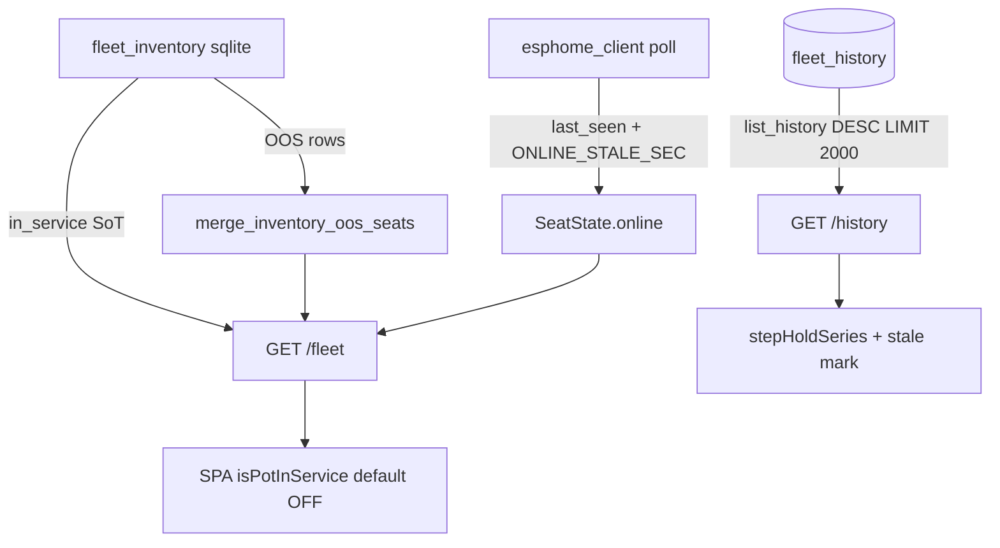

# Fleet truth (7.1.2 remediation)

**Intent:** One honest picture of which seats exist, which are online, and which charts show live vs held history. Verified against tip `65d4104` (`fleet_state.py`, `esphome_client.py`, `settings.list_history`, `seatModel.ts`).

**Closure matrix:** [`AUDIT-CLOSURE-7.1.2.md`](../qa/AUDIT-CLOSURE-7.1.2.md) · ingest: [`FLEET-INGEST.md`](FLEET-INGEST.md) · settings: [`SETTINGS-OPS.md`](SETTINGS-OPS.md)

## Architecture



## `in_service` SoT

| Layer | Role |
|---|---|
| **SQLite `fleet_inventory.in_service`** | **Source of truth** for seats in the control/UI loop |
| `PATCH /settings/inventory/{seat}` | Operator toggle (Settings + DecisionLayer confirm) |
| Hub `switch.dsc_hub_*_in_service` | **Mirror** — synced on inventory PATCH via `sync_inventory_in_service_to_hub` / `hub_native` |
| SPA `isPotInService` | Reads inventory / hass booleans; **missing row defaults OFF** (never re-admit OOS pots) |

**Planned OOS seats** (`ac`, `mister`, `tank`, and any unchecked pot) stay in Settings cards and appear in `/fleet` as offline stubs via `merge_inventory_oos_seats` — they are not polled for Native API ingest.

**Pitfall:** Do not treat hub firmware in_service switches as an independent operator toggle. Flip inventory; the hub follows.

## Online expiry

| Constant | Value | Module |
|---|---|---|
| `ONLINE_STALE_SEC` / `_ONLINE_STALE_SEC` | **120 s** | `esphome_client.py` |

After a successful poll, `last_seen` advances. `_expire_unpolled_seats` marks `online=False` when `now - last_seen > 120` while the seat remains `in_service`. Failed polls keep prior values via `_mark_stale_seat` until expiry.

**Honesty:** Grey gauges / offline chips mean no fresh Native API sample within two minutes — not “device deleted.”

## History cap

| API | Behavior |
|---|---|
| `record_history(seat, metric, value)` | Append-only SQLite `fleet_history` (~5 s ingest cadence for live metrics) |
| `list_history(..., limit=2000)` | **`ORDER BY ts DESC LIMIT n`** — newest samples win |
| `query_entity_history` | Sorts ascending for charts after the capped fetch |
| SPA downsample | Index stride (1h/60 … 48h/192); not min/max envelope |

**Before 7.1.2:** ASC + LIMIT dropped the **newest** points once a series exceeded 2000 (48h charts flatlined mid-window).

**After:** Charts receive the newest 2000 points in range. Step-hold tails past the last real sample must render **stale/held**, not live (`seriesHold.ts` / `viz/charts.tsx`).

```bash
# Smoke: newest-first contract
pytest brain/tests/test_brain_pi.py -q -k list_history_newest
```

## Related entity map gaps (fixed in same pass)

`history_ops.ENTITY_METRIC_MAP` now includes room VPD, fan `*_pct`, window binaries, SF1000 brightness, and grow-mat demand so Climate/Light/Root strips resolve instead of silent `[]` + “Thin recorder.”

## Developer checks

```bash
pytest brain/tests/test_brain_pi.py -q -k 'in_service or list_history or online_stale'
# Live (studio LAN): curl -s http://dsc-brain.local:8787/fleet | jq '.pots.pot3'
# Expect in_service false + online false when pot3 OOS
```
