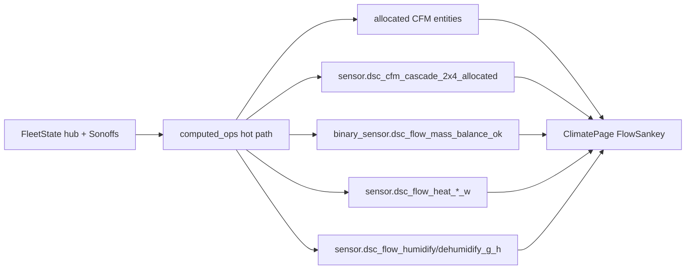

# Flow Sankey (7.3)

**In one line:** Experimental Climate viz for air CFM, heat watts, and humidity mass proxies — informational only, never a control input.

**UI:** Pi SPA → Live → Climate → **Air path** card (`FlowSankey`).  
**Code:** `frontend/src/components/FlowSankey.tsx` · proxies in `brain/dsc_brain/computed_ops.py`.

## Intent

Operators need a single picture of how intake / cascade / dump / recirc and climate appliances move energy and moisture. 7.2 shipped a CFM-only prototype (`SankeyFlowPrototype`); 7.3 replaces it with tabbed **Air / Heat / Humidity** and brain-computed cascade + mass-balance entities.

## Architecture



## Modes

| Tab | Unit | Sources | Notes |
|-----|------|---------|-------|
| **Air** | CFM | Intake 2×4 / 4×8, cascade, dump, recirc via `resolveCfm(..._allocated, ...)` | Mass-balance chip when `binary_sensor.dsc_flow_mass_balance_ok` is available |
| **Heat** | W | `sensor.dsc_flow_heat_tent_w`, `sensor.dsc_flow_heat_mat_w` | Estimated proxies (see honesty) |
| **Humidity** | g/h | `sensor.dsc_flow_humidify_g_h`, `sensor.dsc_flow_dehumidify_g_h` | UI splits humidify ~55/45 across tents for layout only |

### Cascade + mass balance (verified)

When total intake ≥ 0.5 CFM:

```
direct_exhaust_2x4 = out_alloc * (intake_2x4_alloc / total_intake)
cascade_2x4        = max(0, intake_2x4_alloc - direct_exhaust_2x4)
imbalance          = |total_intake - (out_alloc + recirc_alloc)|
mass_ok            = imbalance < max(5 CFM, 5% of max(intake, exhaust))
```

Sonoff relay entities are merged from fleet `relay_on` when HA-shaped switches are absent (`_states_with_sonoff_relays`) so island SPA still gets heat/humidity proxies.

### Heat / humidity proxies (verified)

| Entity | When non-zero | Formula honesty attr |
|--------|---------------|----------------------|
| `dsc_flow_heat_tent_w` | heater demand **and** relay on | `max(0, tent_t − room_t) × 120` |
| `dsc_flow_heat_mat_w` | mat demand **and** relay on | constant `80` W |
| `dsc_flow_humidify_g_h` | humidifier demand **and** relay on | `max(0, rh_min − room_rh) × 2` |
| `dsc_flow_dehumidify_g_h` | dehumidifier demand **and** relay on | `max(0, room_rh − rh_max) × 2` |

## Constraints

- Marked **EXPERIMENTAL** in UI — do not wire control loops to these numbers.
- Provenance kinds come from `cfmProvenance` (allocated vs measured); labels are display-only.
- Heat/humidity are **not** calorimeter or psychrometric SoT — they scale with demand + delta T/RH.
- Related latch: `binary_sensor.dsc_heater_temp_oos_latch` (N-014) — heater demand+relay on, tent below target−1.5 °C for ≥480 s runtime today.

## Pitfalls

1. Missing cascade entity → UI falls back to intake 2×4 allocated as cascade reading (`ClimatePage` `resolveCfm` second id).
2. Room T/RH missing → heat tent / humidity proxies stay `0` even when relays are on.
3. Do not confuse with retired HA `dsc_airflow_*` Sankey helpers (culled earlier; archive only).

## Related

- Closure: [`docs/qa/AUDIT-CLOSURE-7.3.md`](../qa/AUDIT-CLOSURE-7.3.md)
- CFM ops: [`docs/ANEMOMETER-CFM.md`](../ANEMOMETER-CFM.md)
- Soak: [`docs/qa/FLOW-SANKEY-SOAK-7.3.md`](../qa/FLOW-SANKEY-SOAK-7.3.md)
- Tests: `test_brain_pi.py` flow proxy / mass-balance assertions
