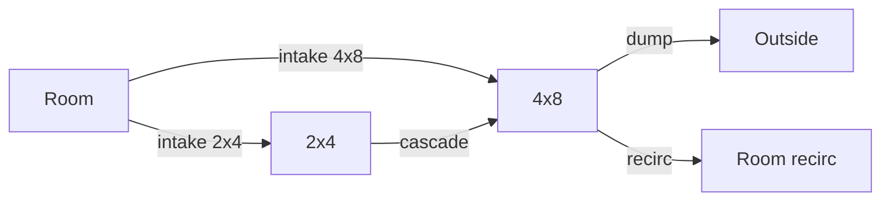

# FlowSankey — Climate air CFM (honesty)

**In one line:** Climate mounts one ECharts air CFM Sankey beside `AirPathMap`; heat/humidity estimated splits are gone; the mass-balance chip stays gated (`massBalanceOk={null}`).

**Tip (v7.4.0 signed off):** `32836fe` · SPA `index-K2_ziUnM.js` · soak [`../qa/FLOW-SANKEY-SOAK-7.3.md`](../qa/FLOW-SANKEY-SOAK-7.3.md) · closure [`../qa/AUDIT-CLOSURE-7.4.md`](../qa/AUDIT-CLOSURE-7.4.md)  
**Code:** `components/FlowSankey.tsx` · `pages/ClimatePage.tsx` · brain `computed_ops` CFM entities · `lib/cfmProvenance.resolveCfm`

## Intent

Operators need a live air-path diagram that never paints false “Mass imbalance” theater when allocated CFM and nameplate disagree. Phase 0 soak closed 2026-09-01; Phase B removed the **EXPERIMENTAL** label — chip is **Air CFM**.

## Usage (Climate → Air path)

| Input prop | Prefer (allocated) | Fallback (nameplate) |
|---|---|---|
| `intakeClone` | `sensor.dsc_cfm_intake_2x4_allocated` | `sensor.dsc_cfm_intake_2x4` |
| `intakeMain` | `sensor.dsc_cfm_intake_main_allocated` | `sensor.dsc_cfm_intake_main` |
| `cascade` | see pitfall below | — |
| `outCfm` | `sensor.dsc_cfm_exhaust_out_allocated` | `sensor.dsc_cfm_exhaust_out` |
| `recircCfm` | `sensor.dsc_cfm_exhaust_recirc_allocated` | `sensor.dsc_cfm_exhaust_recirc` |
| `massBalanceOk` | **always `null` from Climate** | chip omitted |

Behavior (verified in `FlowSankey.tsx`):

- Zero / missing links are **omitted** (graphic: “No measured air CFM…”).
- Tooltip shows Allocated / Nameplate kind via `cfmKindLabel`.
- Deprecated heat/humidity props are ignored.

Brain still emits `binary_sensor.dsc_flow_mass_balance_ok` for diagnostics — SPA must not paint it as operator theater.

## Pitfall — cascade entity id

Brain computed writes:

- `sensor.dsc_cfm_cascade_2x4_allocated` (`computed_ops.py`, mass_balance_cascade model)

Climate currently resolves:

- `sensor.dsc_cfm_cascade_allocated` / `sensor.dsc_cfm_cascade`

Those SPA ids are **not** produced by the brain on tip `32836fe`. Cascade link therefore falls through `resolveCfm` to a non-finite / zero nameplate and is omitted from the chart — intake/dump/recirc links still render when allocated CFM is live (soak snapshot 2026-09-01).

**Do not** invent cascade CFM in the SPA. Fix path (code, not this docs PR): point Climate `resolveCfm` at `sensor.dsc_cfm_cascade_2x4_allocated` (no nameplate companion today). Tracked in [`../FOLLOWUPS.md`](../FOLLOWUPS.md).

## Constraints

- Do not re-add heat/humidity Sankey tabs without live producers + soak.
- Do not wire Overview mass-balance alert without ops OK.
- ECharts only — no second chart library for this surface.

## Related

- Soak / signoff: [`../qa/FLOW-SANKEY-SOAK-7.3.md`](../qa/FLOW-SANKEY-SOAK-7.3.md)
- Plan Phase B: [`../qa/PLAN-7.4.md`](../qa/PLAN-7.4.md)
- Viz rule: [`.cursor/rules/dsc-viz-honesty.mdc`](../../.cursor/rules/dsc-viz-honesty.mdc) (rule text may lag shipped air Sankey — trust this SoT + code)
