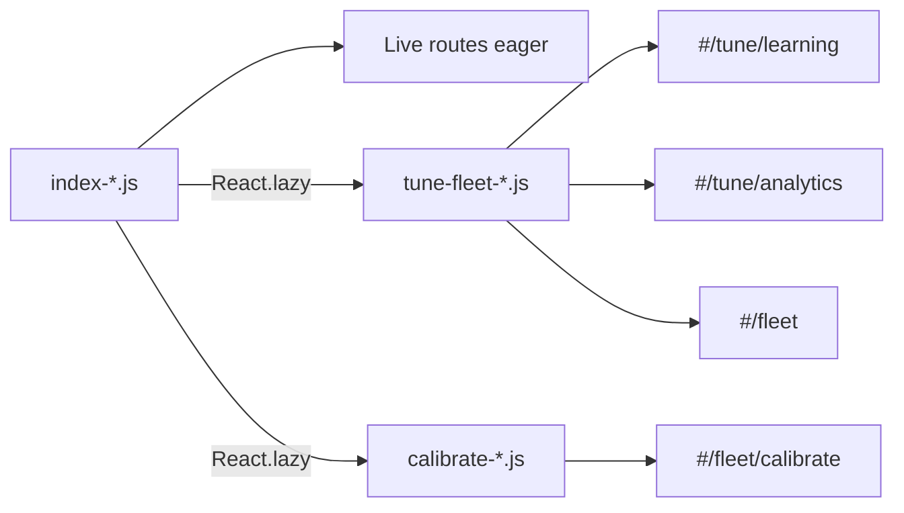

# Frontend CI and SPA code split

**Intent:** Gate panel TypeScript and SPA production builds on every push/PR that touches the frontend, and keep the main chunk under Vite’s size warning via route-level splits. Verified against tip `86f8c2e` (`.github/workflows/frontend-ci.yml`, `routes.ts`, `vite.spa.config.ts`, `spa-dist/`).

## CI workflow

[`.github/workflows/frontend-ci.yml`](../../.github/workflows/frontend-ci.yml)

| Trigger | Paths |
|---|---|
| `push` / `pull_request` | `homeassistant/custom_components/dsc_hub/frontend/**`, the workflow file itself |

| Step | Command (cwd = frontend) |
|---|---|
| Install | `npm ci` (Node **22**) |
| Typecheck | `npx tsc --noEmit` |
| Build | `npm run build:spa` |

**Local parity:**

```bash
cd homeassistant/custom_components/dsc_hub/frontend
npm ci
npx tsc --noEmit
npm run build:spa
```

Commit updated `spa-dist/` when shipping brain image / hot-patch (deploy scripts `docker cp` SPA static).

## Route-level code split



| Chunk | Source | Routes |
|---|---|---|
| Main `index-Ck-kkOyW.js` (hash drifts) | App shell + Live/Grow | Overview, Climate, tents, Settings shell, … |
| `tune-fleet-*.js` | `pages/TuneFleetPages.tsx` | Learning, Analytics, Fleet overview |
| `calibrate-*.js` | `pages/CalibratePage.tsx` | Calibrate soil/tank/CFM wizards |

`manualChunks` in `vite.spa.config.ts` mirrors the lazy imports in `routes.ts`. `index.html` may `modulepreload` the tune-fleet chunk.

## Twin / grow-log adjuncts (same pass)

- Twin/cockpit routes preload THREE + dash card via `ensureLocalCards` (`App.tsx`).
- Grow log: `growLogFilter.ts` drops noisy boot Stage/Clone lines and elevates dark-period alerts.

## Pitfalls

| Symptom | Fix |
|---|---|
| CI red on `tsc` | Fix types locally — Vite alone used to hide errors |
| Blank route after navigate | Suspense boundary / ErrorBoundary; hard-refresh after deploy |
| Stale hash after deploy | Confirm `spa-dist/index.html` script `src` matches disk; hard-reload `:8787` |
| Bundle &gt;500 kB warning returns | Keep Tune/Calibrate lazy; do not re-eager-import `TuneFleetPages` into App |
