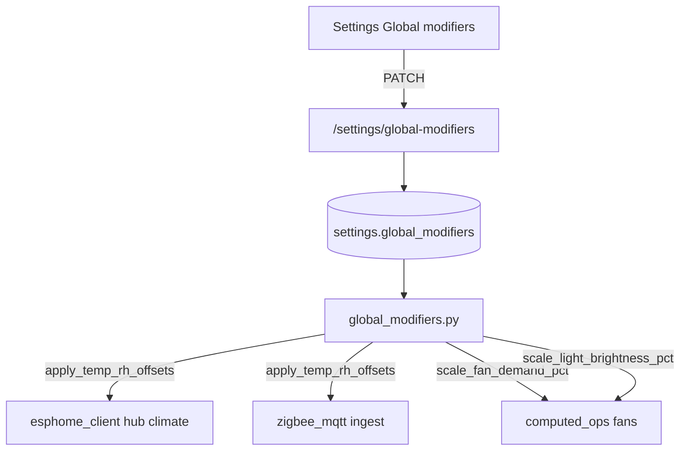

# Global modifiers (7.2)

**In one line:** Operator-tunable fan/light scales and per-zone temp/RH offsets applied on ingest and computed control — not a substitute for calibration.

**Code:** `brain/dsc_brain/global_modifiers.py` · Settings UI · `PATCH /settings/global-modifiers`  
**Persisted:** settings key `global_modifiers` (JSON)

## Intent

Give studio operators a single Settings accordion to:

1. Scale **fan demand %** and **light brightness %** used by `/fleet/computed` (0.5–1.5).
2. Offset **temp / RH** per climate zone (`room`, `clone`, `main`) on hub + Zigbee ingest.
3. Clamp out-of-range sensor values after offset (defaults: temp −5…50 °C, RH 0…100 %).

Offsets are applied **before** VPD recompute on the hub path. They do **not** rewrite firmware setpoints or ESPHome calibration tables.

## Architecture



| Hook | Module | Effect |
|------|--------|--------|
| Hub T/RH | `esphome_client._apply_hub_climate_modifiers` | Offsets `temp_c` / `clone_*` / `room_*`; sets `sensor_clamp_active` if clamped |
| Zigbee T/H | `zigbee_mqtt._on_message` | Zone inferred from placement label (`4x8`→main, `2x4`→clone, else room) |
| Fan % / CFM | `computed_ops` hot path | Scales control-derived fan % before CFM allocation |
| Light off gate | `computed_ops` | Scales brightness % before `dsc_light_effectively_off` |

## Defaults

```json
{
  "fan_demand_scale": 1.0,
  "light_brightness_scale": 1.0,
  "temp_offset_c": { "room": 0.0, "clone": 0.0, "main": 0.0 },
  "rh_offset_pct": { "room": 0.0, "clone": 0.0, "main": 0.0 },
  "sensor_clamp": {
    "temp_c": { "min": -5.0, "max": 50.0 },
    "rh_pct": { "min": 0.0, "max": 100.0 }
  }
}
```

`sensor_clamp` is returned and applied but **not** writable via the current PATCH body (code defaults only).

## API

```bash
# Read
curl -s http://dsc-brain.local:8787/settings/global-modifiers | jq .

# Scale exhaust demand + nudge room RH
curl -s -X PATCH http://dsc-brain.local:8787/settings/global-modifiers \
  -H 'content-type: application/json' \
  -d '{"fan_demand_scale":1.1,"rh_offset_pct":{"room":-3}}' | jq .
```

**Constraints (verified):**

- `fan_demand_scale` / `light_brightness_scale` clamped to **0.5–1.5** on write.
- Scaled fan/light percentages further clamped to **0–100**.
- Invalid JSON in settings → silent fallback to defaults.
- Zone keys outside `room|clone|main` are ignored.

## SPA

Fleet → Settings → **Global modifiers** accordion (`SettingsPage.tsx` + `fleetApi.patchGlobalModifiers`).

## Pitfalls

| Symptom | Cause | Fix |
|---------|-------|-----|
| Charts jump after Save | Offsets apply on next ingest tick | Wait one fleet poll; do not double-correct in firmware |
| Fan CFM “too high” after scale | Scale multiplies demand % before CFM curve | Reset scale to 1.0; use Calibrate for nameplate curves |
| Zigbee vs hub disagree more | Placement zone mapping wrong | Label placements with `4x8` / `2x4` / `canopy_*` so zone inference matches |
| Clamp flag on | Offset pushed reading outside clamp | Reduce offset or inspect sensor |

## Tests

`test_global_modifiers_offsets_and_clamp`, `test_global_modifiers_api` in `brain/tests/test_brain_pi.py`.
