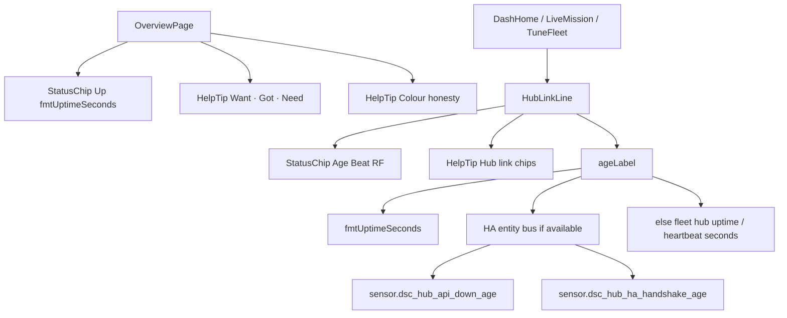

# Inline `?` HelpTip (SPA chrome)

**In one line:** Native `
` callouts that explain a chip row without a modal or JS dependency.

Architect sketch: [`docs/superpowers/plans/2026-08-28-dsc-polish-architect-sketch.md`](../superpowers/plans/2026-08-28-dsc-polish-architect-sketch.md)

## Intent

Operators land on Overview / Mission / Dash / Fleet and see **Age / Beat / RF** chips plus Want/Got colour semantics. Raw floats (`Age 20402.7890625`) and unexplained grey RF were audit debt (**DA-P1-1**). Tips `39d7f88` → `8208461` close that path with:

1. Human durations via `fmtUptimeSeconds` (HubLinkLine Age/Beat **and** Overview hub uptime)
2. Inline `?` tips on HubLinkLine **and** Overview (Want · Got · Need + Colour honesty)

## Components

| Piece | Path | Contract |
|-------|------|----------|
| `HelpTip` | `frontend/src/components/HelpTip.tsx` | `
` · summary `?` · `aria-label="Help: {title}"` · body = title + children |
| Styles | `frontend/src/styles/dsc.css` (`.dsc-help-tip*`) | Absolute popover under the `?`; works with no JS |
| `HubLinkLine` | `frontend/src/components/HubLinkLine.tsx` | Age / Bounces / RF / Beat + “Hub link chips” tip |
| `OverviewPage` | `frontend/src/pages/OverviewPage.tsx` | Hub ONLINE chip · `Up {fmtUptimeSeconds}` · Want/Got + Colour tips |
| Duration | `frontend/src/lib/formatDuration.ts` | `fmtUptimeSeconds(s)` → `10M` / `2H 14M` / `1.5D` |

## Age / Beat / Overview uptime

Verified in `HubLinkLine.tsx` + `OverviewPage.tsx`:

| Surface | Prefer when entity available | Else |
|---------|------------------------------|------|
| **HubLinkLine Age** | `sensor.dsc_hub_api_down_age` | Fleet hub `uptime` (seconds — brain publishes `unit_of_measurement: s`) |
| **HubLinkLine Beat** | `sensor.dsc_hub_ha_handshake_age` | Fleet hub `heartbeat` |
| **HubLinkLine Bounces / RF** | HA entity bus only | `—` when missing |
| **Overview Up** | `sensor.dsc_hub_uptime` via entity bus `num(...)` | Fleet `hub.values.uptime` |

`ageLabel` rules: `null` / `—` → `—`; finite number (or numeric string) → `fmtUptimeSeconds`; otherwise leave the string as-is.

**Examples:**

- `Age 2H 14M` — ~8040 s of healthy link (or HA down-age when that entity is the source).
- Overview `Up 2H 14M` — same formatter; no more `Up 2h` hour-only rounding from tip `8208461`.

## Overview HelpTip copy (tip `8208461`)

| Tip title | Operator meaning |
|-----------|------------------|
| **Want · Got · Need** | Want = target · Got = measured · Need = gap the brain proposes (not a guessed setpoint rewrite) |
| **Colour honesty** | Teal/green = in band · Amber = drifting · Red = out of band · Grey = no data / OOS (missing kit is not an alarm) |

## Developer pitfalls (conditional hooks — tip `8208461`)

React Doctor / Rules of Hooks traps fixed on this tip — keep these patterns:

| Hook / site | Wrong pattern | Correct pattern |
|-------------|---------------|-----------------|
| `usePanelOfflineMs` | Early-return **before** `useOfflineMs(...)` when Pi panel path short-circuits | Always call `useOfflineMs("binary_sensor.dsc_hub_panel_link")`, then choose Pi `last_seen` vs entity result |
| `useHeldReading` | Reset hold ref during render when `entityId` changes | Reset inside `useEffect([entityId])` + bump |
| `HassProvider` | Assign `hassRef.current = hass` during render | Sync ref in `useEffect([hass])` |

`OverviewPage` must import `useFleet` — tip closed a latent `ReferenceError` when reading `fleet.hub.*`.

## Constraints

- Prefer native `
` over modals — matches PD FAQ pattern; no help-store JS.
- Grey **RF** / OOS greys are not always faults — inventory out-of-service stays quiet on purpose.
- **SPA rebuild required:** tips `39d7f88`/`8208461` changed source only. Committed `spa-dist` (`index-DL1EcjhX` / `tune-fleet-IPnSFs3d`) still lacks `dsc-help-tip` / HelpTip strings until the next Vite build + hash sync. See [`../ops/DSC-HUB-DOCKER.md`](../ops/DSC-HUB-DOCKER.md) (`-SkipSpaBuild` pitfalls).

## Where it mounts

| Consumer | Pages |
|----------|-------|
| `HubLinkLine` | `DashHomePage.tsx` · `LiveMissionPage.tsx` · `TuneFleetPages.tsx` |
| Direct `HelpTip` | `OverviewPage.tsx` (Want/Got + Colour) |

## Residual (next polish)

| Gap | Notes |
|-----|-------|
| Full Auto `?` tip on Overview | PD dashboard has Full Auto tips in Help 1.2.2; SPA Overview not yet |
| Mission / Dash heartbeat chips outside `HubLinkLine` | Some pages still `String(heartbeat)` for Beat labels |
| PD `help_tip()` helper | WordPress-PD only; not a SPA export |
| Rebuild spa-dist | Operators still on pre-HelpTip bundle until Vite + deploy |

## Related

- [`WEBUI.md`](WEBUI.md) · [`../qa/DESIGN-AUDIT-7.1.md`](../qa/DESIGN-AUDIT-7.1.md) (DA-P1-1) · [`../FOLLOWUPS.md`](../FOLLOWUPS.md)
