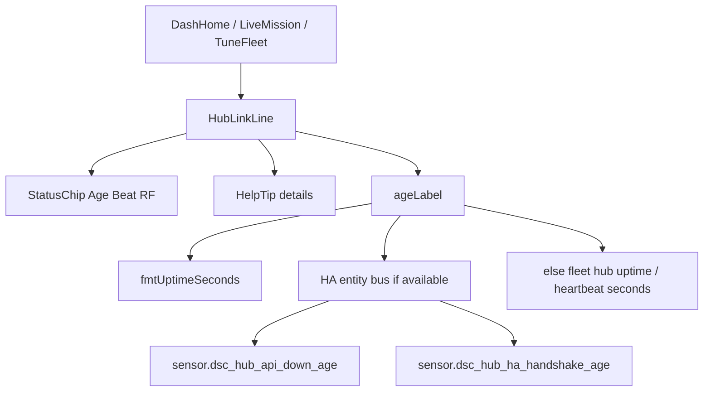

# Inline `?` HelpTip (SPA chrome)

**In one line:** Native `
` callouts that explain a chip row without a modal or JS dependency.

Architect sketch: [`docs/superpowers/plans/2026-08-28-dsc-polish-architect-sketch.md`](../superpowers/plans/2026-08-28-dsc-polish-architect-sketch.md)

## Intent

Operators land on Overview / Mission / Dash / Fleet and see **Age / Beat / RF** chips. Raw floats (`Age 20402.7890625`) and unexplained grey RF were audit debt (**DA-P1-1**). Tip `39d7f88` closes that path with:

1. Human durations via `fmtUptimeSeconds`
2. An inline `?` tip next to the hub link chips

## Components

| Piece | Path | Contract |
|-------|------|----------|
| `HelpTip` | `frontend/src/components/HelpTip.tsx` | `
` · summary `?` · `aria-label="Help: {title}"` · body = title + children |
| Styles | `frontend/src/styles/dsc.css` (`.dsc-help-tip*`) | Absolute popover under the `?`; works with no JS |
| `HubLinkLine` | `frontend/src/components/HubLinkLine.tsx` | First consumer — Age / Bounces / RF / Beat + tip |
| Duration | `frontend/src/lib/formatDuration.ts` | `fmtUptimeSeconds(s)` → `10M` / `2H 14M` / `1.5D` |

## Age / Beat source preference

Verified in `HubLinkLine.tsx`:

| Chip | Prefer when entity available | Else |
|------|------------------------------|------|
| **Age** | `sensor.dsc_hub_api_down_age` | Fleet hub `uptime` (seconds — brain publishes `unit_of_measurement: s`) |
| **Beat** | `sensor.dsc_hub_ha_handshake_age` | Fleet hub `heartbeat` |
| **Bounces / RF** | HA entity bus only | `—` when missing |

`ageLabel` rules: `null` / `—` → `—`; finite number (or numeric string) → `fmtUptimeSeconds`; otherwise leave the string as-is.

**Example:** `Age 2H 14M` means ~8040 s of healthy link (or the HA down-age reading, when that entity is the source).

## Constraints

- Prefer native `
` over modals — matches PD FAQ pattern; no help-store JS.
- Do **not** invent Want/Got/Need copy in the tip until product copy is wired; Hub link tip text is fixed in source today.
- Grey **RF** is not always a fault — inventory OOS stays quiet on purpose (stated in the tip body).
- **SPA rebuild required:** tip `39d7f88` changed source only. Committed `spa-dist` (`index-DL1EcjhX` / `tune-fleet-IPnSFs3d`) still lacks `dsc-help-tip` / HelpTip strings until the next Vite build + hash sync. See [`../ops/DSC-HUB-DOCKER.md`](../ops/DSC-HUB-DOCKER.md) (`-SkipSpaBuild` pitfalls).

## Where it mounts

`HubLinkLine` is rendered from:

- `DashHomePage.tsx`
- `LiveMissionPage.tsx`
- `TuneFleetPages.tsx`

## Residual (next polish)

| Gap | Notes |
|-----|-------|
| Want / Got / Full Auto `?` tips on Overview | Architect sketch “next”; HelpTip is reusable — not wired yet |
| Mission / Dash heartbeat chips outside `HubLinkLine` | Some pages still `String(heartbeat)` for Beat labels |
| PD `help_tip()` helper | Documented in the architect sketch for WordPress-PD; not a SPA export |

## Related

- [`WEBUI.md`](WEBUI.md) · [`../qa/DESIGN-AUDIT-7.1.md`](../qa/DESIGN-AUDIT-7.1.md) (DA-P1-1) · [`../FOLLOWUPS.md`](../FOLLOWUPS.md)
