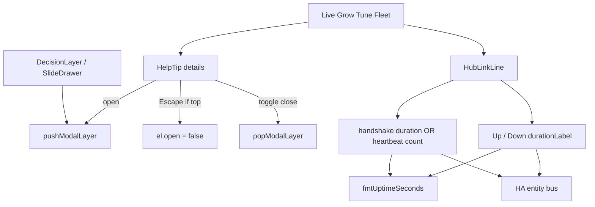
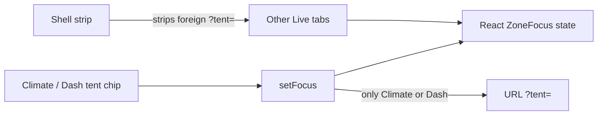

# Inline `?` HelpTip (SPA chrome)

**In one line:** Native `
` callouts that explain a chip row without a modal or help-store JS — Escape-aware via the shared modal layer.

Architect sketch: [`docs/superpowers/plans/2026-08-28-dsc-polish-architect-sketch.md`](../superpowers/plans/2026-08-28-dsc-polish-architect-sketch.md) · mm-review: [`docs/superpowers/plans/2026-08-28-polish-pass-mm-review.md`](../superpowers/plans/2026-08-28-polish-pass-mm-review.md)

## Intent

Operators land on Overview / Climate / Grow / Fleet and see **Age / Beat / RF**, Want/Got colour, and desk-specific jargon. Raw floats (`Age 20402.7890625`), heartbeat ticks formatted as hours, and unexplained greys were audit debt (**DA-P1-1**). Tips `39d7f88` → `c1eaedd` close that path with:

1. Honest hub chips via `HubLinkLine` (`Up`/`Down` + Beat duration-or-count)
2. Inline `?` tips across Live / Grow / Tune / Fleet desks
3. Escape ownership shared with drawers (`modalLayer`)

## Components

| Piece | Path | Contract |
|-------|------|----------|
| `HelpTip` | `frontend/src/components/HelpTip.tsx` | `
` · summary `?` · `aria-label="Help: {title}"` · Escape closes only when tip is top modal layer |
| `modalLayer` | `frontend/src/lib/modalLayer.ts` | Nested Escape stack for DecisionLayer / SlideDrawer / HelpTip |
| Styles | `frontend/src/styles/dsc.css` (`.dsc-help-tip*`) | Absolute popover; open z-index; max-height scroll; last-in-row opens left; `.dsc-page-header` flex-wrap |
| `HubLinkLine` | `frontend/src/components/HubLinkLine.tsx` | Up/Down Age · Bounces · RF · Beat + “Hub link chips” tip |
| Duration | `frontend/src/lib/formatDuration.ts` | `fmtUptimeSeconds(s)` → `10M` / `2H 14M` / `1.5D`; `0` → `0S` (fresh, not blank) |

## HubLinkLine Age / Beat honesty (tip `deafc88` → `c1eaedd`)

Verified in `HubLinkLine.tsx`:

| Chip | Prefer when entity available | Else | Rules |
|------|------------------------------|------|-------|
| **Age** | Positive `sensor.dsc_hub_api_down_age` → `Down {duration}` | Fleet hub `uptime` → `Up {duration}` | `≤0` down-age is **not** Down; `0` seconds → `0S` |
| **Beat** | `sensor.dsc_hub_ha_handshake_age` → duration | Fleet `heartbeat` → **integer count** | Never run the tick counter through `fmtUptimeSeconds` |
| **Bounces / RF** | HA entity bus only | `—` when missing | Grey RF ≠ alarm when kit is OOS |

**Examples:**

- `Up 2H 14M` — healthy link; uptime seconds through `fmtUptimeSeconds`.
- `Down 3M` — API-down age positive.
- `Beat 42` — heartbeat tick count (not “42 hours”).
- `Beat 12S` — handshake age when HA exposes it.

## ZoneFocus URL ownership (tip `3b082e5` → `cf1cd37`)

`useZoneFocus` keeps React state as SoT for tent focus. Writing `?tent=` on every route fought Shell’s strip and stuck Live tabs (N-LAYOUT-TENT-NAV residue).

| Path | Owns `?tent=` / `?zone=`? |
|------|---------------------------|
| `/live/climate` · `/ops/home` | **Yes** — `setFocus` mirrors into the query string |
| Everywhere else | **No** — `setFocus` updates React only; TentCockpit must **not** call `setFocus(tent)` on mount |

## Overview tips placement

Want · Got · Need and Colour honesty sit **beside “Climate bands”** (above `DashBandsGrid`), not on the hub status strip — tip `deafc88` moved them after mm-review.

| Tip title | Operator meaning |
|-----------|------------------|
| **Want · Got · Need** | Want = target · Got = measured · Need = gap the brain proposes |
| **Colour honesty** | Teal/green = in band · Amber = drifting · Red = out of band · Grey = no data / OOS |

## Desk tip map (tip `c1eaedd`)

| Surface | Tip title | File |
|---------|-----------|------|
| HubLinkLine (Dash / Mission / Fleet) | Hub link chips | `HubLinkLine.tsx` |
| Overview | Want · Got · Need · Colour honesty | `OverviewPage.tsx` |
| Climate | Full Auto vs takeover | `ClimatePage.tsx` |
| Light | Photoperiod Want | `LightPage.tsx` |
| Soft cal | Soft cal vs lab stamp | `SoftCalWizard.tsx` |
| Calibrate | Curves vs nameplate | `CalibratePage.tsx` |
| Root | Got vs idle probe | `RootPage.tsx` |
| Settings | In service | `SettingsPage.tsx` |
| Compose | Compose draft | `GrowPages.tsx` |
| Research | Catalog honesty | `GrowPages.tsx` |
| Roster | Edit vs Delete | `GrowPages.tsx` |
| Learning | Learning samples | `TuneFleetPages.tsx` |
| Analytics | Analytics pack | `TuneFleetPages.tsx` |
| Fleet | Kit pulse | `TuneFleetPages.tsx` |
| Dash (demoted) | Dash vs Overview | `DashHomePage.tsx` |

## Developer pitfalls (verified tip `c1eaedd`)

React Doctor / Rules of Hooks — keep these patterns. **mm-review Act-on reversed earlier “move into effects” drafts for hold/hass:**

| Hook / site | Wrong pattern | Correct pattern (current tip) |
|-------------|---------------|-------------------------------|
| `usePanelOfflineMs` | Early-return **before** `useOfflineMs(...)` when Pi path short-circuits | Always call `useOfflineMs(...)`, then choose Pi `last_seen` vs entity result (`useHeldReading.ts`) |
| `useHeldReading` | Clear hold in `useEffect([entityId])` | Clear hold **during render** when `entityId` changes — an effect leaks the prior pot for ≥1 frame |
| `HassProvider` | Sync `hassRef.current = hass` only in `useEffect` | Assign **during render** so child accessors never see a stale hass |
| ZoneFocus | `setFocus` writes `?tent=` on every route / TentCockpit remount | Only Climate + Dash own the query; React state elsewhere |
| HelpTip Escape | Close on any Escape while open | Only if tip’s layer is top (`isTopModalLayer`) |

`OverviewPage` must import `useFleet` — tip `8208461` closed a latent `ReferenceError`.

**Deslop:** unused `LungLoop.tsx` removed — live lung viz is `AirPathMap` (+ airflow R3F scaffold).

## Constraints

- Prefer native `
` over modals — matches PD FAQ; no help-store JS.
- Grey **RF** / OOS greys are not always faults — inventory out-of-service stays quiet on purpose.
- Do **not** invent catalog height / chem / PPFD / NPK — Research tip states blanks stay blank.
- **SPA rebuild required:** tip `c1eaedd` is source-only. Committed `spa-dist` (`index-DL1EcjhX` / `tune-fleet-IPnSFs3d`) still lacks `dsc-help-tip` until Vite + hash sync. See [`../ops/DSC-HUB-DOCKER.md`](../ops/DSC-HUB-DOCKER.md) (`-SkipSpaBuild` pitfalls).

## Residual (next polish)

| Gap | Notes |
|-----|-------|
| Rebuild spa-dist | Operators still on pre-HelpTip bundle |
| Mission demoted tips | Optional if operators still land there |
| PD `help_tip()` helper | WordPress-PD only; not a SPA export |
| Full Auto on Overview | Climate has it; Overview still Want/Got/Colour only |

## Related

- [`WEBUI.md`](WEBUI.md) · [`../qa/DESIGN-AUDIT-7.1.md`](../qa/DESIGN-AUDIT-7.1.md) (DA-P1-1) · [`../FOLLOWUPS.md`](../FOLLOWUPS.md) · [`../ops/LAB-WET-CAL.md`](../ops/LAB-WET-CAL.md)
