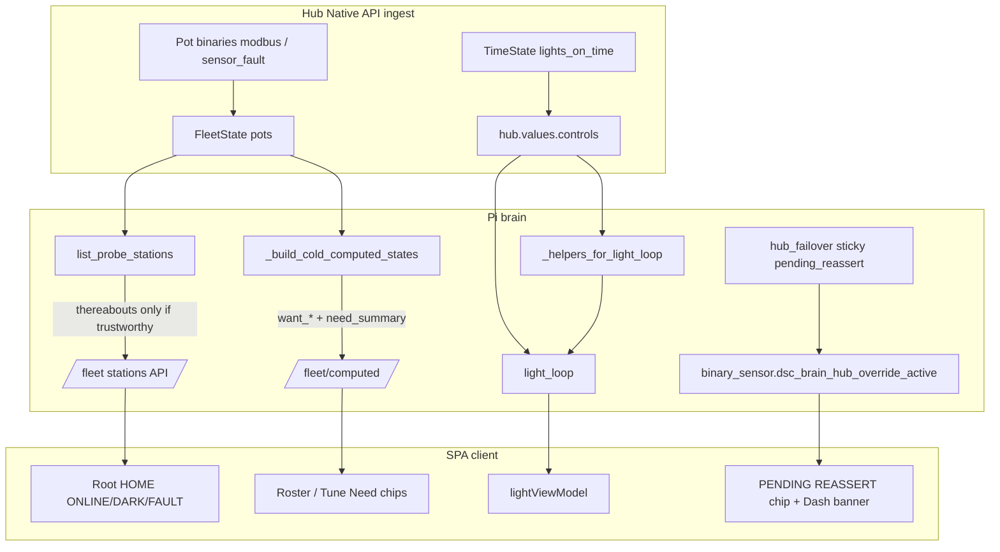

# Honesty pass — dual-home, schedule ingest, Want/Need

**In one line:** Never show theater readings, schedules, or Need text the brain cannot defend from live telemetry.

**Status:** Shipped tip `6230383` (closes Bar 1 residuals + dual-home station lie). Tests: `brain/tests/test_probe_station_honesty.py`, `brain/tests/test_hub_time_ingest.py`.

Notion: [Pi offline brain](https://app.notion.com/p/3b52b4cda370818e8b66f671689f7a57) · [Local webserver UI](https://app.notion.com/p/3b52b4cda37081c19048e794d4bdf819) · [Engineering Ops](https://app.notion.com/p/3b02b4cda37081fda872fe551e60c116)

Related: [DECISION_LOOP.md](DECISION_LOOP.md) · [WEBUI.md](WEBUI.md) · FOLLOWUPS “Honesty followups” · Bar 1 recovery (draft [#138](https://github.com/weddas/DSC-HUB/pull/138)) · Bar 2 lifecycle (draft [#139](https://github.com/weddas/DSC-HUB/pull/139))

## Why

Operators were seeing **held moisture** on a probe station whose idle home was Modbus-dark, **NO SCHEDULE** / wrong photoperiod while hub `lights_on_time` existed on the wire, **Need —** with no Want bands for rostered plants, and **silent TTL expiry** under Manual Takeover (`pending_reassert` sticky but invisible).

Honesty rule: **empty / dark / pending beats a confident lie.**

## Architecture



## 1. Dual-home probe stations

A **probe station** seat (`extra.role=probe_station`) may dock at `idle_home_pot_id` (e.g. pot2 station → pot1 home). Thereabouts soil is the **home probe’s** values — not the vacant station seat.

### Trust gate (`soil_tests._pot_home_trust`)

| Condition | Trustworthy? |
|---|---|
| Home pot online | required |
| `sensor_fault` false | required |
| `modbus_probe_online` true **or unknown (`None`)** | required — known `False` = dark |

When not trustworthy: `thereabouts` is `{}` (no moisture/temp mirror). API still reports honesty flags.

### Station payload (verified)

```json
{
  "seat_id": "pot2",
  "idle_home_pot_id": "pot1",
  "thereabouts": {},
  "thereabouts_source": "pot1",
  "home_online": true,
  "home_trustworthy": false,
  "home_sensor_fault": false,
  "home_modbus_ok": false,
  "seat_online": false,
  "seat_sensor_fault": false,
  "seat_modbus_ok": true
}
```

### SPA

- Root strip: gauges null when `home_trustworthy === false`; chips **HOME ONLINE** / **HOME DARK** / fault path (`RootPage.tsx`).
- `potTrust.blockNeedAct` includes Modbus offline — no Act chrome on dark/fault Got.
- Settings station list reads `thereabouts` from the same API (empty when withheld).

### Pitfalls

- Do **not** fall back to seat pot values when home is dark — that reintroduces the lie.
- Unknown Modbus ≠ offline; only explicit `False` withholds.
- Dual-home soak still open as ops soak (FOLLOWUPS) — code gate is done.

## 2. `lights_on_time` ingest → light_loop

ESPHome `datetime` (type: time) OIDs map to HA-style entities (**ingest only**):

| OID | Entity |
|---|---|
| `lights_on_time` | `time.dsc_hub_lights_on_time` |
| `clone_lights_on_time` | `time.dsc_hub_clone_lights_on_time` |

- Ingest: `esphome_client._hub_controls_from_states` → `HH:MM:SS` (empty if `missing_state`).
- Maps: `hub_controls.HUB_TIME_OID_TO_ENTITY` / `HUB_TIME_ENTITY_TO_OID`.
- Feed: `_helpers_for_light_loop` merges live controls into helpers when compose helpers omit the time.
- Consumer: `light_loop` + SPA `lightViewModel` / Light page — same SoT as Bar 1.

### Dual-emit cleanup

`dash_computed.emit_dash_entities` **no longer** pre-emits `sensor.dsc_expected_light_hours` / clone hours. Those are owned by `emit_light_loop` only — pre-emit was stage-default theater until overwrite.

## 3. Want bands + Need summary (brain SoT)

For each occupied probe pot, cold computed:

1. Resolve Want via `resolve_want(strain_id, stage_family)` (occupied seats even without strain get stage-family defaults).
2. Emit band sensors (when band present):

   - `sensor.dsc_probe{N}_want_temp_{min,max}`
   - `sensor.dsc_probe{N}_want_rh_{min,max}`
   - `sensor.dsc_probe{N}_want_moisture_{min,max}`
   - `sensor.dsc_probe{N}_want_ec_{min,max}`
   - `sensor.dsc_probe{N}_want_ph_{min,max}`

3. Emit `sensor.dsc_probe{N}_need_summary` from Got vs Want (`_need_summary_text`):

   - Reading gated: pot online, not `sensor_fault`, Modbus not explicitly offline.
   - Bad/missing Got → `"—"`.
   - In band → `"On target vs Want bands"`.
   - Else short EC / pH / moisture deviation text.

No fake moisture band when catalog/stage omit `moisture_pct`. SPA Roster / Tune / plant cards read `need_summary` + want sensors — client of brain, not a second band calculator.

## 4. SPA `pending_reassert`

`hub_failover`: when reconnect override **TTL fires while Manual Takeover is still on**, override binary clears but `attributes.pending_reassert` stays sticky until takeover clears.

| Surface | Behavior |
|---|---|
| `HubLinkLine` | **PENDING REASSERT** chip when sticky and override not active |
| Overview Dash banners | “Pending re-assert — takeover still on…” |
| HelpTip | Explains TTL vs takeover clear |

## Operator / developer checklist

| Symptom | Check |
|---|---|
| Station shows home moisture while HOME DARK | Brain build pre-`6230383`, or SPA ignoring `home_trustworthy` |
| Light “NO SCHEDULE” with hub time set | Time OID not in controls; verify ingest + `_helpers_for_light_loop` |
| Need always `—` with live EC/pH | Want bands missing for stage, or `reading_ok` false (fault/Modbus) |
| No PENDING REASSERT after TTL under takeover | SPA bundle pre-honesty; sticky attr only on override entity |
| Expected light hours flicker / stage-default | Old dash pre-emit — should be light_loop-only |

## Never

- Invent height / chem / PPFD / NPK for honesty chrome
- Mirror idle-home moisture when Modbus/fault disagree
- Pre-emit light hours from grow_stage defaults in dash
- Treat Twin / Sankey as control or Got SoT
