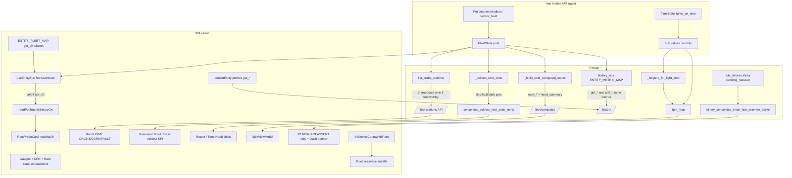

# Honesty pass — dual-home, schedule ingest, Want/Need

**In one line:** Never show theater readings, schedules, or Need text the brain cannot defend from live telemetry.

**Status:** Shipped tip `6230383` (dual-home + schedule + Want/Need) · SPA binary bus `cc288d7` / evidence `2bb0643` · Root NPK/Rate + `got_*` history tip `33e702e` · coldest-root trust + `got_ph` fleet map tip `5db15bb` (`index-Dq8ysX3P.js`). Tests: `brain/tests/test_probe_station_honesty.py`, `brain/tests/test_hub_time_ingest.py`, `brain/tests/test_coldest_root_honesty.py`. Shots: `honesty-root-fault.png`, `honesty-npk-rate-withheld.png`.

Notion: [Pi offline brain](https://app.notion.com/p/3b52b4cda370818e8b66f671689f7a57) · [Local webserver UI](https://app.notion.com/p/3b52b4cda37081c19048e794d4bdf819) · [Engineering Ops](https://app.notion.com/p/3b02b4cda37081fda872fe551e60c116)

Related: [DECISION_LOOP.md](DECISION_LOOP.md) · [WEBUI.md](WEBUI.md) · FOLLOWUPS “Honesty followups” · Bar 1 recovery (draft [#138](https://github.com/weddas/DSC-HUB/pull/138)) · Bar 2 lifecycle (draft [#139](https://github.com/weddas/DSC-HUB/pull/139)) · honesty close (draft [#142](https://github.com/weddas/DSC-HUB/pull/142))

## Why

Operators were seeing **held moisture** on a probe station whose idle home was Modbus-dark, **NO SCHEDULE** / wrong photoperiod while hub `lights_on_time` existed on the wire, **Need —** with no Want bands for rostered plants, **silent TTL expiry** under Manual Takeover (`pending_reassert` sticky but invisible), **Root gauges still lying** because Pi fleet binaries arrived as `1`/`0` while trust chips compared `=== "on"`, then — after gauges blanked — **NPK / Rate chips still showing held numbers** while SENSOR FAULT / PROBE DARK, **Root history charts collapsing** because SPA prefers `got_*` entities that `/history` did not map, and **Coldest root KPI still voting soil °C from Modbus-dark / sensor-fault pots** while Root cards correctly withheld.

Honesty rule: **empty / dark / pending beats a confident lie.**

## Architecture



## 1. Dual-home probe stations

A **probe station** seat (`extra.role=probe_station`) may dock at `idle_home_pot_id` (e.g. pot2 station → pot1 home). Thereabouts soil is the **home probe’s** values — not the vacant station seat.

### Trust gate (`soil_tests._pot_home_trust`)

| Condition | Trustworthy? |
|---|---|
| Home pot online | required |
| `sensor_fault` false | required |
| `modbus_probe_online` true **or unknown (`None`)** | required — known `False` = dark |

When not trustworthy: `thereabouts` is `{}` (no moisture/temp mirror). API still reports honesty flags.

### Station payload (verified)

```json
{
  "seat_id": "pot2",
  "idle_home_pot_id": "pot1",
  "thereabouts": {},
  "thereabouts_source": "pot1",
  "home_online": true,
  "home_trustworthy": false,
  "home_sensor_fault": false,
  "home_modbus_ok": false,
  "seat_online": false,
  "seat_sensor_fault": false,
  "seat_modbus_ok": true
}
```

### SPA

- Root strip: gauges null when `home_trustworthy === false`; chips **HOME ONLINE** / **HOME DARK** / fault path (`RootPage.tsx`).
- `potTrust.blockNeedAct` includes Modbus offline — no Act chrome on dark/fault Got.
- Settings station list reads `thereabouts` from the same API (empty when withheld).

### Pitfalls

- Do **not** fall back to seat pot values when home is dark — that reintroduces the lie.
- Unknown Modbus ≠ offline; only explicit `False` withholds.
- Dual-home soak still open as ops soak (FOLLOWUPS) — code gate is done.

## 2. `lights_on_time` ingest → light_loop

ESPHome `datetime` (type: time) OIDs map to HA-style entities (**ingest only**):

| OID | Entity |
|---|---|
| `lights_on_time` | `time.dsc_hub_lights_on_time` |
| `clone_lights_on_time` | `time.dsc_hub_clone_lights_on_time` |

- Ingest: `esphome_client._hub_controls_from_states` → `HH:MM:SS` (empty if `missing_state`).
- Maps: `hub_controls.HUB_TIME_OID_TO_ENTITY` / `HUB_TIME_ENTITY_TO_OID`.
- Feed: `_helpers_for_light_loop` merges live controls into helpers when compose helpers omit the time.
- Consumer: `light_loop` + SPA `lightViewModel` / Light page — same SoT as Bar 1.

### Dual-emit cleanup

`dash_computed.emit_dash_entities` **no longer** pre-emits `sensor.dsc_expected_light_hours` / clone hours. Those are owned by `emit_light_loop` only — pre-emit was stage-default theater until overwrite.

## 3. Want bands + Need summary (brain SoT)

For each occupied probe pot, cold computed:

1. Resolve Want via `resolve_want(strain_id, stage_family)` (occupied seats even without strain get stage-family defaults).
2. Emit band sensors (when band present):

   - `sensor.dsc_probe{N}_want_temp_{min,max}`
   - `sensor.dsc_probe{N}_want_rh_{min,max}`
   - `sensor.dsc_probe{N}_want_moisture_{min,max}`
   - `sensor.dsc_probe{N}_want_ec_{min,max}`
   - `sensor.dsc_probe{N}_want_ph_{min,max}`

3. Emit `sensor.dsc_probe{N}_need_summary` from Got vs Want (`_need_summary_text`):

   - Reading gated: pot online, not `sensor_fault`, Modbus not explicitly offline.
   - Bad/missing Got → `"—"`.
   - In band → `"On target vs Want bands"`.
   - Else short EC / pH / moisture deviation text.

No fake moisture band when catalog/stage omit `moisture_pct`. SPA Roster / Tune / plant cards read `need_summary` + want sensors — client of brain, not a second band calculator.

## 4. SPA `pending_reassert`

`hub_failover`: when reconnect override **TTL fires while Manual Takeover is still on**, override binary clears but `attributes.pending_reassert` stays sticky until takeover clears.

| Surface | Behavior |
|---|---|
| `HubLinkLine` | **PENDING REASSERT** chip when sticky and override not active |
| Overview Dash banners | “Pending re-assert — takeover still on…” |
| HelpTip | Explains TTL vs takeover clear |

## 5. Pi fleet binary bus → HA-shaped `on`/`off`

**Bug (pre-`cc288d7`):** On Pi source, `useEntityBus().state()` used `fleetLiveNumber` and returned `String(1)` / `String(0)` for mapped binaries. `readPotTrust` compared with `=== "on"`, so Modbus offline and `sensor_fault` never matched — Root kept glowing held Got while probes were dark/fault.

**Fix (verified):**

| Layer | Behavior |
|---|---|
| `entityFleetMap.fleetLiveState` | Mapped binaries → `"on"` / `"off"` (never `"1"` / `"0"`); numerics stay `String(n)` |
| `useEntityBus.state` | Prefers `fleetLiveState` over number stringify |
| `potTrust.isBinaryOn` | Accepts `on` / `true` / `1` (defense in depth) |
| Modbus known | Treats `""` / `unavailable` / `—` as unknown; known + not-on → **probe dark** |

RootProbeCard: `readingOk` false when labels include `sensor fault` or `probe dark` → gauges `NaN` (no held theater). Chips render from `trust.labels`. Bundle after binary fix: **`index-CLqaVJXR.js`**. Evidence shot: `docs/qa-screenshots-2026-08-29/honesty-root-fault.png`.

### Pitfalls

- Do **not** route binaries through `fleetLiveNumber` → `String(n)` for trust / chip comparisons.
- HA path already uses `on`/`off`; the bug is **Pi fleet path only**.
- `fleetLiveNumber` still returns `0|1` for `num()` — correct for dials; wrong for state strings.

## 6. Root NPK / Rate gated on `readingOk` (tip `33e702e`)

**Bug:** After §5, moisture/EC/pH gauges blanked on fault/dark, but N/P/K chips still rendered held EC-derived values (often `0`) and Rate still opened history — theater next to SENSOR FAULT / PROBE DARK.

**Fix (verified in `RootPage.tsx`):**

| Surface | Behavior when `readingOk === false` |
|---|---|
| N / P / K chips | `NaN` → `fmtChip` shows `—`; stale `*` suppressed |
| Rate | Static **Rate —** (`title`: probe dark or fault — rate withheld); no history open |
| Gauges (prior) | Already `NaN` when not `readingOk` |

`readingOk` = trust labels do **not** include `sensor fault` or `probe dark` (same gate as gauges). When healthy: NPK remain **from EC** producers (not invented chem); Rate uses moisture-rate entity when finite.

### In-service subtitle

Root header count uses `inServiceCountWithFleet(state, fleet, KIT_PROBE_NUMBERS)` — prefers fleet inventory SoT over HA-only `inServiceCount`. Matches kit honesty / OOS lists (`dsc-kit-sot`).

Bundle **`index-wtobVnOJ.js`**. Shot: `docs/qa-screenshots-2026-08-29/honesty-npk-rate-withheld.png`.

### Pitfalls

- Do **not** show finite held NPK when fault/dark just because the producer entity exists — withhold with gauges.
- Do **not** invent N/P/K numbers; withhold or show EC-derived held only when `readingOk`.
- Twin / other surfaces may still use HA-only `isPotInService` — Root subtitle is WithFleet.

## 7. `got_*` history aliases (`history_ops.ENTITY_METRIC_MAP`)

**Bug:** SPA `potGotEntity(pot, kind)` prefers live `sensor.dsc_probe{N}_got_{moisture|ec|ph}` over `soil_*`. `/history` only mapped `soil_*` → fleet_history metrics, so series were empty/thin and X-axis labels collapsed.

**Fix (verified in `brain/dsc_brain/history_ops.py`):**

| SPA entity (preferred when live) | Same fleet_history metric |
|---|---|
| `sensor.dsc_probe{N}_got_moisture` | `moisture_pct` (with `soil_moisture`) |
| `sensor.dsc_probe{N}_got_ec` | `ec_us` (with `soil_ec` / conductivity) |
| `sensor.dsc_probe{N}_got_ph` | `ph` (with `soil_ph`) |

Aliases are ingest/query only — no second history store. Tune / Root charts that call `useEntitySeries(potGotEntity(...))` hit the same metrics.

### Pitfalls

- Adding a new Got entity id without an `ENTITY_METRIC_MAP` alias recreates empty charts.
- Prefer extending the map over teaching SPA to always request `soil_*` for history.

## 8. Coldest root KPI skips faulted / Modbus-dark pots (tip `5db15bb`)

**Bug:** `_coldest_root_zone` voted the minimum `soil_temp_c` among online pots (mat-vote helpers + 5–45 °C plausibility) **without** checking `sensor_fault` / `modbus_probe_online`. When both kit probes were dark/faulted but still online with stale soil °C, Overview / Root / Dash showed a confident coldest-root number while Root cards correctly withheld Got.

**Fix (verified in `brain/dsc_brain/dash_computed.py`):**

| Gate | Behavior |
|---|---|
| `binaries.sensor_fault is True` | Skip pot |
| `binaries.modbus_probe_online is False` | Skip pot |
| No trusted vote remains | Emit `sensor.dsc_coldest_root_zone_temp` = `unavailable`, `available=False`, attrs `pot=none`, `reason=no trusted soil temp` |
| Trusted vote exists | Emit rounded °C + `pot` attr; `record_history("hub", "coldest_root_c", …)` as before |

Unknown Modbus (`None` / missing key) still votes — same as dual-home trust: only **known dark** withholds. Mat-vote helpers and 5–45 °C band unchanged.

Tests: `brain/tests/test_coldest_root_honesty.py` (all-fault → `None`/`none`; mixed → trusted pot only).

SPA consumers (`RootPage`, `OverviewPage`, `DashHome*`, `BandChartHost`) already treat unavailable / non-finite as blank via `num` / `useHeldReading` — no SPA theater path required for this tip.

### Pitfalls

- Do **not** fall back to “any online pot soil °C” when trust binaries disagree — that reintroduces KPI theater.
- Do **not** invent a synthetic coldest from room/air temp when no pot is trusted.
- History stops when unavailable (no `record_history` in the else branch) — charts may go stale; that is preferred over a flat lie.

## 9. `got_ph` fleet map aliases (`ENTITY_FLEET_MAP`, tip `5db15bb`)

**Bug / gap:** Tip `33e702e` mapped `got_*` in brain `history_ops.ENTITY_METRIC_MAP` for `/history`. SPA held / fleet enrich also needs `ENTITY_FLEET_MAP` so `got_ph` resolves to the same seat metric as `soil_ph` when the bus prefers Got.

**Fix (verified in `entityFleetMap.ts`):**

| Entity | Seat metric |
|---|---|
| `sensor.dsc_probe{N}_got_ph` | `ph` (with `soil_ph`) |

Complements existing `got_moisture` / `got_ec` fleet-map rows and §7 history aliases. Bundle after tip: **`index-Dq8ysX3P.js`**.

### Pitfalls

- History alias without fleet-map alias (or the reverse) leaves one path honest and the other thin — keep both maps in lockstep when adding Got ids.

## Operator / developer checklist

| Symptom | Check |
|---|---|
| Station shows home moisture while HOME DARK | Brain build pre-`6230383`, or SPA ignoring `home_trustworthy` |
| Root shows live moisture with SENSOR FAULT / PROBE DARK absent | SPA pre-`cc288d7` / pre-`index-CLqaVJXR.js` — binary bus `1`/`0` vs `on` |
| Root gauges blank but NPK/Rate still numeric on fault | SPA pre-`33e702e` / pre-`index-wtobVnOJ.js` — chips not gated on `readingOk` |
| Root / Tune moisture history empty or X-axis collapsed | `/history` missing `got_*` aliases — need tip `33e702e` `history_ops` |
| Root / Tune pH held or enrich thin while `got_ph` live | SPA `ENTITY_FLEET_MAP` missing `got_ph` — need tip `5db15bb` |
| Coldest root still shows °C while both probes SENSOR FAULT / PROBE DARK | Brain pre-`5db15bb` — `_coldest_root_zone` not skipping fault/dark binaries |
| Coldest root unavailable with healthy trusted pot | Check mat-vote helpers, pot online, soil_temp in 5–45, binaries not fault/dark |
| Root in-service count disagrees with fleet inventory | Using HA-only `inServiceCount` — prefer `inServiceCountWithFleet` |
| Light “NO SCHEDULE” with hub time set | Time OID not in controls; verify ingest + `_helpers_for_light_loop` |
| Need always `—` with live EC/pH | Want bands missing for stage, or `reading_ok` false (fault/Modbus) |
| No PENDING REASSERT after TTL under takeover | SPA bundle pre-honesty; sticky attr only on override entity |
| Expected light hours flicker / stage-default | Old dash pre-emit — should be light_loop-only |

## Never

- Invent height / chem / PPFD / NPK for honesty chrome
- Show held NPK / Rate when SENSOR FAULT or PROBE DARK
- Vote coldest root from sensor_fault / Modbus-dark pots
- Mirror idle-home moisture when Modbus/fault disagree
- Pre-emit light hours from grow_stage defaults in dash
- Treat Twin / Sankey as control or Got SoT
- Compare fleet binary state with `=== "on"` without normalizing `1`/`0`
- Map SPA history or fleet enrich to `got_*` without matching `ENTITY_METRIC_MAP` / `ENTITY_FLEET_MAP` aliases
