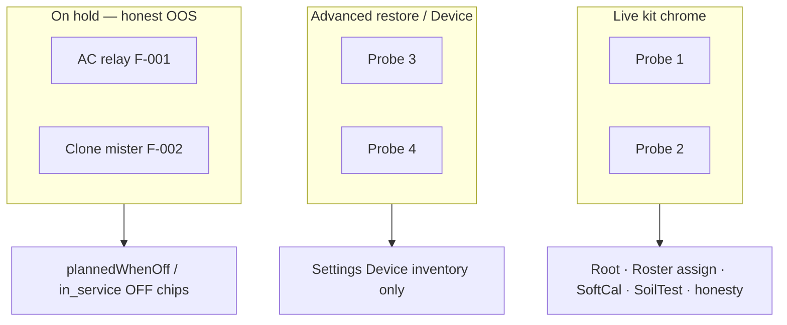

# Kit scope (probes · appliances · Advanced restore)

**In one line:** Live operator kit is **Probe 1–2** only; pot3/4 stay Device inventory / Advanced restore; AC relay and clone mister are **on hold indefinitely** with honest OOS — not version gates.

**Tip (Post-mega D-C-A-B):** `f029702` · SPA `index-CXq-NptO.js`  
**Operator decision:** [`../FOLLOWUPS.md`](../FOLLOWUPS.md) § *2026-09-01 — Operator kit scope* · closure [`../qa/AUDIT-CLOSURE-2026-09-D-C-A-B.md`](../qa/AUDIT-CLOSURE-2026-09-D-C-A-B.md)  
**Rule:** [`.cursor/rules/dsc-kit-sot.mdc`](../../.cursor/rules/dsc-kit-sot.mdc)  
**Code:** `seatModel.ts` (`KIT_PROBE_NUMBERS` / `ALL_POT_NUMBERS`) · `settingsHelpers.inventoryGroup` · `kitInventory.ts` · `test_pot3_default_out_of_service`

## Intent

The product kit ships two soil probes. Keeping pot3/4 and unbuilt climate capacity in Live chrome creates false “broken probe” / “missing AC” theater. Scope is explicit so QA and docs do not reopen retired hardware.



## Constants

| Symbol | Value | Use |
|--------|-------|-----|
| `KIT_PROBE_NUMBERS` | `[1, 2]` | Live Root, Grow roster assign/vacant, SoftCal, SoilTest, Compose assign, Fleet pulse, idle-home defaults |
| `ALL_POT_NUMBERS` | `[1, 2, 3, 4]` | Entity maps, Device inventory, Advanced restore only |

```ts
// seatModel.ts
export const ALL_POT_NUMBERS = [1, 2, 3, 4] as const;
export const KIT_PROBE_NUMBERS = [1, 2] as const;
```

## Settings inventory groups

`settingsHelpers.inventoryGroup`:

| `seat_id` | Group label |
|-----------|-------------|
| hub / control / panel | Brain & panel |
| pot1 / pot2 | Kit probes |
| pot3 / pot4 | Advanced restore (Probe 3–4) |
| other pot* | Probes |
| else | Appliances |

`IDLE_POT_OPTIONS` = `"" | pot1 | pot2` only (`settingsConstants.ts`).

## Hardware status (operator 2026-09-01)

| Item | Status | Product rule |
|------|--------|--------------|
| F-003 / pot3 + pot4 | **Retired from kit** | Not chasing flash/enable; default `in_service=false` (`test_pot3_default_out_of_service`) |
| F-001 AC relay | **On hold indefinitely** | Honest OOS / `plannedWhenOff`; no install timeline |
| F-002 Clone mister | **On hold indefinitely** | Same as F-001 |

**7.4.0 is not gated** on F-003 / F-001 / F-002. Do not file follow-ups that assume pot3 restore or AC/mister landing unless the operator reopens.

## Chrome language

- Say **Probe** / **Plant**, never Seat / POT in operator surfaces.
- Settings may keep internal `seat_id` (`pot1`…) and an Advanced restore section for 3–4.

## Pitfalls

- Do **not** offer pot 3/4 on Compose assign, Root thereabouts, or Live kit cards.
- Do **not** synthesize Got / Need for out-of-service probes.
- Prefer `isPotInServiceWithFleet` when fleet inventory is available so Root / Settings / honesty agree.

## Related

- Module map (D splits): [SPA-MODULE-MAP.md](SPA-MODULE-MAP.md)
- Roster vacant strip: [ROSTER-STOCK.md](ROSTER-STOCK.md)
- Zigbee (separate from kit probes): [ZIGBEE-POLICY-UI.md](ZIGBEE-POLICY-UI.md) · [`../ops/ZIGBEE-RECOVERY.md`](../ops/ZIGBEE-RECOVERY.md)
- Notion: [Engineering Ops](https://app.notion.com/p/3b02b4cda37081fda872fe551e60c116)
