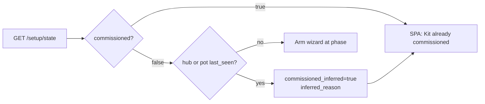

# Kit Setup / commissioning

**Tip SoT:** `17aa6bd`. Product unbox: SD image → SPA `#/setup` → USB flash → fleet SoftAP join → Zigbee → go live.

## Intent

Kits that **predate** the Setup wizard keep `kit_commissioned=false` forever (the flag only flips via `POST /setup/commission`). Gating the destructive USB-flash step on that boolean alone dropped a live flowering fleet into step 2. Commissioning must park the wizard when the fleet has already reported — without a GET inventing a write-back of the flag.

## Phases

`welcome` → `usb_flash` → `fleet_join` → `zigbee` → `go_live`

Persisted: `kit_setup_phase`, `kit_setup_debt` (JSON list), `kit_commissioned`.



## `/setup/state` fields

| Field | Meaning |
|---|---|
| `commissioned` | Explicit flag from `POST /setup/commission`. |
| `commissioned_inferred` | True when not commissioned **and** hub or any pot has `last_seen`. **Never written** from a GET. |
| `inferred_reason` | Human string (e.g. `hub has reported to this brain`). |
| `phase` | One of `VALID_PHASES`. |
| `debt` | Setup debt list; `not_flashed:<seat>` pruned when that seat is online at expected firmware. |
| `version` / `surface` | Brain package + SPA surface — header must not hardcode `8.0`. |

SPA parks when `commissioned || commissioned_inferred` (`SetupPage.tsx`).

## Go-live (`POST /setup/commission`)

Always requires `brain_ok`, `mosquitto_ok`, `z2m_ok` from `setup_health`. Catalog never blocks.

**Hub online:** body `require_hub_online` defaults to **`None`**. The API then uses `hub_expected_for_commission()` — hub is required **unless** debt contains `not_flashed:hub`. Passing `false` every time used to make the gate dead code.

```text
POST /setup/commission
# omit body → hub required unless skipped
# {"require_hub_online": false} → force skip hub gate (rare)
```

## Operator notes

- Opening `#/setup` on a production kit that never ran the wizard should show **Kit is live** (inferred), not USB flash.
- To truly re-arm flash after a deliberate wipe, clear debt / commissioned via System developer paths — do not rely on inference alone for factory reflash.
- USB flash detail: [`../ops/USB-FLASH.md`](../ops/USB-FLASH.md).

## Tests

`brain/tests/test_setup_commission_inference.py`

## Codepaths

`kit_commission.py` · `api.setup_commission` · `frontend/src/pages/SetupPage.tsx` · `frontend/src/lib/setupApi.ts`
