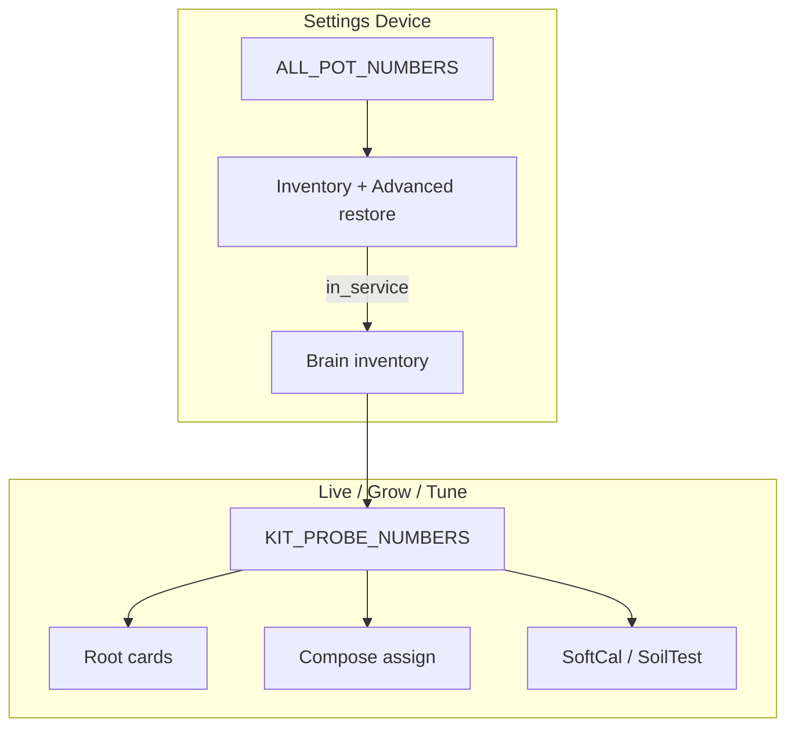

# Kit SoT + professional SPA (Pass A–C)

**In one line:** Live kit is **Probe 1–2**; Settings is blast-radius IA; Climate shows one CFM surface; Root metrics follow producers (see [`../ops/FLEET-SOIL-METRICS.md`](../ops/FLEET-SOIL-METRICS.md)).

Shipped tip **`07bf25f`** (Pass A–C + residuals + NPK producers). Tip **`8b3169c`**: Root peer trust, station rate/dryback, growth-stage calendar advance. Design lock: [`../superpowers/specs/2026-08-29-professional-spa-ui-design.md`](../superpowers/specs/2026-08-29-professional-spa-ui-design.md). Cursor encodes: `.cursor/rules/dsc-kit-sot.mdc`, `dsc-viz-honesty.mdc`, skill `dsc-spa-pi-verify`.

## Kit model

| Constant | Use |
|----------|-----|
| `KIT_PROBE_NUMBERS = [1, 2]` | Live Root, Grow Compose assign, SoftCal/SoilTest pickers, honesty OOS, Kit Pulse, Twin seats |
| `ALL_POT_NUMBERS = [1,2,3,4]` | Entity maps, Device inventory, Advanced restore **only** |

Chrome: **Probe** / **Plant** (not Seat / POT). Internal `seat_id` may stay `potN`.

In-service: prefer `isPotInServiceWithFleet(n, state, fleet)` so Root, honesty, and Settings agree.

## Navigation (hash routes)

| Primary | Default / secondaries |
|---------|------------------------|
| Live | `#/live/overview` · climate · 4×8 · 2×4 · root · light · (mission/twin demoted) |
| Grow | `#/grow/roster` · compose · research |
| Tune | `#/tune/learning` · analytics |
| Fleet | `#/fleet` · `#/fleet/calibrate` |
| Settings | `#/settings/{hub,brain,device,api,network,server,general}` — `/fleet/settings` → device |

## Visual honesty (Pass B + tip `8b3169c`)

- Climate: **Air path** CFM only + honesty note — no Sankey / particle theater.
- Twin / Ops dash: honesty / gated (`TWIN_SURFACE_GATED`) — no blank WebGL.
- NPK / Rate / Dryback: value when finite; else omit or `· no channel` / station `· waiting` / `from EC`.
- Root unassigned: head **Probe station** (role) or **Unassigned**; Need chip **No targets**.
- Peer chip: only when `binary_sensor.dsc_peer_mad_alert` is **on** — never the always-on summary string (`Δ…` / “Need ≥2…”).
- Trust labels: stuck / untrusted / **sensor fault** / **probe dark** (modbus off); `blockNeedAct` on stuck, untrusted, or sensor fault.

## Growth stage vs Expected

| Signal | SoT | Behavior (tip `8b3169c`) |
|--------|-----|--------------------------|
| `sensor.dsc_probeN_expected_stage` | Calendar age (`stage_model.expected_stage`) | Display-only Expected chip |
| `select.dsc_probeN_growth_stage` / recipe `growth_stage` | Operator select + roster | Cold computed **advances** recipe when calendar rank is ahead; keeps override if later than age model |

Ranks: Germination → … → Final 48-72h Flowering (`STAGE_RANK` in `stage_model.py`). Details: [`PROBE-PLANT-MODEL.md`](PROBE-PLANT-MODEL.md).

## Pitfalls

| Symptom | Cause | Fix |
|---------|-------|-----|
| Root still shows Probe 3/4 | Stale SPA bundle | Redeploy spa-dist; confirm `index-*.js` hash |
| False **peer divergence** chip | SPA read summary string, not MAD binary | Tip `8b3169c` — `readPotTrust` → `dsc_peer_mad_alert` |
| Station Rate/Dryback **no channel** forever | Pre-`8b3169c` skipped station emit **or** no moisture history | Brain tip + wait for history; UI should say **waiting** |
| Station stuck / untrusted on idle park | Stuck applied to stations | Stuck stays plant-only |
| Growth stage Early while Expected Late | Recipe not advanced | Tip `8b3169c` calendar advance via `update_pot_recipe` |
| NPK always `—` / 0 | Map used `n|p|k` or brain keys missing | Full keys + `/fleet/computed` merge |
| Compose offers pot 3/4 | Pre–Pass C picker | Kit filter via `KIT_PROBE_NUMBERS` |

## Verify

Skill checklist: [`.cursor/skills/dsc-spa-pi-verify/SKILL.md`](../../.cursor/skills/dsc-spa-pi-verify/SKILL.md). Screenshots: `docs/qa-screenshots-2026-08-29/`. Live bundle reference: `index-CrVRU9Qb.js`.

## Related

- Soil producers: [`../ops/FLEET-SOIL-METRICS.md`](../ops/FLEET-SOIL-METRICS.md)
- Probe/plant assignment: [`PROBE-PLANT-MODEL.md`](PROBE-PLANT-MODEL.md)
- SoftCal: [`../ops/SOFT-CAL.md`](../ops/SOFT-CAL.md)
- Routes overview: [`WEBUI.md`](WEBUI.md)
