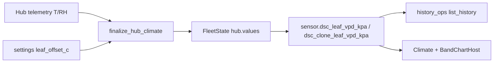

# Leaf VPD (7.3)

**In one line:** Leaf VPD is air VPD computed at estimated leaf temperature (`air_t − leaf_offset_c`), not a separate leaf sensor.

## Intent

Canopy VPD tracks stomatal stress better than air VPD alone. The hub may publish leaf temp offset; the brain always recomputes leaf VPD so charts stay honest when ingest stomps template sensors.

## Math (verified)

`brain/dsc_brain/climate_math.py` → `finalize_hub_climate`:

```
leaf_t = temp_c − leaf_offset_c     # default offset from settings leaf_offset_c or 2 °C
leaf_vpd_kpa = Magnus VPD(leaf_t, rh_pct)
clone_leaf_vpd_kpa = Magnus VPD(clone_temp_c − offset, clone_rh_pct)
```

Magnus SVP: `0.6108 × exp(17.27·T / (T+237.3))`; VPD = SVP − AVP; clamped ≥ 0; rounded to 3 dp.

## Entity path



| Entity | Hub value key | Charts |
|--------|---------------|--------|
| `sensor.dsc_leaf_vpd_kpa` | `leaf_vpd_kpa` | Climate VPD card; Overview BandChart “4×8 leaf” |
| `sensor.dsc_clone_leaf_vpd_kpa` | `clone_leaf_vpd_kpa` | Climate + BandChart “2×4 leaf” |

History keys: `history_ops` maps those entity ids to `("hub", "leaf_vpd_kpa")` / `clone_leaf_vpd_kpa`.  
Y domain for VPD charts: **0–2.5 kPa** (7.3 QoL).

## Constraints

- Leaf series use canopy RH at cooler leaf T — they sit **below** air VPD for the same RH when offset &gt; 0.
- No Want band on leaf series in BandChart (air bands only).
- Plausible range helper: `0 ≤ VPD ≤ 3.5` (`plausible_vpd_kpa`).

## Pitfalls

1. Tuning `leaf_offset_c` without noting it in Learning — charts move even when air T/RH are unchanged.
2. Comparing to HA legacy leaf templates without checking brain finalize — Pi SoT is `climate_math`, not the hub YAML template alone.
3. Missing leaf series after deploy — confirm hub ingest has `temp_c`/`rh_pct` and history newest-first (`GRAPH-REAUDIT-7.3`).

## Related

- Graph closure: [`docs/qa/GRAPH-REAUDIT-7.3.md`](../qa/GRAPH-REAUDIT-7.3.md)
- Flow viz: [`FLOW-SANKEY.md`](FLOW-SANKEY.md)
