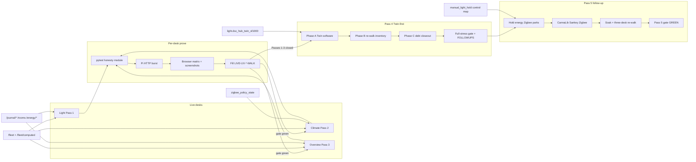
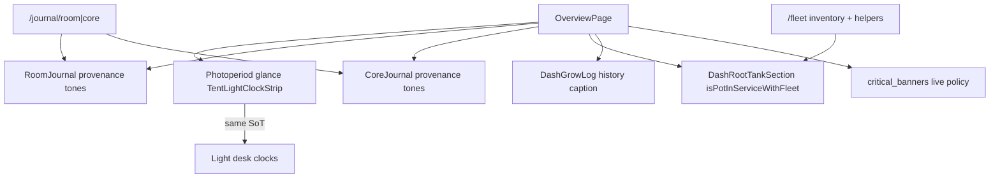
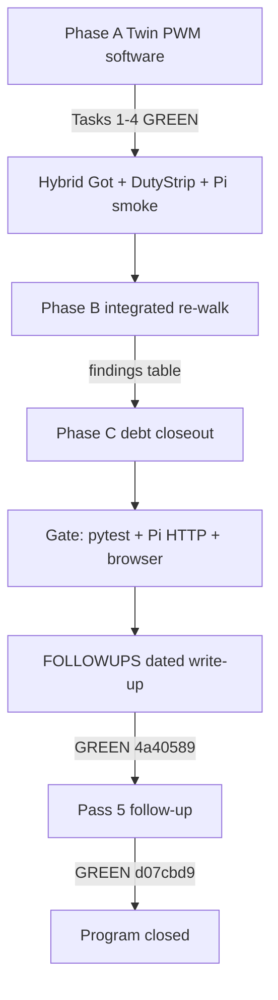
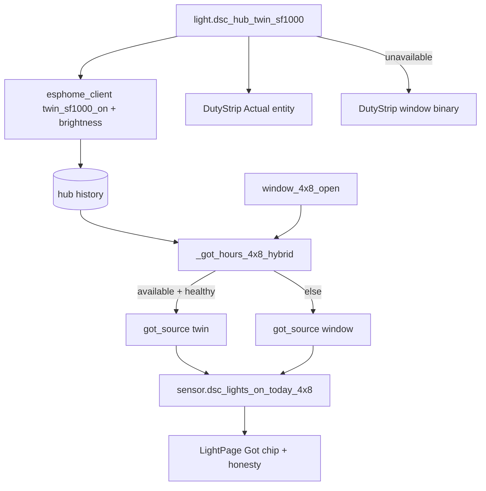
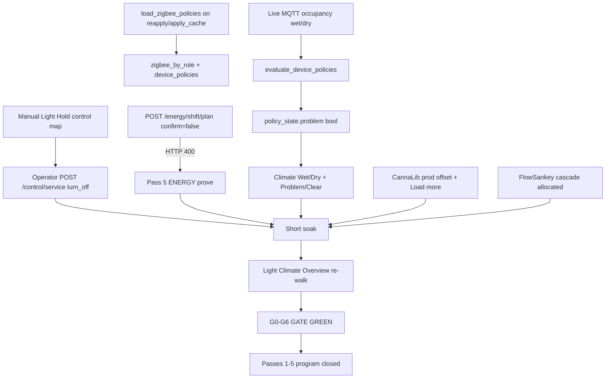

# Live UX honesty program (Light → Climate → Overview → Twin → Pass 5 closeout)

**Intent:** Keep operator Live desks behaviorally honest — gauges/chips/labels match real Want→Got fleet state; Expected/stage rails never read as live plant or live lamp; both tents stay at the same development point.

**Tip:** `ee636f9` · spa-dist `index-BoyhWWR_.js` (+ `calibrate-CYRum8WF.js` · `tune-fleet-BPdxWQzJ.js`)  
**Status:** Passes 1–5 **proven** — five-pass Live UX honesty program **closed**. Pass 4 Twin-first **gate GREEN** (`4a40589`). Pass 5 follow-up **gate GREEN** (`d07cbd9`). Tip advanced `f2ac21f`→`6ce9ea5` (Pass 4 SDD brief archive) →`ee636f9` (hotpatch stop+start + prove-flake habits in `.cursor/rules/dsc-pi-hotpatch.mdc` / AGENTS) — **no SPA/brain behavior change**: Manual Light Hold control map + operator clear; energy `confirm=false` → **HTTP 400**; Zigbee Wet→Problem via `policy_state`; FlowSankey graduated; CannaLib prod verify-close; soak + three-desk re-walk. GPIO5 still **reserved** (not wired; optical N/A). `leak_floor_2x4` parked (no HW).

**Spec / plan:**  
[`../superpowers/specs/2026-09-01-live-ux-honesty-program-design.md`](../superpowers/specs/2026-09-01-live-ux-honesty-program-design.md) ·  
[`../superpowers/plans/2026-09-01-live-ux-honesty-program.md`](../superpowers/plans/2026-09-01-live-ux-honesty-program.md) ·  
Pass 4: [`../superpowers/specs/2026-09-01-live-ux-pass4-twin-integrated-design.md`](../superpowers/specs/2026-09-01-live-ux-pass4-twin-integrated-design.md) ·  
[`../superpowers/plans/2026-09-01-live-ux-pass4-twin-integrated.md`](../superpowers/plans/2026-09-01-live-ux-pass4-twin-integrated.md) ·  
Pass 5: [`../superpowers/specs/2026-09-01-live-ux-pass5-followup-design.md`](../superpowers/specs/2026-09-01-live-ux-pass5-followup-design.md) ·  
[`../superpowers/plans/2026-09-01-live-ux-pass5-followup.md`](../superpowers/plans/2026-09-01-live-ux-pass5-followup.md) ·  
Pass 5 reports: [`.superpowers/sdd/pass5-tasks-2-4-report.md`](../../.superpowers/sdd/pass5-tasks-2-4-report.md) · [`.superpowers/sdd/pass5-task-5-report.md`](../../.superpowers/sdd/pass5-task-5-report.md) · [`.superpowers/sdd/pass5-gate-report.md`](../../.superpowers/sdd/pass5-gate-report.md) ·  
Pass 4 SDD archive (`6ce9ea5`): briefs `pass4-task-{1..5,7}-brief.md` + reports `pass4-task-{1..7}-report.md` under [`.superpowers/sdd/`](../../.superpowers/sdd/) ·  
Task 8/9: [`.superpowers/sdd/task-8-report.md`](../../.superpowers/sdd/task-8-report.md) · [`.superpowers/sdd/task-9-report.md`](../../.superpowers/sdd/task-9-report.md)

## Architecture



| Pass | Desk | Walk | Pytest | Tip status |
|------|------|------|--------|------------|
| 1 | Light | [`LIVE-UX-LIGHT-WALK-2026-09.md`](../qa/LIVE-UX-LIGHT-WALK-2026-09.md) | `test_live_ux_light_honesty.py` | **GREEN** (prove spa was `index-DYFvyI2i.js`) |
| 2 | Climate | [`LIVE-UX-CLIMATE-WALK-2026-09.md`](../qa/LIVE-UX-CLIMATE-WALK-2026-09.md) | `test_live_ux_climate_honesty.py` | **GREEN** (live spa was `index-CzcL7cKc.js`) |
| 3 | Overview | [`LIVE-UX-OVERVIEW-WALK-2026-09.md`](../qa/LIVE-UX-OVERVIEW-WALK-2026-09.md) | `test_live_ux_overview_honesty.py` | **GREEN** (`index-C8GkS5XE.js` · Task 9 prove) |
| 4 | Twin-first integrated | [`LIVE-UX-PASS4-WALK-2026-09.md`](../qa/LIVE-UX-PASS4-WALK-2026-09.md) | `test_live_ux_pass4_twin.py` | **gate GREEN** (`4a40589`) — spa `index-BoyhWWR_.js` |
| 5 | Follow-up closeout | [`LIVE-UX-PASS5-WALK-2026-09.md`](../qa/LIVE-UX-PASS5-WALK-2026-09.md) | Pass 4 twin + climate + zigbee_policies + `test_brain_pi` Hold map | **gate GREEN** (`d07cbd9`; tip `ee636f9`) — program **closed** |

Screenshots: `docs/qa-screenshots-2026-09-01-live-ux/` (incl. `pass4-*` · `pass5-*`). Evidence: `.audit/live-ux-*-prove-evidence.json` · `.audit/live-ux-pass5-prove-evidence.json` · `.audit/live-ux-pass5-task5-evidence.json`.

## Shared honesty contract

| Rule | Meaning |
|------|---------|
| Want→Got→Need | Bind to fleet/brain; missing → grey / OOS / unbound — never fake live |
| Expected ≠ live | Stage rails / calendar / draft tones are Expected only |
| Kit capacity | pot3/4 in `planned_oos` only — never Capacity offline lead |
| Cross-desk | Overview photoperiod glance matches Light SoT; Climate Mode ≠ Light schedule Follow chips |
| Wet vs Problem | Wet/Dry = raw sensor; Problem/Clear only from bound `policy_state` |
| Energy | Estimates labeled; suggestions `apply: false`; shift needs `confirm=true` |
| Journals | Provenance chips (`plant`/`space`/`room`/`core`); observations only |
| History ≠ live | Grow-log amber rows are past notables — not live `critical_banners` |
| Twin PWM | Software entity may be live; **never claim physical GPIO5 wire-up** until operator confirms |

## Pass 1 — Light (codepaths)

| Guard | Codepath |
|-------|----------|
| Estimate label + suggestions never apply | `GET /energy/estimate` · `GET /energy/suggestions` (`estimate_label`, `apply: false`) |
| Shift confirm gate | `POST /energy/shift/plan` with `confirm: false` → `400` |
| Space journal provenance | `POST/GET /journal/space/{4x8\|2x4}` → `provenance=space`, `source=operator` |
| SPA | `LightPage`, `LightEnergyPanel`, `TentOccupancyJournal`, Twin/SF1000 OFF honesty, DLI calibrate CTA |

Prove script: `.audit/live-ux-light-prove.ps1`. Both tents required.

**Pass 4 Phase A tip honesty (4×8 Got hybrid):** When Twin is available + history healthy, brain prefers `twin_sf1000_on` (else brightness) hours and emits `got_source=twin|window` on `sensor.dsc_lights_on_today_4x8`. SPA DutyStrip Actual binds Twin when available; window binary only when Twin absent. GPIO5 remains **reserved** (not wired).

## Pass 2 — Climate (codepaths)

| Guard | Codepath |
|-------|----------|
| pot3/4 planned OOS | `dash_computed._reduced_kit` — `planned_oos` contains POT3/POT4; `offline` must not |
| Wet without recipe ≠ problem | `zigbee_policies.evaluate_device_policies` with `recipe_id=none` → no `policy_state` row |
| `problem_when=inactive` | Wet/`occupancy: true` → `active=true`, `problem=false` |
| SPA | Zone All/4×8/2×4/Room; Climate Mode chips; air-only `FlowSankey`; canopy unbound never fills; Wet/Dry + Problem/Clear chips |

Prove script: `.audit/live-ux-climate-prove.ps1`. **Phase C closed:** `AirPathMap` now requires `cascade` ← `sensor.dsc_cfm_cascade_2x4_allocated` (no `intakeClone` alias).

## Pass 3 — Overview (codepaths)

### API guards (pytest)

| Guard | Codepath |
|-------|----------|
| Rooms seed | `GET /rooms` → 200; kit `grow_room` present (`room_model.ensure_kit_rooms`) |
| Room journal | `GET /journal/room/grow_room` → 200 |
| Core journal | `GET /journal/core` → 200 |
| Health | `GET /health` → 200 |

### SPA honesty (Task 8 — `0d95cdb` / spa `index-C8GkS5XE.js`)



| Honesty gap | Codepath | Behavior |
|-------------|----------|----------|
| Photoperiod glance | `OverviewPage.tsx` + `TentLightClockStrip` | Caption: glance-only, same schedule SoT as Light (incl. Follow 4×8); edit on Light desk |
| Room journal provenance | `RoomJournal.tsx` | Native `room` = ok tone; space rollup = warn; plant = muted; space/plant id chips; Save disabled until note text |
| Core journal provenance | `CoreJournal.tsx` | Native `core` = ok; room/space/plant rollups toned; Save enable hint; empty state |
| Root strip OOS | `DashHomeSections.DashRootTankSection` | `isPotInServiceWithFleet` — OOS forces muted chip + NaN gauge (“No data”), never leftover Got |
| Grow log vs critical | `DashGrowLog` | Caption: amber rows = past notables, **not** live policy banners (`system.critical_banners`) |
| Bands legend | Overview HelpTip + bands subtitle | Grey = no data **or** out of service |

### Pi prove (Task 9 — tip `2d44c52`)

| Item | Path |
|------|------|
| Prove script | `.audit/live-ux-overview-prove.ps1` (+ `.sh` helper + Playwright screenshots) |
| Evidence | `.audit/live-ux-overview-prove-evidence.json` (all gates `ok: true`) |
| Walk | [`LIVE-UX-OVERVIEW-WALK-2026-09.md`](../qa/LIVE-UX-OVERVIEW-WALK-2026-09.md) — G0–G9 **pass** |
| Live index sha256 | `40ec4848fb8974335be024a91897c507c393edb500826dde244d7434c93cea25` |

**Proven live:** KIT HONEST / hub.online / canopy bound; empty `critical_banners` vs grow-log history caption; Overview photoperiod glance parity with Light SoT (both tents + Follow chip); Room/Core journals list + provenance; root/bands/fan OOS greying.

**Phase C closed on tip:** Overview moisture uses `potWantBand` (`GAUGE-P0-1`); DutyStrip 2×4 Actual = window Got (`SV-P1-6`); `AirPathMap` cascade ← allocated sensor.

## Pass 4 — Twin-first integrated (**gate GREEN**)

Tip `6a359f2` closed Phase A (Tasks 1–4), Phase B inventory (Task 5), Phase C debt (Task 6 `083c178`), and Task 7 full-stress gate (`4a40589`): hybrid Got, Light Twin + DutyStrip, brightness scale, B findings disposition, DutyStrip/cascade/moisture/zigbee stub fixes, Pi hotpatch + pytest + HTTP + browser matrix, walk filled, FOLLOWUPS gate section. Optical / GPIO5 wire-up remains deferred — never claim physically wired.



| Phase | Intent | Verified tip `ee636f9` (Pass 4 landings on `6a359f2`; Pass 5 on `d07cbd9`) | Residual |
|-------|--------|------------------------|----------|
| A | Twin software as if present | Hybrid Got + DutyStrip Twin; brightness 0–255↔0–1; walk A1–A8 **pass**; evidence `.audit/live-ux-pass4-prove-evidence.json`; pytest hybrid guards | Optical N/A |
| B | Inventory re-walk | Task 5 **DONE_WITH_CONCERNS**; B1–B5 + B7–B12 **pass**; **B6 fail** at inventory (Wet/Dry UI absent then); inventory `.audit/live-ux-pass4-phaseb-inventory.json` + `pass4-b-*` | Findings consumed by Phase C |
| C | Clear B + named parks | Task 6 `083c178`; walk C1–C5 **pass**; SV-P1-6 / AirPathMap cascade / GAUGE-P0-1 **fixed**; zigbee/canopy stubs; spa `index-BoyhWWR_.js` | Wet/Dry MQTT closed Pass 5 |
| Gate | Full stress | Task 7 **GREEN** (`4a40589`): G0–G6 pass; twin pytest **12** + focused **22**; live cascade **83.3**; `got_source=twin`; FOLLOWUPS gate section | Pass 5 closed remaining parks |

### Phase B → C findings disposition (Task 5 inventory · Task 6 closeout)

| Severity | Topic | Disposition | Verified codepath (tip `6a359f2`) |
|----------|-------|-------------|-----------------------------------|
| P0 | **SV-P1-6** DutyStrip 2×4 `0.0H ON` vs Got ≈12h | **fixed** | `sf1000_on` ingest + `ENTITY_METRIC_MAP`; Light 2×4 **Actual** = `binary_sensor.dsc_hub_2x4_window_open`; separate **SF1000 lamp 24h** strip |
| P0 | **AirPathMap** cascade ← `intakeClone` | **fixed** | Required `cascade` prop ← `sensor.dsc_cfm_cascade_2x4_allocated` (Climate / Overview / LivePages) |
| P0 | **GAUGE-P0-1** Overview moisture 30–70 hardcoded | **fixed** | `DashRootTankSection` uses per-probe `potWantBand`; missing Want → unbanded |
| P1 | Canopy / `zigbee_by_role` empty (B6 fail) | **fixed (stubs)** · Pass 5 live by_role | `_reapply_bindings_to_fleet` safety roles + stubs; Pass 5 seed `zigbee_device_policies` on reapply/apply_cache |
| P2 | Manual Light Hold sticky ON | **cleared Pass 5** | `HUB_SWITCH_ENTITY_TO_OID` + operator `POST /control/service` turn_off |
| P3 | Energy `confirm=false` → **422** | **canonical 400 (Pass 5)** | `schedule_shift.create_shift_plan` → `ValueError` → `HTTPException(400)`; prove asserts exact 400 |

**Gate residuals (Pass 4 era — closed or parked by Pass 5):** historical SF1000 brightness samples are **not** backfilled to `sf1000_on`; Twin Actual `0.0H` with brief OFF cycles can round under 0.1h. Pass 5 closed Hold / energy-400 / Wet→Problem. Hardware parks remain: GPIO5 optical, `leak_floor_2x4`.

**Playwright pitfall:** against `:8787` SPA websockets use `domcontentloaded` (not `networkidle`).

### Twin hybrid codepaths (verified Phase A)



| Layer | Path | Behavior today |
|-------|------|----------------|
| Firmware | `firmware/v4/dsc-hub-v4_0.yaml` | LEDC GPIO5 → `light_twin_sf1000` / HA `light.dsc_hub_twin_sf1000`; PWM module must be wired for live optical brightness |
| Brain map | `hub_controls.py` | `twin_sf1000` ↔ `light.dsc_hub_twin_sf1000` |
| Command | `control_ops._hub_light` | HA-shaped 0–255 → aioesphomeapi **0.0–1.0**; off sends `brightness=0.0` to clear sticky ON |
| Ingest | `esphome_client._hub_controls_from_states` | Native 0–1 brightness → fleet 0–255 (tolerates legacy 0–255) |
| History | `esphome_client.py` + `history_ops.py` | Records `twin_sf1000_on` / `sf1000_on` (0/1) + brightness; DutyStrip maps Twin → `twin_sf1000_on`, clone lamp → `sf1000_on` |
| Got hours | `computed_ops._got_hours_4x8_hybrid` → `light_loop.emit_light_loop` | Prefer Twin on-hours when entity available + ≥1 Twin sample since midnight; else window; attrs `got_source` + window-fallback honesty |
| SPA Light | `LightPage.tsx` (`index-BoyhWWR_.js`) | Twin toggle+brightness; `Got · Twin` / `Got · Window`; 4×8 DutyStrip Actual = Twin when available; 2×4 Actual = window Got SoT + separate SF1000 lamp strip; GPIO5 **reserved** copy |
| Prove | `.audit/live-ux-pass4-prove.ps1` / `.sh` `PASS4_PHASE=GATE` | Gate hotpatch + Twin/energy/journals/cascade/browser; optical N/A |
| Tests | `brain/tests/test_live_ux_pass4_twin.py` (+ zigbee stub guards in `test_brain_pi.py`) | Hybrid prefer/fallback + Twin/SF1000 on-map; gate: twin **12** + focused **22** passed |
| Ops SoT | [`../ops/TWIN-SF1000.md`](../ops/TWIN-SF1000.md) | Entity map + GPIO5 handoff + brightness scale |

**Healthy history caveat:** first poll after local midnight may briefly fall back to window until ingest writes a Twin point — SPA chip warns `Got · Window`.

**Warm-hub caveat (Task 4):** right after brain restart Twin may be absent from `hass_extras`/`controls` for ~15–40s until hub reconnect; prove waits. Fleet on/off can lag; warm-hub brightness echo is the durable smoke signal. Optical remains N/A.

**Operator handoff (gate):** Hub **GPIO5** = reserved Twin SF1000 PWM module — software treats Twin as live actuator (`got_source=twin` at gate); never claim physically wired / optical until operator completes GPIO5 rig-up. Durable note: `docs/FOLLOWUPS.md` Pass 4 / Pass 5 gate sections.

## Pass 5 — Follow-up closeout (**gate GREEN** · program closed)

Tip `ee636f9` (Pass 5 closeout landed at `d07cbd9` / `f2ac21f`; `6ce9ea5` archives Pass 4 SDD briefs; this tip encodes hotpatch stop+start + prove flakes) closed Pass 4 parks + CannaLib prod verify + FlowSankey graduate + Zigbee one-recipe Wet→Problem + soak/re-walk. Gate evidence: `.audit/live-ux-pass5-prove-evidence.json` (`ok=true`) · walk [`../qa/LIVE-UX-PASS5-WALK-2026-09.md`](../qa/LIVE-UX-PASS5-WALK-2026-09.md) · report [`.superpowers/sdd/pass5-gate-report.md`](../../.superpowers/sdd/pass5-gate-report.md) · hotpatch [`../ops/PI-HOTPATCH.md`](../ops/PI-HOTPATCH.md).



| Landing | Codepath | Verified behavior |
|---------|----------|-------------------|
| Manual Light Hold writable | `hub_controls.HUB_SWITCH_ENTITY_TO_OID["switch.dsc_hub_manual_light_hold"] = "manual_light_hold_switch"` · `control_ops` proxy · `POST /control/service` `{domain:switch,service:turn_off,data:{entity_id}}` | Was ingest-only; Pass 5 clears Hold **off** on live Pi + SPA (`MANUAL LIGHT HOLD OFF`). Clear only after **operator confirm** — prove scripts must not auto-clear Hold |
| Energy confirm gate | `schedule_shift.create_shift_plan` raises `ValueError` when `confirm` false → `api.energy_shift_plan` → `HTTPException(400)` | Canonical **400** both tents (`4x8`/`2x4`); 422 is a fail in `.audit/live-ux-pass5-prove.ps1` |
| Zigbee policy seed | `zigbee_mqtt._reapply_bindings_to_fleet` + `apply_zigbee_cache_to_state` call `load_zigbee_policies()` → `fleet.system.zigbee_device_policies`; `save_zigbee_policies` mirrors fleet | Climate can resolve `recipe_id` without waiting for MQTT. **`policy_state.problem` still only after `evaluate_device_policies`** — SPA never invents Problem from wet/`occupancy` |
| Wet/Dry + Problem | Occupancy MQTT → Wet/Dry chips; Problem/Clear ← `zigbee_policy_state[ieee].problem` (`floor_flood_alert` banner-only) | Task 5 resume evidence `.audit/live-ux-pass5-task5-evidence.json`; GATE dry MQTT re-seed after brain stop/start |
| FlowSankey | `AirPathMap` `cascade` ← `sensor.dsc_cfm_cascade_2x4_allocated` | Live cascade **83.3** ≠ intake **96.2**; AIR CFM + MASS CHIP GATED; graduated in FOLLOWUPS |
| CannaLib | Brain `/v1/catalogs` proxy → prod HTTPS + LAN `:8790` | Offset pages distinct; Pi Load more green; MP-030/034 closed; **no redeploy** |
| Prove harness | `.audit/live-ux-pass5-prove.ps1` `PASS5_PHASE=GATE` | G0–G6; 122 pytest; Twin / energy 400 / cascade / Zigbee / Hold off; no SPA hotpatch (bundle already `index-BoyhWWR_.js`) |

### Hold write path (operator)

```bash
# After operator confirm only — never from unattended prove scripts
curl -sS -X POST "http://<pi>:8787/control/service" \
  -H 'Content-Type: application/json' \
  -d '{"domain":"switch","service":"turn_off","data":{"entity_id":"switch.dsc_hub_manual_light_hold"}}'
# Expect hass_extras / SPA Manual Light Hold OFF within ~1 poll
```

### Hotpatch habit (Pass 5)

Prefer **`docker stop -t 20` + `docker start`** for brain after Hold-map hotpatch. Task 5 `docker kill` hung the Pi; gate recovered cleanly with stop+start. `policy_state` clears on restart until MQTT evaluate — re-seed dry pub if asserting Problem/Clear. Full runbook + prove-flake table: [`../ops/PI-HOTPATCH.md`](../ops/PI-HOTPATCH.md) · rule `.cursor/rules/dsc-pi-hotpatch.mdc`.

### Parks remaining (hardware — out of program)

| Item | Status |
|------|--------|
| GPIO5 optical PWM | Soft-gated honesty; never claim wired |
| `leak_floor_2x4` | Parked — no HW (MP-042) |

Do **not** invent Pass 6. Next program only on explicit ask.

## Developer verify

```bash
cd brain
python -m pytest \
  tests/test_live_ux_light_honesty.py \
  tests/test_live_ux_climate_honesty.py \
  tests/test_live_ux_overview_honesty.py \
  tests/test_live_ux_pass4_twin.py \
  tests/test_zigbee_policies.py \
  tests/test_brain_pi.py -q \
  -k "manual_light_hold or zigbee or twin or energy or climate or light or overview"
```

Windows Pi prove (after `build:spa` + plink/pscp hotpatch when needed):

```powershell
.audit/live-ux-light-prove.ps1
.audit/live-ux-climate-prove.ps1
.audit/live-ux-overview-prove.ps1
.audit/live-ux-pass4-prove.ps1   # PASS4_PHASE=GATE
.audit/live-ux-pass5-prove.ps1   # PASS5_PHASE=GATE — Pass 5 gate GREEN
```

## Ops pitfalls

- Advance desks only when the prior walk is **fully filled** and gate green — pytest alone is not enough (Pass 3 pytest is only G6).
- Hotpatch with PuTTY `pscp`/`plink` `-batch -hostkey` (OpenSSH `scp` password-hangs in agent shells) — see [`../ops/PI-HOTPATCH.md`](../ops/PI-HOTPATCH.md).
- Brain container: prefer **`docker stop -t 20` + `start`** (Pass 5); avoid bare `docker restart` and `kill` (both have hung this Pi). Wait ~1 hub poll (~5–10s) before Hold/Twin fleet asserts.
- Restore any schedule stress; leave **no** active shift plans / pending flips.
- Never paste Pi passwords, API keys, or Wi-Fi secrets into walks / FOLLOWUPS / Wiki.
- Do not conflate Climate Mode Follow 4×8 with Light schedule Follow 4×8 — different desks, different chips.
- Grow-log amber ≠ Overview `critical_banners` / `dsc-banner--critical-live`.
- Passes **1–5 proven / closed** — do not invent Pass 6 scope.
- Twin entity available ≠ optical PWM wired — GPIO5 reserved until physical handoff.
- Cold/unhealthy Twin history → honest window Got (chip + sensor attrs), not silent Twin hours.
- Callers may send brightness 0–255; aioesphomeapi expects 0–1 — `_hub_light` normalizes both ways (do not double-scale).
- Energy shift without `confirm=true` must be **HTTP 400** (not 422).
- Wet/`occupancy` ≠ Problem — only `policy_state.problem` after recipe evaluate.
- Hold clear is **operator-gated**; prove harnesses must not turn Hold off unattended.

## Related

- [`SPACE-ENERGY-JOURNAL.md`](SPACE-ENERGY-JOURNAL.md) — journal/energy HTTP SoT  
- [`PHOTOPERIOD-TIMELINE.md`](PHOTOPERIOD-TIMELINE.md) — Light clocks/SVG  
- [`WEBUI.md`](WEBUI.md) — SPA routes  
- [`../ops/TWIN-SF1000.md`](../ops/TWIN-SF1000.md) — Twin entity / GPIO5 ops  
- [`../ops/PI-HOTPATCH.md`](../ops/PI-HOTPATCH.md) — plink/pscp, stop+start, prove flakes  
- [`../ops/ZIGBEE-RECOVERY.md`](../ops/ZIGBEE-RECOVERY.md) — radio recovery (separate from Wet/Problem honesty)  
- [`../qa/LIVE-UX-PASS5-WALK-2026-09.md`](../qa/LIVE-UX-PASS5-WALK-2026-09.md) — Pass 5 walk  
- Notion [Local webserver UI](https://app.notion.com/p/3b52b4cda37081c19048e794d4bdf819) · [Pi offline brain](https://app.notion.com/p/3b52b4cda370818e8b66f671689f7a57) · [Photoperiod & Lighting](https://app.notion.com/p/39c2b4cda3708194a606fa0b1e6098a2)
