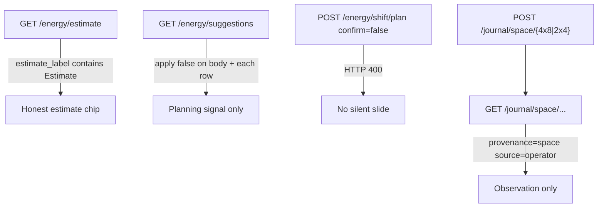
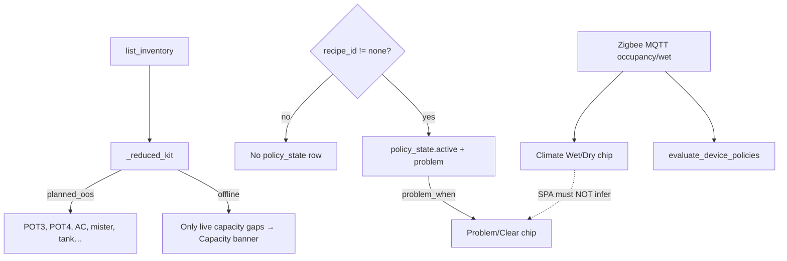

# Live UX honesty program (Light → Climate → Overview)

**Intent:** Keep Live desks honest and tent-parity before parking Twin PWM / new Zigbee recipes. One program, three sequential desk gates; Pass 4/5 stay brainstorm stubs.

**Tip:** `2feb837` (spa-dist `index-DYFvyI2i.js` + `calibrate-DcOg5koY.js` · `tune-fleet-B5F45eEz.js`)  
**Status:** Program **approved**. Pass 1 Light **desk-complete** (API guards + SPA CTAs + Pi hotpatch + filled walk `985a2c4`). Pass 2 Climate **API/brain guard tests SHIPPED** (`2feb837`); Climate walk G0–G9 still blank — do not treat pytest as desk-complete.

**Spec / plan / rule:**  
[`../superpowers/specs/2026-09-01-live-ux-honesty-program-design.md`](../superpowers/specs/2026-09-01-live-ux-honesty-program-design.md) ·  
[`../superpowers/plans/2026-09-01-live-ux-honesty-program.md`](../superpowers/plans/2026-09-01-live-ux-honesty-program.md) ·  
[`.cursor/rules/dsc-space-energy.mdc`](../../.cursor/rules/dsc-space-energy.mdc)

## Pass map


| Pass | Desk | Walk | Pytest (tip) | Prove script |
|------|------|------|--------------|--------------|
| 1 | Light | [`../qa/LIVE-UX-LIGHT-WALK-2026-09.md`](../qa/LIVE-UX-LIGHT-WALK-2026-09.md) **GREEN** | `brain/tests/test_live_ux_light_honesty.py` **SHIPPED** | `.audit/live-ux-light-prove.ps1` **SHIPPED** |
| 2 | Climate | [`../qa/LIVE-UX-CLIMATE-WALK-2026-09.md`](../qa/LIVE-UX-CLIMATE-WALK-2026-09.md) blank | `brain/tests/test_live_ux_climate_honesty.py` **SHIPPED** | `.audit/live-ux-climate-prove.ps1` (planned) |
| 3 | Overview | [`../qa/LIVE-UX-OVERVIEW-WALK-2026-09.md`](../qa/LIVE-UX-OVERVIEW-WALK-2026-09.md) | `test_live_ux_overview_honesty.py` (planned) | `.audit/live-ux-overview-prove.ps1` |
| 4–5 | Integrated / follow-up | — | stubs only | — |

Both tents (`4x8` / `2x4`) must stay at the **same development point** in every pass. Screenshots: `docs/qa-screenshots-2026-09-01-live-ux/`.

## Shared honesty contract (do not invent)

- Gauges/chips/labels bind real Want→Got→Need / fleet state; missing → grey / OOS / unbound.
- Expected / calendar / stage rails ≠ live plant or live lamp.
- pot3/4 = `planned_oos` only; F-001/F-002 honest OOS; KIT HONEST survives hotpatch.
- Overview photoperiod glance must match Light SoT for both tents.
- Climate Mode (2×4 policy) ≠ Light Schedule Follow 4×8 — chips must not conflate.
- Room / Core journals = observation rollups with provenance — not diagnoses.
- No silent schedule mutate (`confirm=true`); Learning/suggestions always `apply: false`.
- Climate Wet/Dry = raw sensor edge; Problem/Clear **only** from bound `policy_state.problem`.

Space-energy HTTP/SPA details: [`SPACE-ENERGY-JOURNAL.md`](SPACE-ENERGY-JOURNAL.md).

## Pass 1 — Light honesty (desk-complete)

Locks estimate labeling, non-auto-apply suggestions, shift confirm gate, space-journal provenance, SPA tent-parity CTAs, and live Pi walk for **both** kit spaces.



| Guard | Codepath | Test / evidence |
|-------|----------|-----------------|
| Estimate labeled | `energy_model.estimate_space_day` → `estimate_label: "Estimate"` | `test_live_ux_light_honesty.py` |
| Suggestions never apply | `api.energy_suggestions` forces `apply: False` | same |
| Confirm gate | `schedule_shift.create_shift_plan` → API `400` without confirm | same |
| Journal provenance | `space_journal` POST/GET; `provenance=space` | same |
| SPA CTAs | `LightPage.tsx` / `LightEnergyPanel.tsx` / `TentOccupancyJournal.tsx` (`038bdb5`) | Task 2 report |
| Pi prove | Hotpatch + both-tent browser matrix | Walk **GREEN**; `.audit/live-ux-light-prove-evidence.json` |

### Local verify

```bash
cd brain && python -m pytest tests/test_live_ux_light_honesty.py -q --tb=short
```

Also keep space-energy suite green when touching energy/journals — see verify block in [`SPACE-ENERGY-JOURNAL.md`](SPACE-ENERGY-JOURNAL.md).

### Pass 1 SPA desk honesty (verified live)

Commit `038bdb5` → spa `index-DYFvyI2i.js`. Pi hotpatched and walk filled in `985a2c4` (Task 3 report).

| Fix | Codepath | Constraint |
|-----|----------|------------|
| 2×4 DLI calibrate CTA parity | `LightPage.tsx` | Never blank the 2×4 CTA while 4×8 shows it |
| Energy honesty sentence join | `LightEnergyPanel.tsx` | Normalize API honesty punctuation before Learning clause |
| Disabled Save clarity | `TentOccupancyJournal.tsx` | “Add text to enable Save” / “Saving…” |
| Climate Want nav cue | `LightPage.tsx` → `#/live/climate` | Deep-link only — not an inline Climate editor |

**Parked (not a gate fail):** 2×4 DutyStrip `0.0H ON` vs Got ≈12h — history strip ≠ photoperiod Got SoT (SV-P1-6).

## Pass 2 — Climate honesty guards (verified in pytest)

Locks reduced-kit planned OOS vs Capacity offline, and Wet/Dry vs Problem/Clear polarity. Browser/SPA desk prove remains Task 5–6 / Climate walk — **not** claimed complete from these tests alone.



| Guard | Codepath | Test |
|-------|----------|------|
| pot3/4 never Capacity offline lead | `dash_computed._reduced_kit` — planned OOS list includes POT3/POT4; offline only live kit gaps (pot1/2 + temp locks) | `test_reduced_kit_pot34_planned_not_offline_lead` |
| Wet without bound recipe ≠ Problem | `zigbee_policies.evaluate_device_policies` with `recipe_id=none` → `None`; no `zigbee_policy_state` row | `test_wet_without_bound_recipe_does_not_set_policy_problem` |
| `problem_when=inactive` polarity | Wet/`occupancy: true` → `active=True`, `problem=False` for `tank_full_appliance` | `test_wet_is_not_problem_when_policy_problem_when_inactive` |

### SPA contract (already in tip; walk still blank)

`ClimatePage.tsx` builds safety rows from `zigbee_by_role` + bindings/policies/`zigbee_policy_state`:

- **Wet/Dry** from raw `row.wet` / `row.active` (liquid occupancy — not PIR motion for leak/liquid SKUs).
- **Problem/Clear** only when `recipe_id !== "none"` **and** `policy_state.problem` is a boolean (`showProblem`). Never derive Problem from wet alone.

Help copy on the desk: “Wet/Dry is the raw sensor. Problem/Clear appears only when a Task is bound.”

### Local verify

```bash
cd brain && python -m pytest tests/test_live_ux_climate_honesty.py -q --tb=short
```

Related (already green historically): `tests/test_reduced_kit.py`, `tests/test_zigbee_policies.py`.

### Pass 2 still open (not yet green on tip)

| Gate | Status |
|------|--------|
| G0 Climate prove hotpatch | blank |
| G1–G5 Full Auto / zones / Mode vs Light / Sankey / canopy | blank |
| G6 Wet/Dry vs Problem/Clear browser | blank (pytest locks brain edge only) |
| G7 Pytest | **code SHIPPED** — fill walk cell when re-run on prove machine |
| G8–G9 Browser matrix + restore | blank |

Do not auto-advance to Overview until Climate walk gates are filled.

## Developer pitfalls

- Treat empty walk Result columns as **not proven** — pytest ≠ SPA commit ≠ Pi HTTP ≠ browser.
- Pass 1 is desk-green; Pass 2 is **tests-only** on tip `2feb837`.
- pot3/4 / F-001 / F-002 belong in `planned_oos`, never the Capacity offline lead.
- Some kit leak sensors expose wet as `occupancy` — do not treat that occupancy as motion.
- Climate Mode chips ≠ Light Schedule Follow chips.
- Windows hotpatch: PuTTY `pscp`/`plink` `-batch -hostkey` — see `dsc-pi-hotpatch.mdc`.
- Ownership tension remains: seat/clone flows can still write 2×4 photoperiod; energy slides stay approve-only.

## Related

- Notion [Photoperiod & Lighting](https://app.notion.com/p/39c2b4cda3708194a606fa0b1e6098a2) · [Local webserver UI](https://app.notion.com/p/3b52b4cda37081c19048e794d4bdf819) · [Pi offline brain](https://app.notion.com/p/3b52b4cda370818e8b66f671689f7a57)
- [`WEBUI.md`](WEBUI.md) · [`PHOTOPERIOD-TIMELINE.md`](PHOTOPERIOD-TIMELINE.md) · [`../qa/SPACE-ENERGY-PI-WALK-2026-09.md`](../qa/SPACE-ENERGY-PI-WALK-2026-09.md)
- Task reports: `.superpowers/sdd/task-2-report.md` · `task-3-report.md`
