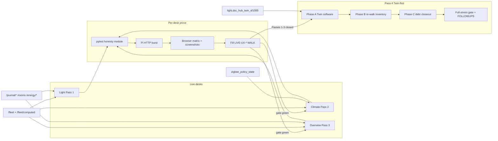
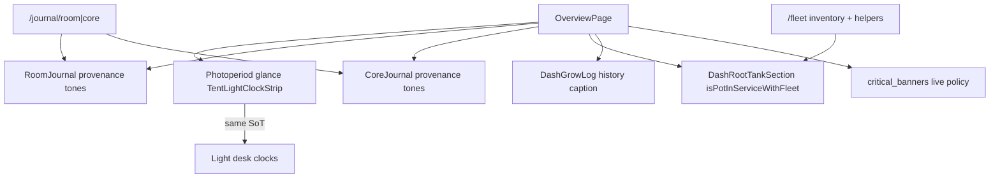
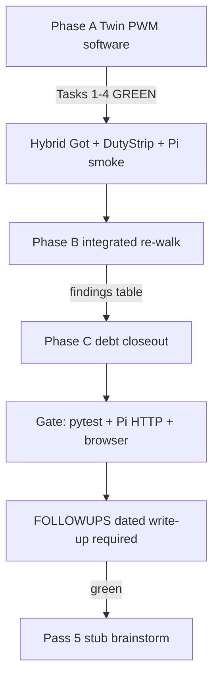
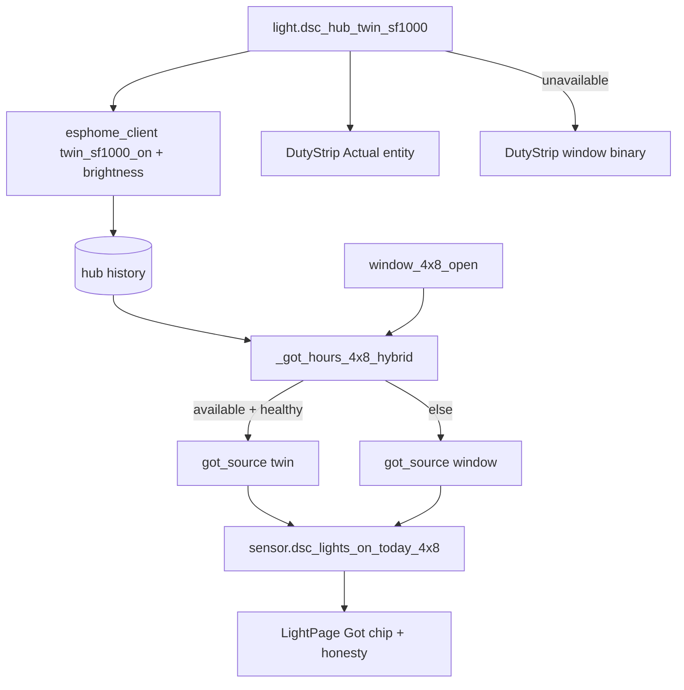

# Live UX honesty program (Light → Climate → Overview → Pass 4 Twin)

**Intent:** Keep operator Live desks behaviorally honest — gauges/chips/labels match real Want→Got fleet state; Expected/stage rails never read as live plant or live lamp; both tents stay at the same development point.

**Tip:** `83af94c` · spa-dist `index-BEjnawnp.js` (+ `calibrate-DcOg5koY.js` · `tune-fleet-B5F45eEz.js`)  
**Status:** Pass 1 Light **gate green** · Pass 2 Climate **gate green** · Pass 3 Overview **gate green**. Passes 1–3 program **closed**. **Pass 4 Twin-first:** Phase A **GREEN** (Tasks 1–4) + Phase B inventory **DONE_WITH_CONCERNS** (Task 5 `84a3387..83af94c`) — Phase C debt + Task 7 full-stress gate **still open**; GPIO5 still **reserved** (not wired). Pass 5 remains stub after Pass 4 gate.

**Spec / plan:**  
[`../superpowers/specs/2026-09-01-live-ux-honesty-program-design.md`](../superpowers/specs/2026-09-01-live-ux-honesty-program-design.md) ·  
[`../superpowers/plans/2026-09-01-live-ux-honesty-program.md`](../superpowers/plans/2026-09-01-live-ux-honesty-program.md) ·  
Pass 4: [`../superpowers/specs/2026-09-01-live-ux-pass4-twin-integrated-design.md`](../superpowers/specs/2026-09-01-live-ux-pass4-twin-integrated-design.md) ·  
[`../superpowers/plans/2026-09-01-live-ux-pass4-twin-integrated.md`](../superpowers/plans/2026-09-01-live-ux-pass4-twin-integrated.md) ·  
Pass 4 reports: [`.superpowers/sdd/pass4-task-2-report.md`](../../.superpowers/sdd/pass4-task-2-report.md) · [`.superpowers/sdd/pass4-task-3-report.md`](../../.superpowers/sdd/pass4-task-3-report.md) · [`.superpowers/sdd/pass4-task-4-report.md`](../../.superpowers/sdd/pass4-task-4-report.md) · [`.superpowers/sdd/pass4-task-5-report.md`](../../.superpowers/sdd/pass4-task-5-report.md) ·  
Task 8: [`.superpowers/sdd/task-8-report.md`](../../.superpowers/sdd/task-8-report.md) ·  
Task 9: [`.superpowers/sdd/task-9-report.md`](../../.superpowers/sdd/task-9-report.md)

## Architecture



| Pass | Desk | Walk | Pytest | Tip status |
|------|------|------|--------|------------|
| 1 | Light | [`LIVE-UX-LIGHT-WALK-2026-09.md`](../qa/LIVE-UX-LIGHT-WALK-2026-09.md) | `test_live_ux_light_honesty.py` | **GREEN** (prove spa was `index-DYFvyI2i.js`) |
| 2 | Climate | [`LIVE-UX-CLIMATE-WALK-2026-09.md`](../qa/LIVE-UX-CLIMATE-WALK-2026-09.md) | `test_live_ux_climate_honesty.py` | **GREEN** (live spa was `index-CzcL7cKc.js`) |
| 3 | Overview | [`LIVE-UX-OVERVIEW-WALK-2026-09.md`](../qa/LIVE-UX-OVERVIEW-WALK-2026-09.md) | `test_live_ux_overview_honesty.py` | **GREEN** (`index-C8GkS5XE.js` · Task 9 prove) |
| 4 | Twin-first integrated | [`LIVE-UX-PASS4-WALK-2026-09.md`](../qa/LIVE-UX-PASS4-WALK-2026-09.md) (Phase A **pass**; Phase B B1–B12 filled — B6 **fail**) | `test_live_ux_pass4_twin.py` | **Phase A GREEN** + **Phase B DONE_WITH_CONCERNS** on `83af94c` — C/gate **open** |
| 5 | Follow-up | — | — | **stub** after Pass 4 gate |

Screenshots: `docs/qa-screenshots-2026-09-01-live-ux/` (incl. `pass4-b-*`). Evidence: `.audit/live-ux-light-prove-evidence.json` · `.audit/live-ux-climate-prove-evidence.json` · `.audit/live-ux-overview-prove-evidence.json` · `.audit/live-ux-pass4-prove-evidence.json` (Phase A) · `.audit/live-ux-pass4-phaseb-inventory.json` (Phase B).

## Shared honesty contract

| Rule | Meaning |
|------|---------|
| Want→Got→Need | Bind to fleet/brain; missing → grey / OOS / unbound — never fake live |
| Expected ≠ live | Stage rails / calendar / draft tones are Expected only |
| Kit capacity | pot3/4 in `planned_oos` only — never Capacity offline lead |
| Cross-desk | Overview photoperiod glance matches Light SoT; Climate Mode ≠ Light schedule Follow chips |
| Wet vs Problem | Wet/Dry = raw sensor; Problem/Clear only from bound `policy_state` |
| Energy | Estimates labeled; suggestions `apply: false`; shift needs `confirm=true` |
| Journals | Provenance chips (`plant`/`space`/`room`/`core`); observations only |
| History ≠ live | Grow-log amber rows are past notables — not live `critical_banners` |
| Twin PWM | Software entity may be live; **never claim physical GPIO5 wire-up** until operator confirms |

## Pass 1 — Light (codepaths)

| Guard | Codepath |
|-------|----------|
| Estimate label + suggestions never apply | `GET /energy/estimate` · `GET /energy/suggestions` (`estimate_label`, `apply: false`) |
| Shift confirm gate | `POST /energy/shift/plan` with `confirm: false` → `400` |
| Space journal provenance | `POST/GET /journal/space/{4x8\|2x4}` → `provenance=space`, `source=operator` |
| SPA | `LightPage`, `LightEnergyPanel`, `TentOccupancyJournal`, Twin/SF1000 OFF honesty, DLI calibrate CTA |

Prove script: `.audit/live-ux-light-prove.ps1`. Both tents required.

**Pass 4 Phase A tip honesty (4×8 Got hybrid):** When Twin is available + history healthy, brain prefers `twin_sf1000_on` (else brightness) hours and emits `got_source=twin|window` on `sensor.dsc_lights_on_today_4x8`. SPA DutyStrip Actual binds Twin when available; window binary only when Twin absent. GPIO5 remains **reserved** (not wired).

## Pass 2 — Climate (codepaths)

| Guard | Codepath |
|-------|----------|
| pot3/4 planned OOS | `dash_computed._reduced_kit` — `planned_oos` contains POT3/POT4; `offline` must not |
| Wet without recipe ≠ problem | `zigbee_policies.evaluate_device_policies` with `recipe_id=none` → no `policy_state` row |
| `problem_when=inactive` | Wet/`occupancy: true` → `active=true`, `problem=false` |
| SPA | Zone All/4×8/2×4/Room; Climate Mode chips; air-only `FlowSankey`; canopy unbound never fills; Wet/Dry + Problem/Clear chips |

Prove script: `.audit/live-ux-climate-prove.ps1`. **Parked (Pass 4 Phase C):** `AirPathMap` still synthesizes cascade from `intakeClone` (lines ~106–111) even though `FlowSankey` uses `sensor.dsc_cfm_cascade_2x4_allocated`.

## Pass 3 — Overview (codepaths)

### API guards (pytest)

| Guard | Codepath |
|-------|----------|
| Rooms seed | `GET /rooms` → 200; kit `grow_room` present (`room_model.ensure_kit_rooms`) |
| Room journal | `GET /journal/room/grow_room` → 200 |
| Core journal | `GET /journal/core` → 200 |
| Health | `GET /health` → 200 |

### SPA honesty (Task 8 — `0d95cdb` / spa `index-C8GkS5XE.js`)



| Honesty gap | Codepath | Behavior |
|-------------|----------|----------|
| Photoperiod glance | `OverviewPage.tsx` + `TentLightClockStrip` | Caption: glance-only, same schedule SoT as Light (incl. Follow 4×8); edit on Light desk |
| Room journal provenance | `RoomJournal.tsx` | Native `room` = ok tone; space rollup = warn; plant = muted; space/plant id chips; Save disabled until note text |
| Core journal provenance | `CoreJournal.tsx` | Native `core` = ok; room/space/plant rollups toned; Save enable hint; empty state |
| Root strip OOS | `DashHomeSections.DashRootTankSection` | `isPotInServiceWithFleet` — OOS forces muted chip + NaN gauge (“No data”), never leftover Got |
| Grow log vs critical | `DashGrowLog` | Caption: amber rows = past notables, **not** live policy banners (`system.critical_banners`) |
| Bands legend | Overview HelpTip + bands subtitle | Grey = no data **or** out of service |

### Pi prove (Task 9 — tip `2d44c52`)

| Item | Path |
|------|------|
| Prove script | `.audit/live-ux-overview-prove.ps1` (+ `.sh` helper + Playwright screenshots) |
| Evidence | `.audit/live-ux-overview-prove-evidence.json` (all gates `ok: true`) |
| Walk | [`LIVE-UX-OVERVIEW-WALK-2026-09.md`](../qa/LIVE-UX-OVERVIEW-WALK-2026-09.md) — G0–G9 **pass** |
| Live index sha256 | `40ec4848fb8974335be024a91897c507c393edb500826dde244d7434c93cea25` |

**Proven live:** KIT HONEST / hub.online / canopy bound; empty `critical_banners` vs grow-log history caption; Overview photoperiod glance parity with Light SoT (both tents + Follow chip); Room/Core journals list + provenance; root/bands/fan OOS greying.

**Parked into Pass 4 Phase C (still open on tip):** Overview moisture band hardcodes 30–70 vs Root Want (`GAUGE-P0-1`); DutyStrip Actual vs ON (`SV-P1-6`); `AirPathMap` cascade ← intake alias.

## Pass 4 — Twin-first integrated (Phase A GREEN; Phase B DONE_WITH_CONCERNS; C/gate open)

**Do not invent Pass 4 gate green.** Tip `83af94c` closed Phase A (Tasks 1–4) and Phase B inventory (Task 5 **DONE_WITH_CONCERNS**): hybrid Got, Light Twin + DutyStrip, Pi smoke A1–A8, brightness scale, plus filled B1–B12 matrix (B6 fail). Phase C parks and Task 7 full-stress gate remain open. Optical / GPIO5 wire-up is still deferred.



| Phase | Intent | Verified tip `83af94c` | Still open |
|-------|--------|------------------------|------------|
| A | Twin software as if present | Hybrid Got + DutyStrip Twin; brightness 0–255↔0–1; walk A1–A8 **pass**; evidence `.audit/live-ux-pass4-prove-evidence.json`; pytest 8 passed | Optical N/A |
| B | Inventory re-walk | Task 5 `84a3387..83af94c` **DONE_WITH_CONCERNS**; B1–B5 + B7–B12 **pass**; **B6 fail** (Wet/Dry Safety UI absent — `zigbee_by_role` empty); inventory `.audit/live-ux-pass4-phaseb-inventory.json` + `pass4-b-*` shots | Phase C consumes findings |
| C | Clear B + named parks | Parks still open in source | SV-P1-6 2×4 / AirPathMap cascade / GAUGE-P0-1 / canopy+zigbee plane empty |
| Gate | Full stress | Phase A prove scripts landed | Task 7 extends prove; FOLLOWUPS gate write-up |

### Phase B findings (Task 5 — do not invent Phase C fixes)

| Severity | Topic | Disposition | Verified codepath |
|----------|-------|-------------|-------------------|
| P0 | **SV-P1-6** DutyStrip 2×4 `0.0H ON` vs Got ≈12h (window SoT); Twin Actual can show cycles + `0.0H` while Twin OFF | **in-scope** Phase C | `DutyStrip` + `history_ops` SF1000/Twin maps; walk B1/B2 |
| P0 | **AirPathMap** cascade ribbon ← `intakeClone` (live `cascade 96` = intake 2×4 allocated 96.2, not cascade sensor 83.3) | **in-scope** Phase C | `AirPathMap.tsx` lines ~106–111 still copy `intakeClone` into cascade |
| P0 | **GAUGE-P0-1** Overview moisture band hardcodes 30–70 vs Root `potWantBand` | **in-scope** Phase C | `DashHomeSections.tsx` `moistBand = { min: 30, max: 70 }` |
| P1 | Canopy/Zigbee surfaces dark: bindings present but `fleet.canopy={}` / `zigbee_by_role={}` / empty `zigbee_policy_state` → Overview “Canopy unbound”; Climate Zigbee + Wet/Dry card omitted (**B6 fail**) | **in-scope** Phase C | Climate card gated on fleet planes; decide fix vs Pass 5 if ingest flaky |
| P2 | Manual Light Hold sticky ON after Phase A stress | **pass5** | Light honesty chip truthful but sticky |
| P3 | Energy `confirm=false` → **422** (was 400 in Pass 1) — still blocks silent shift | **pass5** | Status-code drift only |

**Playwright pitfall:** against `:8787` SPA websockets use `domcontentloaded` (not `networkidle`).

### Twin hybrid codepaths (verified Phase A)



| Layer | Path | Behavior today |
|-------|------|----------------|
| Firmware | `firmware/v4/dsc-hub-v4_0.yaml` | LEDC GPIO5 → `light_twin_sf1000` / HA `light.dsc_hub_twin_sf1000`; PWM module must be wired for live optical brightness |
| Brain map | `hub_controls.py` | `twin_sf1000` ↔ `light.dsc_hub_twin_sf1000` |
| Command | `control_ops._hub_light` | HA-shaped 0–255 → aioesphomeapi **0.0–1.0**; off sends `brightness=0.0` to clear sticky ON |
| Ingest | `esphome_client._hub_controls_from_states` | Native 0–1 brightness → fleet 0–255 (tolerates legacy 0–255) |
| History | `esphome_client.py` + `history_ops.py` | Records `twin_sf1000_on` (0/1) + `twin_sf1000_brightness`; DutyStrip maps Twin → `twin_sf1000_on` |
| Got hours | `computed_ops._got_hours_4x8_hybrid` → `light_loop.emit_light_loop` | Prefer Twin on-hours when entity available + ≥1 Twin sample since midnight; else window; attrs `got_source` + window-fallback honesty |
| SPA Light | `LightPage.tsx` (`index-BEjnawnp.js`) | Twin toggle+brightness; `Got · Twin` / `Got · Window` chip; DutyStrip Actual = Twin when available; GPIO5 **reserved** copy |
| Prove | `.audit/live-ux-pass4-prove.ps1` / `.sh` | Phase A hotpatch + Twin entity/command gates; optical N/A |
| Tests | `brain/tests/test_live_ux_pass4_twin.py` | Hybrid prefer/fallback + ingest + ENTITY_METRIC_MAP (8 passed on tip) |
| Ops SoT | [`../ops/TWIN-SF1000.md`](../ops/TWIN-SF1000.md) | Entity map + GPIO5 handoff + brightness scale |

**Healthy history caveat:** first poll after local midnight may briefly fall back to window until ingest writes a Twin point — SPA chip warns `Got · Window`.

**Warm-hub caveat (Task 4):** right after brain restart Twin may be absent from `hass_extras`/`controls` for ~15–40s until hub reconnect; prove waits. Fleet on/off can lag; warm-hub brightness echo is the durable smoke signal. Optical remains N/A.

**Operator handoff:** Hub **GPIO5** = reserved Twin SF1000 PWM module — software treats Twin as live actuator; never claim physically wired until operator confirms. Expand at Pass 4 gate (Task 7).

## Developer verify

```bash
cd brain
python -m pytest \
  tests/test_live_ux_light_honesty.py \
  tests/test_live_ux_climate_honesty.py \
  tests/test_live_ux_overview_honesty.py \
  tests/test_live_ux_pass4_twin.py \
  tests/test_light_loop.py -q
```

Windows Pi prove (after `build:spa` + plink/pscp hotpatch):

```powershell
.audit/live-ux-light-prove.ps1
.audit/live-ux-climate-prove.ps1
.audit/live-ux-overview-prove.ps1
.audit/live-ux-pass4-prove.ps1   # Phase A GREEN; Task 7 extends for full gate
```

## Ops pitfalls

- Advance desks only when the prior walk is **fully filled** and gate green — pytest alone is not enough (Pass 3 pytest is only G6).
- Hotpatch with PuTTY `pscp`/`plink` `-batch -hostkey` (OpenSSH `scp` password-hangs in agent shells).
- Brain container: prefer `docker kill` + `start` over bare `docker restart` (restart hung the Pi mid-session during Task 4).
- Restore any schedule stress; leave **no** active shift plans / pending flips.
- Never paste Pi passwords, API keys, or Wi-Fi secrets into walks / FOLLOWUPS / Wiki.
- Do not conflate Climate Mode Follow 4×8 with Light schedule Follow 4×8 — different desks, different chips.
- Grow-log amber ≠ Overview `critical_banners` / `dsc-banner--critical-live`.
- Pass 4 Phase A **GREEN** + Phase B **DONE_WITH_CONCERNS** ≠ Pass 4 **gate green** — need Phase C + Task 7 full stress + FOLLOWUPS gate write-up.
- Twin entity available ≠ optical PWM wired — GPIO5 reserved until physical handoff.
- Cold/unhealthy Twin history → honest window Got (chip + sensor attrs), not silent Twin hours.
- Callers may send brightness 0–255; aioesphomeapi expects 0–1 — `_hub_light` normalizes both ways (do not double-scale).

## Related

- [`SPACE-ENERGY-JOURNAL.md`](SPACE-ENERGY-JOURNAL.md) — journal/energy HTTP SoT  
- [`PHOTOPERIOD-TIMELINE.md`](PHOTOPERIOD-TIMELINE.md) — Light clocks/SVG  
- [`WEBUI.md`](WEBUI.md) — SPA routes  
- [`../ops/TWIN-SF1000.md`](../ops/TWIN-SF1000.md) — Twin entity / GPIO5 ops  
- Notion [Local webserver UI](https://app.notion.com/p/3b52b4cda37081c19048e794d4bdf819) · [Pi offline brain](https://app.notion.com/p/3b52b4cda370818e8b66f671689f7a57) · [Photoperiod & Lighting](https://app.notion.com/p/39c2b4cda3708194a606fa0b1e6098a2)
