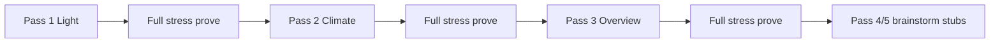
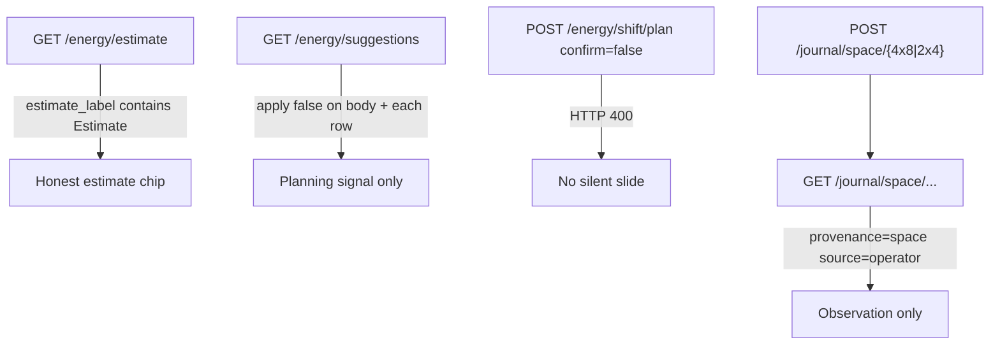

# Live UX honesty program (Light → Climate → Overview)

**Intent:** Keep Live desks honest and tent-parity before parking Twin PWM / new Zigbee recipes. One program, three sequential desk gates; Pass 4/5 stay brainstorm stubs.

**Tip:** `77c8541` (spa-dist still `index-B79UQDGB.js` + `calibrate-DcOg5koY.js` · `tune-fleet-B5F45eEz.js` from space-energy ship)  
**Status:** Program **approved**; Pass 1 **brain/API guard tests SHIPPED** (`test_live_ux_light_honesty.py`). Desk walk tables still empty until Pi/browser prove fills them.

**Spec / plan / rule:**  
[`../superpowers/specs/2026-09-01-live-ux-honesty-program-design.md`](../superpowers/specs/2026-09-01-live-ux-honesty-program-design.md) ·  
[`../superpowers/plans/2026-09-01-live-ux-honesty-program.md`](../superpowers/plans/2026-09-01-live-ux-honesty-program.md) ·  
[`.cursor/rules/dsc-space-energy.mdc`](../../.cursor/rules/dsc-space-energy.mdc)

## Pass map



| Pass | Desk | Walk | Pytest (tip) | Prove script |
|------|------|------|--------------|--------------|
| 1 | Light | [`../qa/LIVE-UX-LIGHT-WALK-2026-09.md`](../qa/LIVE-UX-LIGHT-WALK-2026-09.md) | `brain/tests/test_live_ux_light_honesty.py` **SHIPPED** | `.audit/live-ux-light-prove.ps1` (plan Task 3 — may still be absent) |
| 2 | Climate | [`../qa/LIVE-UX-CLIMATE-WALK-2026-09.md`](../qa/LIVE-UX-CLIMATE-WALK-2026-09.md) | `test_live_ux_climate_honesty.py` (planned) | `.audit/live-ux-climate-prove.ps1` |
| 3 | Overview | [`../qa/LIVE-UX-OVERVIEW-WALK-2026-09.md`](../qa/LIVE-UX-OVERVIEW-WALK-2026-09.md) | `test_live_ux_overview_honesty.py` (planned) | `.audit/live-ux-overview-prove.ps1` |
| 4–5 | Integrated / follow-up | — | stubs only | — |

Both tents (`4x8` / `2x4`) must stay at the **same development point** in every pass. Screenshots: `docs/qa-screenshots-2026-09-01-live-ux/`.

## Shared honesty contract (do not invent)

- Gauges/chips/labels bind real Want→Got→Need / fleet state; missing → grey / OOS / unbound.
- Expected / calendar / stage rails ≠ live plant or live lamp.
- pot3/4 = `planned_oos` only; F-001/F-002 honest OOS; KIT HONEST survives hotpatch.
- Overview photoperiod glance must match Light SoT for both tents.
- Climate Mode (2×4 policy) ≠ Light Schedule Follow 4×8 — chips must not conflate.
- Room / Core journals = observation rollups with provenance — not diagnoses.
- No silent schedule mutate (`confirm=true`); Learning/suggestions always `apply: false`.

Space-energy HTTP/SPA details: [`SPACE-ENERGY-JOURNAL.md`](SPACE-ENERGY-JOURNAL.md).

## Pass 1 — Light honesty guards (verified)

Locks estimate labeling, non-auto-apply suggestions, shift confirm gate, and space-journal provenance for **both** kit spaces.



| Guard | Codepath | Test |
|-------|----------|------|
| Estimate labeled | `energy_model.estimate_space_day` → `estimate_label: "Estimate"` + honesty string | `test_both_spaces_estimate_labeled_and_suggestions_never_apply` |
| Suggestions never apply | `api.energy_suggestions` forces `apply: False` on payload and each suggestion | same |
| Confirm gate | `schedule_shift.create_shift_plan` raises if `confirm` false → API `400` | `test_shift_confirm_gate_both_spaces` |
| Journal provenance | `space_journal` POST/GET; `provenance=space`, `source=operator` | `test_journal_space_provenance_both_spaces` |

### Local verify

```bash
cd brain && python -m pytest tests/test_live_ux_light_honesty.py -q --tb=short
```

Also keep space-energy suite green when touching energy/journals — see verify block in [`SPACE-ENERGY-JOURNAL.md`](SPACE-ENERGY-JOURNAL.md).

### Pass 1 still open (not yet green on tip)

Walk G0–G8 (hotpatch, Got/Want/DARK/Follow, Twin/SF1000 honesty, DLI, browser matrix, restore) remain **blank** in the Light walk until Tasks 2–3 fill evidence. Do not claim Pass 1 desk-complete from pytest alone.

## Developer pitfalls

- Treat empty walk Result columns as **not proven** — pytest ≠ Pi HTTP ≠ browser.
- Do not auto-advance to Climate until Light walk gates are filled and stress restored (no active shift plans).
- Force-tick / schedule stress: record pre lights-on for both tents; Cancel + restore after (same discipline as space-energy closure).
- Windows hotpatch: PuTTY `pscp`/`plink` `-batch -hostkey` — see `dsc-pi-hotpatch.mdc`.
- Ownership tension remains: seat/clone flows can still write 2×4 photoperiod; energy slides stay approve-only.

## Related

- Notion [Photoperiod & Lighting](https://app.notion.com/p/39c2b4cda3708194a606fa0b1e6098a2) · [Local webserver UI](https://app.notion.com/p/3b52b4cda37081c19048e794d4bdf819) · [Pi offline brain](https://app.notion.com/p/3b52b4cda370818e8b66f671689f7a57)
- [`WEBUI.md`](WEBUI.md) · [`PHOTOPERIOD-TIMELINE.md`](PHOTOPERIOD-TIMELINE.md) · [`../qa/SPACE-ENERGY-PI-WALK-2026-09.md`](../qa/SPACE-ENERGY-PI-WALK-2026-09.md)
