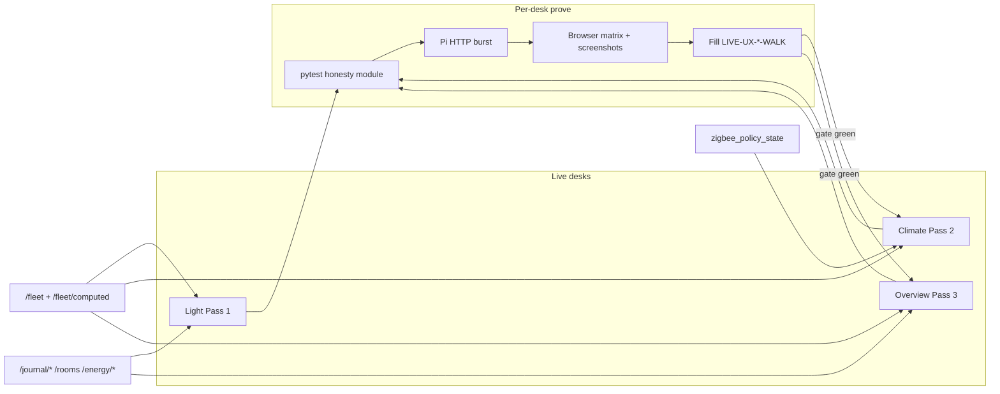

# Live UX honesty program (Light → Climate → Overview)

**Intent:** Keep operator Live desks behaviorally honest — gauges/chips/labels match real Want→Got fleet state; Expected/stage rails never read as live plant or live lamp; both tents stay at the same development point.

**Tip:** `3b22bcc` · spa-dist `index-CzcL7cKc.js` (+ `calibrate-DcOg5koY.js` · `tune-fleet-B5F45eEz.js`)  
**Status:** Pass 1 Light **gate green** · Pass 2 Climate **gate green** · Pass 3 Overview **pytest landed** (SPA + Pi walk Tasks 8–9 still open). Pass 4/5 are stubs only.

**Spec / plan:**  
[`../superpowers/specs/2026-09-01-live-ux-honesty-program-design.md`](../superpowers/specs/2026-09-01-live-ux-honesty-program-design.md) ·  
[`../superpowers/plans/2026-09-01-live-ux-honesty-program.md`](../superpowers/plans/2026-09-01-live-ux-honesty-program.md)

## Architecture



| Pass | Desk | Walk | Pytest | Tip status |
|------|------|------|--------|------------|
| 1 | Light | [`LIVE-UX-LIGHT-WALK-2026-09.md`](../qa/LIVE-UX-LIGHT-WALK-2026-09.md) | `test_live_ux_light_honesty.py` | **GREEN** (prove spa was `index-DYFvyI2i.js`) |
| 2 | Climate | [`LIVE-UX-CLIMATE-WALK-2026-09.md`](../qa/LIVE-UX-CLIMATE-WALK-2026-09.md) | `test_live_ux_climate_honesty.py` | **GREEN** (live spa `index-CzcL7cKc.js`) |
| 3 | Overview | [`LIVE-UX-OVERVIEW-WALK-2026-09.md`](../qa/LIVE-UX-OVERVIEW-WALK-2026-09.md) | `test_live_ux_overview_honesty.py` | **API guard only** — walk gates blank until Task 9 |
| 4–5 | Integrated / follow-up | — | — | **stubs** — do not invent requirements |

Screenshots: `docs/qa-screenshots-2026-09-01-live-ux/`. Evidence JSON: `.audit/live-ux-light-prove-evidence.json` · `.audit/live-ux-climate-prove-evidence.json`.

## Shared honesty contract

| Rule | Meaning |
|------|---------|
| Want→Got→Need | Bind to fleet/brain; missing → grey / OOS / unbound — never fake live |
| Expected ≠ live | Stage rails / calendar / draft tones are Expected only |
| Kit capacity | pot3/4 in `planned_oos` only — never Capacity offline lead |
| Cross-desk | Overview photoperiod glance matches Light SoT; Climate Mode ≠ Light schedule Follow chips |
| Wet vs Problem | Wet/Dry = raw sensor; Problem/Clear only from bound `policy_state` |
| Energy | Estimates labeled; suggestions `apply: false`; shift needs `confirm=true` |
| Journals | Provenance chips (`plant`/`space`/`room`/`core`); observations only |

## Pass 1 — Light (codepaths)

| Guard | Codepath |
|-------|----------|
| Estimate label + suggestions never apply | `GET /energy/estimate` · `GET /energy/suggestions` (`estimate_label`, `apply: false`) |
| Shift confirm gate | `POST /energy/shift/plan` with `confirm: false` → `400` |
| Space journal provenance | `POST/GET /journal/space/{4x8\|2x4}` → `provenance=space`, `source=operator` |
| SPA | `LightPage`, `LightEnergyPanel`, `TentOccupancyJournal`, Twin/SF1000 OFF honesty, DLI calibrate CTA |

Prove script: `.audit/live-ux-light-prove.ps1`. Both tents required.

## Pass 2 — Climate (codepaths)

| Guard | Codepath |
|-------|----------|
| pot3/4 planned OOS | `dash_computed._reduced_kit` — `planned_oos` contains POT3/POT4; `offline` must not |
| Wet without recipe ≠ problem | `zigbee_policies.evaluate_device_policies` with `recipe_id=none` → no `policy_state` row |
| `problem_when=inactive` | Wet/`occupancy: true` → `active=true`, `problem=false` |
| SPA | Zone All/4×8/2×4/Room; Climate Mode chips; air-only `FlowSankey`; canopy unbound never fills; Wet/Dry + Problem/Clear chips |

Prove script: `.audit/live-ux-climate-prove.ps1`. **Parked (not a fail):** `AirPathMap` cascade ribbon still aliases intake 2×4 CFM — FlowSankey uses allocated cascade.

## Pass 3 — Overview (codepaths)

| Guard | Codepath |
|-------|----------|
| Rooms seed | `GET /rooms` → 200; kit `grow_room` present (`room_model.ensure_kit_rooms`) |
| Room journal | `GET /journal/room/grow_room` → 200 |
| Core journal | `GET /journal/core` → 200 |
| Health | `GET /health` → 200 |

SPA / browser / photoperiod-glance parity are **Task 8–9** — do not mark Overview walk green from pytest alone. Plan names `.audit/live-ux-overview-prove.ps1` for Task 9; that script is **not in the tip tree yet**.

## Developer verify

```bash
cd brain
python -m pytest \
  tests/test_live_ux_light_honesty.py \
  tests/test_live_ux_climate_honesty.py \
  tests/test_live_ux_overview_honesty.py -q
```

Windows Pi prove (after `build:spa` + plink/pscp hotpatch):

```powershell
.audit/live-ux-light-prove.ps1
.audit/live-ux-climate-prove.ps1
# Overview: after Task 8 SPA + Task 9 walk fill (prove script lands with Task 9)
```

## Ops pitfalls

- Advance desks only when the prior walk is **fully filled** and gate green — pytest alone is not enough for Pass 1/2; for Pass 3 pytest is only G6.
- Hotpatch with PuTTY `pscp`/`plink` `-batch -hostkey` (OpenSSH `scp` password-hangs in agent shells).
- Restore any schedule stress; leave **no** active shift plans / pending flips.
- Never paste Pi passwords, API keys, or Wi-Fi secrets into walks / FOLLOWUPS / Wiki.
- Do not conflate Climate Mode Follow 4×8 with Light schedule Follow 4×8 — different desks, different chips.
- Pass 4/5 remain brainstorm stubs — park debt in [`../FOLLOWUPS.md`](../FOLLOWUPS.md).

## Related

- [`SPACE-ENERGY-JOURNAL.md`](SPACE-ENERGY-JOURNAL.md) — journal/energy HTTP SoT  
- [`PHOTOPERIOD-TIMELINE.md`](PHOTOPERIOD-TIMELINE.md) — Light clocks/SVG  
- [`WEBUI.md`](WEBUI.md) — SPA routes  
- Notion [Local webserver UI](https://app.notion.com/p/3b52b4cda37081c19048e794d4bdf819) · [Pi offline brain](https://app.notion.com/p/3b52b4cda370818e8b66f671689f7a57)
