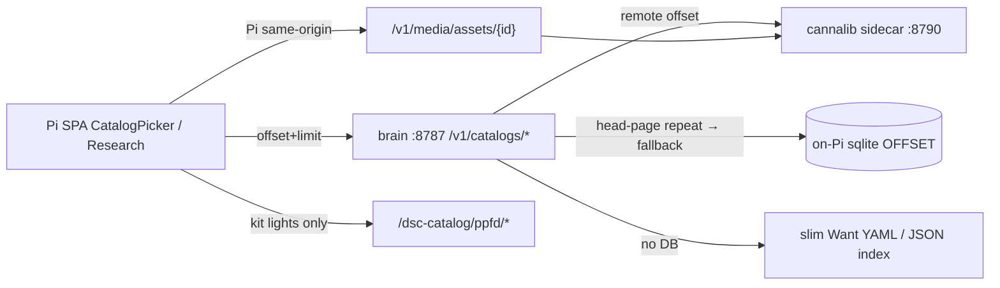

# Operator polish Waves 2–5 (CannaLib · PPFD · Twin · honesty)

**In one line:** Catalog browse pages past the curated head, kit PPFD maps stay local, Twin/Sankey refuse theater, and `/fleet/computed` survives sparse moisture history.

**Tip:** `94705f0` (feature `28953ae`; HACS sync of lights index) · **Progress:** [`.superpowers/sdd/progress-operator-polish.md`](../../.superpowers/sdd/progress-operator-polish.md) · **Wave 1:** [OPERATOR-WAVE1.md](OPERATOR-WAVE1.md)

Notion: [Local webserver UI](https://app.notion.com/p/3b52b4cda37081c19048e794d4bdf819) · [Catalogs and Build a Plant](https://app.notion.com/p/3b52b4cda37081a6b661f7e4697b39cf)

## Intent

Wave 1 fixed SoftCal / cal strips / nickname honesty. Waves 2–5 close the rest of the CreateGoal operator-polish objective without inventing cultivar photos, CDN PPFD, or estimated Sankey heat splits:

| Wave | Job | Status (verified) |
|---|---|---|
| 2 | CannaLib offset / Load more / type icons / media hydrate slot | **done** (brain + hub trampoline; live CDN offset still deferred) |
| 3 | Kit PPFD maps under `/dsc-catalog/ppfd/` | **done** |
| 4 | Sankey air-only + UUID migrate verify | **done** |
| 5 | Twin moisture/HELD + CSS motion + HF architect notes | **done** (doc + hotpatch) |

Parked: fan anemometer live session (HW), cultivar-specific licensed media (`media_n=0` upstream), Zigbee / extra HW.

## Architecture



| Layer | Path | Job |
|---|---|---|
| Brain proxy | `brain/dsc_brain/api.py` | `GET /v1/catalogs/{kind}?q&limit&offset`; `GET /v1/catalogs/strains/{id}`; `GET /v1/media/assets/{id}` |
| Integrations | `brain/dsc_brain/integrations.py` | Remote search + head-page-repeat detect; local sqlite `LIMIT/OFFSET`; strain detail + media bytes |
| Hub trampoline | `services/cannalib/standalone_server.py` | Offset on list endpoints; strain_tree hydrate; media asset URLs |
| SPA catalog | `frontend/src/lib/catalog.ts` | `searchCatalog(..., offset)`; `fetchStrainDetail`; `catalogMediaBase` (Pi `""` same-origin); PPFD resolve refuses CDN |
| Picker | `CatalogPicker.tsx` | Load more appends; detects remote ignored-offset (duplicate head ids) |
| Research | `CatalogResearch.tsx` | Type icons; licensed media slot or honest blank; kit PPFD panel |
| PPFD scripts | `scripts/fetch_kit_ppfd_maps.py`, `crop_kit_ppfd_maps.py` | Archive SF1000/SF2000/SE7000/TS1000 locally; rewrite index paths |
| Sankey | `FlowSankey.tsx` | Air CFM only; `massBalanceOk={null}` gates MASS IMBALANCE chip |
| Twin | `twin/DscTwinCanvas.tsx` | Vessel fill from live moisture % only; HELD when hub link down; WireBox restored |
| Trust | `brain/dsc_brain/sensor_trust.py` | `_moisture_rate_per_hour` skips null history values — `/fleet/computed` must not 500 |

## Wave 2 — CannaLib browse

### Offset contract

1. SPA calls brain `GET /v1/catalogs/{kind}?limit=&offset=` (Pi mode).
2. Brain prefers remote CannaLib with `offset`.
3. If `offset > 0` and remote first-id equals head-page first-id → treat as **remote offset ignored** → fall through to on-Pi sqlite `OFFSET`.
4. Without DB → slim Want / local JSON index slice (never invent rows).

Hub trampoline (`standalone_server.py`) implements offset; production `cannalib.plausible-deniability.net` still needs the same deploy (**FOLLOWUPS:** Live CannaLib offset deploy).

### Search / icons / media

- Multi-field client filter: name · type · breeder · summary (`filterStrainItems` / local index match).
- Strain type icons (indica / sativa / hybrid / auto) via `IconNames` — not one glyph for all strains.
- Detail: `fetchStrainDetail` → brain `/v1/catalogs/strains/{id}` → CannaLib strain_tree.
- Images: `/v1/media/assets/{asset_id}` proxied same-origin on Pi. When hydrate `media_n=0`, show honest blank / genus reference — **do not** hotlink marketing CDNs.

## Wave 3 — Kit PPFD

Manifest: `homeassistant/www/dsc-catalog/ppfd/manifest.json` (also under spa-dist / custom_components www).

| Kit id | Local path |
|---|---|
| `spider_farmer_sf1000` | `/dsc-catalog/ppfd/spider_farmer_sf1000.jpg` |
| `spider_farmer_sf2000` | `/dsc-catalog/ppfd/spider_farmer_sf2000.jpg` |
| `spider_farmer_se7000` | `/dsc-catalog/ppfd/spider_farmer_se7000.jpg` |
| `mars_hydro_ts1000` | `/dsc-catalog/ppfd/mars_hydro_ts1000.jpg` |

`resolveKitPpfdUrl` / `ppfdDisplayUrl` accept only `/dsc-catalog/ppfd/`, `/local/dsc-catalog/ppfd/`, `/media/ppfd/` — **refuse** `http(s)://` manufacturer CDNs at render time. Tip `94705f0` HACS-synced `dist/dsc-catalog/dsc_lights_search_index.json` after light-index rewrite.

## Wave 4 — Sankey + UUID

- `FlowSankey`: air CFM provenance only (Allocated / Nameplate). Deprecated `heatTentW` / `heatMatW` ignored.
- Climate passes `massBalanceOk={null}` so MASS IMBALANCE never implies a live balance check.
- UUID migrate: inventory/roster must show `plant:…` not residual `slot:` (`.audit/uuid-migrate-smoke.sh`).

## Wave 5 — Twin · motion · computed · HF notes

- Twin vessels: moisture column only when finite live `%`; blank when missing.
- Hub link down → **HELD** chip; rotation frozen.
- CSS: card depth / stagger / gauge entrance; honor `prefers-reduced-motion`.
- `sensor_trust._moisture_rate_per_hour`: filter null history values; return `None` when &lt;2 usable points — tests in `brain/tests/test_sensor_trust_history.py`.
- HF research snapshot only: [`docs/superpowers/specs/2026-08-31-hf-ai-architect-notes.md`](../superpowers/specs/2026-08-31-hf-ai-architect-notes.md) — SoftCal/Ollama remain control SoT; no HF weights in the act path.

## spa-dist (tip `94705f0`)

| Asset | Hash |
|---|---|
| Index | `index-JuWgMbJV.js` · CSS `index-YHuXqGUv.css` |
| Calibrate | `calibrate-BNJCw6ba.js` |
| Tune fleet | `tune-fleet-DFrH_SAo.js` |
| Twin | `twin-three-B0t1gmm4.js` |

Live smoke (progress file): SoftCal_OK · live_hold · outcome_strip · offset_ok · PPFD 200 · slot_residual none · `/fleet/computed` HTTP 200.

## Constraints / pitfalls

- Do **not** invent height / chem / PPFD grid cells / NPK channels / cultivar photos.
- Empty-q Load more must append new ids — duplicate head page means remote ignored offset; rely on brain local fallback until CDN deploy.
- Kit PPFD only — unmatched lights stay without local map (honest absence).
- Twin / Sankey: prefer honesty blank or gated chip over estimated theater.
- Secrets: never paste CannaLib API keys into Wiki / PR bodies; Settings helpers / Notion Credentials DB only.
- Client strain filters (type/format/breeder) are local — API accepts `q`/`limit`/`offset` only.

## Verify

```bash
# Brain catalog offset (Pi or local stack)
curl -s "http://127.0.0.1:8787/v1/catalogs/strains?q=&limit=5&offset=0" | head
curl -s "http://127.0.0.1:8787/v1/catalogs/strains?q=&limit=5&offset=5" | head

# Computed must stay 200 with sparse pot history
curl -s -o /dev/null -w "%{http_code}\n" http://127.0.0.1:8787/fleet/computed

# Unit
cd brain && python -m pytest tests/test_sensor_trust_history.py -q

# PPFD static
curl -s -o /dev/null -w "%{http_code}\n" http://127.0.0.1:8787/dsc-catalog/ppfd/manifest.json
```

Browser: Research Load more · type icons · blank media when `media_n=0` · SF1000 PPFD local · Climate Sankey without heat modes · Twin moisture fill / HELD.
